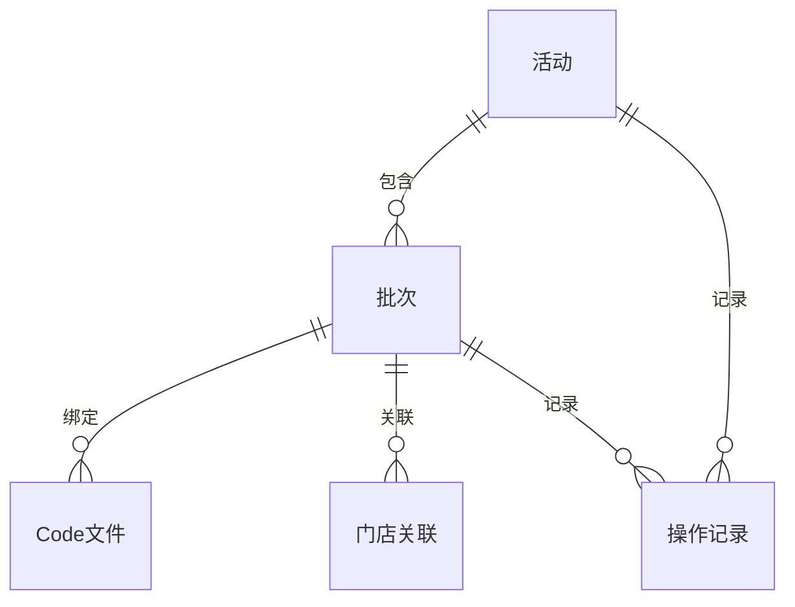

# Weixin摇一摇产品需求文档（PRD）

> 版本阶段：正式交付稿  
> 当前状态：待评审签核  
> 适用范围：Weixin摇一摇需求目录下的活动管理、批次管理与页面展示能力

## 封面信息

- 项目名称：Weixin摇一摇
- 文档名称：Weixin摇一摇产品需求文档 PRD / 需求规格说明
- 产品名称：Weixin摇一摇活动管理
- 文档版本：V2.9
- 编写人：Codex
- 编写日期：2026-05-11
- 所属部门：产品/业务协同

## 修订记录

| 文档版本号 | 提交时间 | 修订内容 | 修订人 | 审核人 |
|---|---|---|---|---|
| V1.0 | 2026-05-10 | 首版正式 PRD，汇总 6 个页面设计稿的已收口内容，并形成统一需求基线 | Codex | 待评审签核 |
| V1.1 | 2026-05-10 | 方案 A 冻结补强版：补充角色-权限-动作矩阵、活动层/批次层职责边界、状态迁移原则、接口契约要求、异常与验收基线 | Codex | 待评审签核 |
| V1.2 | 2026-05-10 | 术语统一与冻结闭环加强版：统一列表页时间窗口术语为“活动日期窗口（活动使用时间范围）” | Codex | 待评审签核 |
| V1.3 | 2026-05-10 | 最终签核清单收敛版：将第 10 章待签项收束为唯一人工确认清单 | Codex | 待评审签核 |
| V1.4 | 2026-05-10 | 最终签核模板版：保留冻结内容不变，仅将签核位显式收敛为可人工填写模板 | Codex | 待评审签核 |
| V1.5 | 2026-05-11 | 按正式交付模板重排结构，补齐标准章节、正式图引用与模板化交付格式 | Codex | 待评审签核 |
| V1.6 | 2026-05-11 | 根据正式模板要求细化 2.1 大章节的各页面说明，补充页面级流程、字段、规则、异常与验收口径 | Codex | 待评审签核 |
| V1.7 | 2026-05-11 | 依据活动新增页详细设计补齐两段式创建流程、字段规则、按钮逻辑和异常情况 | Codex | 待评审签核 |
| V1.8 | 2026-05-11 | 依据活动编辑页详细设计补齐草稿补全与生效前修订的字段、规则、按钮和异常情况 | Codex | 待评审签核 |
| V1.9 | 2026-05-11 | 依据活动修改页详细设计补齐生效后低风险修订、只读快照和保存回流规则 | Codex | 待评审签核 |
| V2.0 | 2026-05-11 | 依据活动详情页详细设计补齐只读总览、批次概览和状态控制按钮规则 | Codex | 待评审签核 |
| V2.1 | 2026-05-11 | 依据活动详情页详细设计补齐只读总览、批次概览和状态控制按钮规则 | Codex | 待评审签核 |
| V2.2 | 2026-05-11 | 依据批次管理页详细设计补齐活动摘要、批次列表、批次详情、预算、门店、Code、通知与发放控制规则 | Codex | 待评审签核 |
| V2.3 | 2026-05-11 | 依据 PRD 全文口径统一并补充名词解释，收口活动层、批次层、状态、模式与页面概念术语 | Codex | 待评审签核 |
| V2.4 | 2026-05-11 | 按要求将名词解释改写为纯中文术语表达，去除英文写法 | Codex | 待评审签核 |
| V2.5 | 2026-05-11 | 依据正式模板补强业务背景、目标用户、产品目标、角色清单与业务场景的中文表达 | Codex | 待评审签核 |
| V2.6 | 2026-05-11 | 依据正式模板补强集成需求章节，拆分活动、批次、券码、门店、通知与留痕集成能力 | Codex | 待评审签核 |
| V2.8 | 2026-05-11 | 补强用户测试用例章节，按页面主流程、异常、权限、状态、集成、性能与留痕完善可执行验收用例 | Codex | 待评审签核 |
| V2.9 | 2026-05-11 | 按正式原型文件替换 1.5.3 整体流程图与 2.1.0 角色用例图引用，统一正式文件口径 | Codex | 待评审签核 |

## 需求列表

| 业务需求 / Epic | 产品需求 / User Story | 产品需求描述 | 记录日期 | 产品发布版本 | 提出部门 |
|---|---|---|---|---|---|
| Weixin摇一摇活动管理 | 统一创建、维护、查看和执行商品券活动 | 覆盖活动列表、活动新增、活动编辑、活动修改、活动详情与批次管理，统一活动创建、草稿接续、生效前修订、只读详情与批次发放管理能力 | 2026-05-11 | V2.9 | 业务方待确认 |

## 目录

1. 产品概述
2. 功能需求
3. 集成需求
4. 非功能性需求
5. 数据治理-逻辑模型
6. 用户测试用例
7. 附件一 产品需求文档（PRD）确认书

## 1. 产品概述

### 1.1 业务背景

Weixin摇一摇用于承载商品券活动的创建、查看、修订和批次执行管理。本 PRD 冻结范围内，目标是把活动层与批次层的职责边界固定下来，把列表、详情、编辑、修改和批次管理的入口关系统一起来，并把与发放相关的能力从活动配置中拆分出去。

当前业务现状和问题主要包括：

- 活动创建、草稿修订、生效前修订与生效后低风险修改的入口不统一，用户容易在不同页面之间重复查找入口
- 列表、详情、编辑、修改、批次管理之间的职责边界不够明确，活动信息与批次信息存在混写风险
- 券码上传、门店关联、预算配置、通知配置和发放控制等批次层能力必须从活动层剥离，否则容易造成配置混乱和权限越界
- 活动列表的检索口径、时间范围筛选口径和状态口径需要统一，否则会影响查询准确性和排查效率
- 正式冻结前需要形成可追踪的正式需求文档、原型绑定和交付留痕，保证研发、测试和评审能够按同一版本执行

本次建设的核心目标不是扩展更多功能，而是把已有功能的边界、入口、状态和交互口径收紧，降低误操作、返工和解释成本。

### 1.2 目标用户

| 目标用户 | 目标用户分析 |
|---|---|
| 产品经理 | 负责需求范围、评审结论、冻结判断与交付确认，需要关注入口分发、状态边界、验收标准和版本一致性，核心诉求是让需求可落地、可追踪、可验收 |
| 运营人员 | 负责活动创建、补全、修订、提交和日常维护，需要关注表单效率、草稿恢复、页面跳转和批次入口，核心诉求是减少重复填报和误操作 |
| 审核管理角色 | 负责活动与批次配置审核，需要关注规则是否满足、状态是否合规、配置是否完整，以及是否允许进入下一阶段，核心诉求是快速判断、减少歧义 |
| 执行角色 | 负责批次发放、暂停、失效与执行控制，需要关注批次状态、券码、门店范围、预算和发放结果，核心诉求是执行过程可控、异常可回退 |
| 门店协同角色 | 负责门店关联确认、范围校验和协同查看，需要关注门店适用范围、关联结果和受控操作，核心诉求是减少门店配置差错 |
| 测试角色 | 负责按规则校验页面行为与状态变化，需要关注字段、按钮、状态机、异常提示和验收口径，核心诉求是用例清晰、可直接执行 |

### 1.3 产品目标

- 用户价值：降低活动创建、修订与批次管理的理解成本，让用户能在正确页面完成正确动作，减少来回跳转和重复确认
- 业务价值：收口活动与批次职责边界，减少返工、误操作和配置串层，提升活动和批次的执行效率
- 产品价值：形成可复用的活动管理需求基线、页面设计基线和状态边界基线，后续同类项目可以直接复用这套结构
- 可量化目标：入口跳转正确率提升、误入错误入口次数下降、审核一次通过率提升、批次配置返工率下降、页面规则解释成本下降

本次目标不是单纯“把页面做出来”，而是确保每个页面都承担明确职责，列表负责分发，活动页负责活动配置，批次页负责批次执行，详情页负责只读追溯。

### 1.4 应用架构

| 图文件 | 可编辑源文件 | 图示说明 |
|---|---|---|
| [Weixin摇一摇_应用架构图_v1.4_20260510.png](E:/Codex/New_rules/docs/versions/Weixin摇一摇/Weixin摇一摇_应用架构图_v1.4_20260510.png) | [Weixin摇一摇_应用架构图.drawio](E:/Codex/New_rules/docs/versions/Weixin摇一摇/Weixin摇一摇_应用架构图.drawio) | 前台页面层、业务能力层、数据与留痕层；明确活动状态主源、批次状态主源、页面路由、业务调用、数据流向和留痕归档 |

### 1.5 功能架构

### 1.5.1 功能清单（思维导图的形式）

| 图文件 | 可编辑源文件 | 图示说明 |
|---|---|---|
| [Weixin摇一摇_功能架构图_v1.4_20260510.png](E:/Codex/New_rules/docs/versions/Weixin摇一摇/Weixin摇一摇_功能架构图_v1.4_20260510.png) | [Weixin摇一摇_功能架构图.drawio](E:/Codex/New_rules/docs/versions/Weixin摇一摇/Weixin摇一摇_功能架构图.drawio) | 根节点为 Weixin摇一摇；一级分支为活动管理与批次管理；活动管理覆盖活动列表/新增/编辑/修改/详情，批次管理覆盖批次列表/预配置/Code 上传校验/门店关联/发放控制/批次状态管理 / 发放状态管理 |

### 1.5.2 角色清单

| 角色名称 | 功能 |
|---|---|
| 产品经理 | 负责查看需求、确认范围、校验模板完整性、组织评审、判断是否冻结以及确认交付版本 |
| 运营人员 | 负责创建活动、补全表单、保存草稿、提交审核、查看详情、进入批次管理并处理日常维护 |
| 审核管理角色 | 负责检查活动和批次配置是否符合规则，决定是否允许进入下一阶段或继续保留在审核状态 |
| 执行角色 | 负责批次预配置、券码上传、发放、暂停、失效和执行过程控制 |
| 门店协同角色 | 负责门店范围确认、门店关联校验、受控信息查看和协同处理 |
| 测试角色 | 负责按页面规则、按钮规则、状态规则和异常提示编写并执行测试用例 |

### 1.5.3 整体流程图

| 图文件 | 可编辑源文件 | 图示说明 |
|---|---|---|
| [Weixin摇一摇_整体流程图_v1.5_20260511.png](E:/Codex/New_rules/docs/versions/Weixin摇一摇/Weixin摇一摇_整体流程图_v1.5_20260511.png) | [Weixin摇一摇_整体流程图.drawio](E:/Codex/New_rules/docs/versions/Weixin摇一摇/Weixin摇一摇_整体流程图.drawio) | 活动列表页、活动新增/编辑/修改/详情、批次管理页、批次预配置/Code 校验/门店关联/发放控制与状态结果的主流程，含草稿恢复、校验失败和失效处理 |

### 1.6 名词解释

| 名词名称 | 名词描述 |
|---|---|
| 活动 | 商品券活动的业务对象，是活动层主对象，统一承载名称、券类型、优惠范围、状态、规则摘要、时间窗口和批次集合 |
| 活动层 | 活动的配置与展示层，负责活动列表、活动新增、活动编辑、活动修改和活动详情等能力 |
| 活动状态主源 | 活动层状态及其接口返回结果，是列表页、详情页和活动入口按钮的状态判断依据 |
| 批次 | 活动下的发放执行单元，负责预配置、预算、门店、券码、通知和发放控制 |
| 批次层 | 活动下的执行与配置层，负责批次列表、批次详情、预配置和发放控制等能力 |
| 批次状态主源 | 批次接口状态及其返回结果，是批次列表、批次详情和批次操作按钮的状态判断依据 |
| 草稿 | 未提交审核的活动或批次编辑结果；在活动新增、编辑、修改中表示待提交数据，在批次页中仅表示页面预配置编辑态，不代表正式批次状态 |
| 预配置 | 批次页中的准备性配置过程和配置结果，包含基础信息、日期窗口、预算、门店、券码和通知，但不等同于正式发放态 |
| 页面预配置态 | 预配置的页面级概念，用于表示批次正式发放前的编辑与校验状态，不作为接口状态展示 |
| 活动使用时间范围 | 活动可被使用的日期范围；在列表页中用于筛选和覆盖范围展示，按当前活动下批次可用日期窗计算 |
| 活动日期窗覆盖范围 | 列表页展示的日期覆盖窗口，按当前活动下所有非草稿批次的最早开始日期到最晚结束日期计算，部分重叠即可命中筛选 |
| 只读快照 | 已生效活动或详情页展示时的只读结果，不承接编辑动作，只用于查看与追溯 |
| 单券模式 | 使用模式固定值，表示单券模式 |
| 文件上传模式 | 券码分配模式固定值，表示通过文件上传提供券码 |
| 券码分配模式 | 批次或活动中的券码分配方式字段，当前冻结范围内主要支持文件上传模式 |
| 门店范围 | 门店适用范围字段，用于标识是否开放门店关联能力，当前主要包含全部门店与指定门店 |
| 审核中状态 | 活动审核中的状态；在批次页中仅开放预配置类受控能力 |
| 生效中状态 | 活动生效态；对应活动层可进入修改和批次管理入口 |
| 发放中状态 | 批次发放中状态 |
| 已暂停状态 | 批次已暂停状态 |
| 已停止状态 | 批次自然终态，仅允许查看 |
| 已失效状态 | 活动或批次失效终态 |
| 券码文件 | 批次待用券码文件及其内容集合，用于批次发放时分配可用券码 |
| 门店关联 | 当门店范围为指定门店时启用的门店绑定与解绑能力 |
| 发放控制 | 批次在发放中、已暂停等受控状态下可执行的发放、暂停、继续等动作集合 |

### 1.7 业务场景

| 分类 | 功能模块 | 业务场景 | 描述 |
|---|---|---|---|
| 活动管理 | 活动列表 | 活动列表检索 | 用户按名称、编号、状态、时间范围和活动使用时间范围查找活动，快速定位待处理对象并进入对应页面 |
| 活动管理 | 活动新增 | 首次创建活动 | 用户从新增页创建新的商品券活动，完成基础信息填写后进入审核或草稿接续流程 |
| 活动管理 | 活动编辑 | 草稿继续补全 | 系统识别已有草稿后，用户跳转到编辑页继续补全未完成内容，避免重复新建 |
| 活动管理 | 活动修改 | 生效前修订 | 活动处于审核中且尚未进入执行阶段时，用户可以修订低风险内容并重新提交 |
| 活动管理 | 活动详情 | 生效后低风险修改 | 活动已生效后，用户通过只读详情页查看全量快照，并对允许修改的低风险内容做受控调整 |
| 批次管理 | 批次列表 | 批次检索与切换 | 用户在某个活动下查看全部批次，识别不同状态的批次并切换到对应配置面板 |
| 批次管理 | 批次预配置 | 批次基础配置 | 用户对批次名称、日期窗口、预算、门店和通知等内容进行预配置和保存 |
| 批次管理 | 券码上传 | 待用券码导入 | 用户上传券码文件并执行校验，确保券码可用于后续发放 |
| 批次管理 | 门店关联 | 指定门店关联 | 当活动范围要求指定门店时，用户在批次页完成门店关联与解绑操作 |
| 批次管理 | 发放控制 | 批次发放与控制 | 用户在发放中或已暂停状态下执行发放、暂停、继续和失效等控制动作 |
| 批次管理 | 状态管理 | 批次生命周期控制 | 系统根据批次状态控制按钮可见性和可执行动作，确保页面行为与状态一致 |

## 2. 功能需求

> 说明：详细页面级字段、规则和表单内容以对应页面设计稿为准，本 PRD 保留正式交付所需的结构、边界与验收口径。

### 2.1 <Weixin摇一摇活动管理>

#### 2.1.0 角色用例图

| 图文件 | 可编辑源文件 | 图示说明 |
|---|---|---|
| [Weixin摇一摇_角色用例图_v1.7_20260511.png](E:/Codex/New_rules/docs/versions/Weixin摇一摇/Weixin摇一摇_角色用例图_v1.7_20260511.png) | [Weixin摇一摇_角色用例图.drawio](E:/Codex/New_rules/docs/versions/Weixin摇一摇/Weixin摇一摇_角色用例图.drawio) | 产品经理、运营人员、审核/管理角色、执行角色、门店/区域协同角色与活动/批次能力的边界关系 |

#### 2.1.1 活动列表页

##### 2.1.1.1 功能描述

活动列表页是 Weixin摇一摇 的活动层统一入口，用于承载活动的检索、浏览、状态识别和入口分发。该页只覆盖活动层能力，不展开批次明细、Code 上传、门店关联、预算配置和发放控制；这些能力统一进入批次管理页。列表页同时承担活动名称、活动 ID、券类型、优惠范围、规则摘要、活动日期窗覆盖范围、状态、创建人、最后修改人、创建时间和最后修改时间的统一展示与检索职责，是活动生命周期中进入详情、编辑、修改和批次管理的总路由起点。

##### 2.1.1.2 产品流程

1. 用户进入活动列表页，系统默认加载活动列表数据。
2. 用户可通过商品券名称、商品券ID、商品券类型、优惠范围、状态、创建人、最后修改人、创建时间、最后修改时间和活动日期窗覆盖范围进行筛选。
3. 用户在列表中查看活动的基本信息、状态标签、规则摘要和覆盖窗口信息。
4. 用户根据活动状态点击 `查看`、`编辑`、`修改`、`批次管理` 或 `失效`。
5. 系统按照状态规则跳转到对应页面，或在执行 `失效` 时弹出二次确认。
6. 用户完成查看、跳转或取消操作后，列表本身不被当前操作直接改写。

###### 2.1.1.2.1 角色用例图

| 图文件 | 可编辑源文件 | 图示说明 |
|---|---|---|
| [Weixin摇一摇_角色用例图_v1.5_20260511.png](E:/Codex/New_rules/docs/versions/Weixin摇一摇/Weixin摇一摇_角色用例图_v1.5_20260511.png) | [Weixin摇一摇_角色用例图.drawio](E:/Codex/New_rules/docs/versions/Weixin摇一摇/Weixin摇一摇_角色用例图.drawio) | 产品经理、运营人员、审核/管理角色、执行角色、门店/区域协同角色与活动/批次能力的角色边界 |

###### 2.1.1.2.2 产品流程图

| 图文件 | 可编辑源文件 | 图示说明 |
|---|---|---|
| [Weixin摇一摇_整体流程图_v1.5_20260511.png](E:/Codex/New_rules/docs/versions/Weixin摇一摇/Weixin摇一摇_整体流程图_v1.5_20260511.png) | [Weixin摇一摇_整体流程图.drawio](E:/Codex/New_rules/docs/versions/Weixin摇一摇/Weixin摇一摇_整体流程图.drawio) | 列表页到新增、编辑、修改、详情、批次管理及失效确认的主流程与状态判断 |

##### 2.1.1.3 前置条件

- 用户已登录并具备进入活动列表页的权限。
- 系统中已存在活动数据，或当前角色至少具备查看空列表的权限。
- 列表页能够访问当前需求目录下的活动数据快照。
- 当前页面展示的是活动层数据，不直接展开批次层明细。
- 活动基础属性 `SINGLE` 与 `UPLOAD` 为系统固定值，不作为页面可配置前置条件。

##### 2.1.1.4 目标用户

运营人员、审核/管理角色、执行角色。

##### 2.1.1.5 后置条件

- 用户可进入活动详情页、活动新增页、活动编辑页、活动修改页或批次管理页。
- 用户可按状态识别当前活动允许的操作入口。
- 用户完成查看、筛选或跳转后，不改变活动的业务状态。
- 当用户执行失效并确认成功后，活动进入 `已失效` 状态。

##### 2.1.1.6 原型图 / UI 界面

| 页面名称 | 图文件 | 可编辑源文件 | 图示说明 |
|---|---|---|---|
| 活动列表页 | 见 [Weixin摇一摇_活动列表页_v1.6_20260510.md](E:/Codex/New_rules/docs/versions/Weixin摇一摇/Weixin摇一摇_活动列表页_v1.6_20260510.md) 所述页面原型 | [Weixin摇一摇_活动列表页_v1.6_20260510.md](E:/Codex/New_rules/docs/versions/Weixin摇一摇/Weixin摇一摇_活动列表页_v1.6_20260510.md) | 活动总入口、筛选、状态分发、入口跳转 |

###### 2.1.1.6.1 功能逻辑说明

1. 页面默认展示活动列表数据，并以活动层数据作为唯一列表对象。
2. 用户可通过查询条件过滤活动，列表不直接查询批次明细。
3. `商品券名称` 支持模糊查询，查询前建议去除首尾空格。
4. `商品券ID` 必须输入完整 ID 才能命中，为精确查询。
5. `商品券类型` 仅支持固定枚举 `满减券`、`兑换券`。
6. `优惠范围` 以配置字典或树形选择方式呈现，不建议自由输入。
7. `状态` 使用固定枚举 `草稿`、`审批中`、`生效中`、`已失效`。
8. `创建人`、`最后修改人` 支持按保存名称模糊匹配。
9. `创建时间`、`最后修改时间` 使用时间范围筛选，建议默认本地时区。
10. `活动日期窗覆盖范围` 用于查找与查询时间范围存在部分重叠的活动，不表示连续可用日期。
11. 列表中应同时展示活动名称、活动 ID、活动类型、优惠范围、优惠规则摘要、活动日期窗覆盖范围、状态、创建人、最后修改人、创建时间、最后修改时间；如实现需要，可增加批次数量作为辅助信息。
12. 活动名称作为主展示列，超长省略并支持 hover 查看完整内容，点击进入详情页。
13. 活动 ID 用于排查和对账，建议完整展示并提供复制能力。
14. 优惠规则摘要必须优先可读，满减券展示 `满X减Y`，兑换券展示 `原价X / 兑换内容摘要`。
15. 状态标签必须与页面文案一致，活动层状态变化不应混入批次层状态。
16. 列表页不允许直接编辑活动字段，只允许按状态跳转到对应页面或执行失效确认。
17. `SINGLE` 与 `UPLOAD` 为系统固定属性，不作为列表筛选条件，也不作为可编辑字段展示。

###### 2.1.1.6.2 交互说明

说明：查询条件本质上是列表顶部的联合筛选区，本节按“字段控件 + 主要动作入口”两类交互统一列示，确保与设计稿中的查询方式、查询规则和按钮入口保持一致。

| 序号 | 元件名称 | 交互方式 | 交互结果 |
|---:|---|---|---|
| 1 | 商品券名称 | 输入 | 支持部分名称模糊查询，查询前建议去除首尾空格 |
| 2 | 商品券ID | 输入 | 支持精确查询，必须输入完整 ID 才能命中 |
| 3 | 商品券类型 | 选择 | 下拉单选，仅支持 `满减券`、`兑换券` |
| 4 | 优惠范围 | 选择 | 下拉单选或树形选择，按系统配置字典展示 |
| 5 | 状态 | 选择 | 下拉单选，仅支持 `草稿`、`审批中`、`生效中`、`已失效` |
| 6 | 创建人 | 输入 | 按保存名称模糊匹配，支持排查活动创建来源 |
| 7 | 最后修改人 | 输入 | 按保存名称模糊匹配，支持排查活动最近修改来源 |
| 8 | 创建时间 | 选择 | 使用起止时间范围筛选，建议默认本地时区 |
| 9 | 最后修改时间 | 选择 | 使用起止时间范围筛选，建议默认本地时区 |
| 10 | 活动日期窗覆盖范围 | 选择 | 支持日期范围筛选，采用部分重叠即可命中规则 |
| 11 | 新增活动 | 点击 | 进入活动新增页 |
| 12 | 查看 | 点击 | 进入活动详情页 |
| 13 | 编辑 | 点击 | 进入活动编辑页 |
| 14 | 修改 | 点击 | 进入活动修改页 |
| 15 | 批次管理 | 点击 | 进入该活动的批次管理页 |
| 16 | 失效 | 点击 | 弹出二次确认，确认后执行失效流程 |
| 17 | 活动名称 | 点击 | 进入活动详情页 |
| 18 | 活动ID | 点击 / 复制 | 可跳转详情或复制标识 |
| 19 | 状态标签 | 查看 | 识别当前可执行入口 |

###### 2.1.1.6.3 字段说明

| 序号 | 字段 | 数据类型 | 数据限制 | 是否必填 | 描述 | 默认值 | 数据来源 | 数据是否可编辑 | 数据字典 | 数据字典说明 |
|---:|---|---|---|---|---|---|---|---|---|---|
| 1 | 商品券名称 | 文本 | 模糊查询，建议去除首尾空格 | 否 | 活动名称关键字 | 无 | 用户输入 | 可编辑 | 无 | 无 |
| 2 | 商品券ID | 文本 | 精确查询，需完整输入 | 否 | 活动唯一标识 | 无 | 用户输入 | 可编辑 | 无 | 无 |
| 3 | 商品券类型 | 枚举 | 固定枚举 | 否 | 活动类型 | 无 | 系统字典 | 不可编辑 | 券类型字典 | 满减券 / 兑换券 |
| 4 | 优惠范围 | 枚举 / 树形 | 固定配置字典或树形选择 | 否 | 活动适用范围 | 无 | 系统字典 | 不可编辑 | 范围字典 | 按系统配置展示 |
| 5 | 状态 | 枚举 | 固定枚举 | 否 | 活动当前状态 | 无 | 系统生成 | 不可编辑 | 状态字典 | 草稿 / 审批中 / 生效中 / 已失效 |
| 6 | 创建人 | 文本 | 模糊查询 | 否 | 活动创建人 | 无 | 系统生成 | 不可编辑 | 无 | 无 |
| 7 | 最后修改人 | 文本 | 模糊查询 | 否 | 最近一次修改活动的人 | 无 | 系统生成 | 不可编辑 | 无 | 无 |
| 8 | 创建时间 | 时间 | 时间范围 | 否 | 活动创建时间 | 无 | 系统生成 | 不可编辑 | 无 | 无 |
| 9 | 最后修改时间 | 时间 | 时间范围 | 否 | 活动最后修改时间 | 无 | 系统生成 | 不可编辑 | 无 | 无 |
| 10 | 活动日期窗覆盖范围 | 日期范围 | 支持部分重叠查询 | 否 | 当前活动下批次可用日期窗覆盖窗口 | `--` | 系统汇总 | 不可编辑 | 无 | 用于查询和展示覆盖窗口 |
| 11 | 优惠规则摘要 | 文本 | 按券型规则拼接 | 否 | 活动规则简要展示 | 无 | 系统汇总 | 不可编辑 | 无 | 满减券显示 `满X减Y`；兑换券显示 `原价X / 兑换内容摘要` |
| 12 | 批次数量 | 数值 | 可选展示 | 否 | 当前活动下的批次数量 | 无 | 系统汇总 | 不可编辑 | 无 | 辅助信息，不进入状态判断 |

###### 2.1.1.6.4 业务规则

- 列表页是活动总入口，顶部仅保留 `新增活动`。
- 行内按钮包括 `查看`、`编辑`、`修改`、`批次管理`、`失效`，且按钮展示必须随状态变化。
- 对不可用动作必须隐藏或置灰，禁止显示为可点击但实际不可执行。
- `查看` 对全部状态可见，为列表页主入口。
- `编辑` 仅允许 `草稿`、`审批中` 的活动进入。
- `修改` 仅允许 `生效中` 的活动进入。
- `批次管理` 仅允许 `审批中`、`生效中` 的活动进入，其中 `审批中` 仅支持预配置，`生效中` 支持完整管理。
- `失效` 仅允许 `生效中` 的活动执行，并且必须二次确认。
- `已失效` 仅允许查看，不允许编辑、修改、批次管理或失效。
- `活动日期窗覆盖范围` 采用部分重叠规则进行筛选，展示口径仅表示覆盖窗口，不代表连续可用区间。
- `活动日期窗覆盖范围` 的查询目标是当前活动下所有非草稿批次的日期窗口，草稿批次不参与查询与汇总。
- `EFFECTIVE` 仅表示活动生效态，不是批次状态枚举。
- 列表页不承担 Code 上传、门店关联、预算配置和发放控制。
- 活动层状态判断以活动层为准，批次状态只在批次管理页展开，不回写到列表页状态标签。
- `SINGLE` 与 `UPLOAD` 均为系统固定属性，不作为列表筛选条件，也不在列表中作为可编辑字段展示。
- 创建时间、修改时间默认展示到分钟，hover 可按实现需要显示更完整信息。
- 状态标签、按钮文案和页面提示必须统一使用同一套活动状态词。

##### 2.1.1.7 异常情况

| 异常场景 | 触发条件 | 系统处理 | 用户提示 |
|---|---|---|---|
| 无结果 | 未找到符合条件的数据 | 显示空态 | 未找到符合条件的数据 |
| 无权限 | 当前角色无操作权限 | 按权限隐藏或置灰 | 当前角色无操作权限 |
| 状态加载失败 | 状态信息获取失败 | 提示重试 | 状态信息获取失败 |
| 时间范围为空 | 当前无可查询批次日期窗口 | 展示 `--` | 当前无可查询批次日期窗口 |
| 失效二次确认取消 | 用户取消失效 | 保持当前页面状态 | 已取消失效操作 |
| 查询条件非法 | 商品券ID 未完整输入或范围选择不合法 | 阻止查询并提示修正 | 查询条件不合法，请检查后重试 |
| 列表接口异常 | 列表数据拉取失败 | 保持当前页面并提示重试 | 列表加载失败，请稍后重试 |
#### 2.1.2 活动新增页

##### 2.1.2.1 功能描述

活动新增页负责商品券活动的首次创建流程，采用“券类型选择页 + 创建表单页”的两段式结构。该页只承接首次创建，不承接已有草稿的继续编辑；系统识别到同一活动已存在草稿时，应直接跳转活动编辑页继续补全，不在新增页形成第二个创建入口。

##### 2.1.2.2 产品流程

1. 用户进入活动新增页后，系统先展示券类型选择页。
2. 用户选择 `满减券` 或 `兑换券` 后，系统进入对应创建表单页，并锁定当前券类型。
3. 创建表单页按公共区和差异区组织内容，公共区展示各券型通用字段，差异区展示当前券型专属字段。
4. 用户可先保存草稿，草稿允许跨天恢复。
5. 用户也可在必填项和字段联动全部满足后提交审核。
6. 提交成功后活动进入 `审批中`，并返回活动详情页。
7. 若系统识别当前活动已有草稿，则直接跳转活动编辑页，不再进入新增页的首次创建流程。

###### 2.1.2.2.1 角色用例图

| 图文件 | 可编辑源文件 | 图示说明 |
|---|---|---|
| [Weixin摇一摇_角色用例图_v1.5_20260511.png](E:/Codex/New_rules/docs/versions/Weixin摇一摇/Weixin摇一摇_角色用例图_v1.5_20260511.png) | [Weixin摇一摇_角色用例图.drawio](E:/Codex/New_rules/docs/versions/Weixin摇一摇/Weixin摇一摇_角色用例图.drawio) | 运营人员在新增页完成首次创建、保存草稿、提交审核的角色边界 |

###### 2.1.2.2.2 产品流程图

| 图文件 | 可编辑源文件 | 图示说明 |
|---|---|---|
| [Weixin摇一摇_整体流程图_v1.5_20260511.png](E:/Codex/New_rules/docs/versions/Weixin摇一摇/Weixin摇一摇_整体流程图_v1.5_20260511.png) | [Weixin摇一摇_整体流程图.drawio](E:/Codex/New_rules/docs/versions/Weixin摇一摇/Weixin摇一摇_整体流程图.drawio) | 券类型选择、创建表单填写、草稿保存、提交审核、返回详情与已有草稿跳转编辑页的主流程 |

##### 2.1.2.3 前置条件

- 用户已登录并具备活动创建权限。
- 仅支持 `满减券`、`兑换券` 两种券类型。
- `使用模式` 固定为 `SINGLE`，不可修改。
- `Code 分配模式` 固定为 `UPLOAD`，不可修改。
- 当前活动同一时间仅允许存在一个草稿。
- 若系统识别到同一活动已存在草稿，应直接恢复并跳转活动编辑页，不进入新增页的新建流程。

##### 2.1.2.4 目标用户

运营人员。

##### 2.1.2.5 后置条件

- 保存草稿后，当前输入内容被保留为草稿，可跨天恢复。
- 提交审核成功后，活动状态进入 `审批中`，并返回活动详情页。
- 返回券类型选择页或列表页前，若存在未保存内容，系统应触发二次确认。

##### 2.1.2.6 原型图 / UI 界面

| 页面名称 | 图文件 | 可编辑源文件 | 图示说明 |
|---|---|---|---|
| 券类型选择页 | 见 [Weixin摇一摇_活动新增页_v1.8_20260510.md](E:/Codex/New_rules/docs/versions/Weixin摇一摇/Weixin摇一摇_活动新增页_v1.8_20260510.md) | [Weixin摇一摇_活动新增页_v1.8_20260510.md](E:/Codex/New_rules/docs/versions/Weixin摇一摇/Weixin摇一摇_活动新增页_v1.8_20260510.md) | 先选择满减券或兑换券，再进入对应创建表单 |
| 创建表单页 | 见 [Weixin摇一摇_活动新增页_v1.8_20260510.md](E:/Codex/New_rules/docs/versions/Weixin摇一摇/Weixin摇一摇_活动新增页_v1.8_20260510.md) | [Weixin摇一摇_活动新增页_v1.8_20260510.md](E:/Codex/New_rules/docs/versions/Weixin摇一摇/Weixin摇一摇_活动新增页_v1.8_20260510.md) | 公共区 + 差异区 + 提交确认，支持草稿保存与提交审核 |

###### 2.1.2.6.1 功能逻辑说明

1. 券类型选择页仅提供 `满减券`、`兑换券` 两个入口和 `取消` 动作。
2. 用户选择券类型后进入对应创建表单页，并锁定当前券类型，不允许中途切换。
3. 创建表单页由公共区和差异区组成，公共区展示两种券型共用配置，差异区按券型分别展示。
4. `商品券名称`、`商品券图片`、`商品券背景图`、`商品券标题文案`、`规则摘要` 为新增页核心必填项。
5. `商品券详情图`、`商品券副标题` 为扩展字段，可选填写。
6. `使用模式` 为系统固定值 `SINGLE`，仅展示不可修改。
7. 满减券差异区展示 `门槛金额`、`减免金额`、`满减说明`，并以金额联动规则校验提交。
8. 兑换券差异区展示 `商品原价`、`适用商品组合`、`兑换说明`，其中 `适用商品组合` 为可重复配置区。
9. 适用商品组合下的每个组合至少包含 `组合名称`、`可选单品数量` 和 `单品列表`。
10. 单品列表至少包含 `单品名称`、`单品价格`、`单品数量`，并可选配置 `单品图片`、`小程序 AppID`、`小程序路径`。
11. 草稿保存允许在必填项未完整填写时执行，但不会进入审批流。
12. 提交审核前必须满足字段格式、必填项、字段联动与组合校验要求。
13. 提交成功后返回活动详情页，并将活动状态置为 `审批中`。
14. 若用户返回券类型选择页或列表页，且存在未保存更改，系统应先二次确认。
15. 若系统识别当前活动已有草稿，则不再继续新增流程，而是跳转活动编辑页继续补全。

###### 2.1.2.6.2 交互说明

| 序号 | 元件名称 | 交互方式 | 交互结果 |
|---:|---|---|---|
| 1 | 选择满减券 | 点击 | 进入满减券创建表单并锁定券类型 |
| 2 | 选择兑换券 | 点击 | 进入兑换券创建表单并锁定券类型 |
| 3 | 取消 | 点击 | 返回列表页，若存在未保存内容则需二次确认 |
| 4 | 商品券名称 | 输入 | 支持中文、英文、数字、空格及常用符号，首尾空格自动去除 |
| 5 | 商品券图片 | 上传 | 上传商品券展示图片，需满足尺寸和格式要求 |
| 6 | 商品券背景图 | 上传 | 上传商品券背景图片，需满足尺寸和格式要求 |
| 7 | 商品券详情图 | 上传 | 最多上传 8 张详情图，超出上限阻止继续添加 |
| 8 | 商品券标题文案 | 输入 | 填写页面展示标题，需满足长度与字符限制 |
| 9 | 商品券副标题 | 输入 | 填写辅助展示文案，支持选填 |
| 10 | 规则摘要 | 输入 | 填写前台可读规则概述，需满足长度与字符限制 |
| 11 | 使用模式 | 查看 | 只读展示固定值 `SINGLE` |
| 12 | 门槛金额 | 输入 | 满减券中填写触发门槛，支持两位小数 |
| 13 | 减免金额 | 输入 | 满减券中填写减免金额，支持两位小数并受联动限制 |
| 14 | 商品原价 | 输入 | 兑换券中填写原价，支持两位小数并受范围限制 |
| 15 | 适用商品组合 | 增删改 | 配置兑换券商品组合，至少 1 个，最多 50 个 |
| 16 | 单品列表 | 增删改 | 配置组合内单品，至少 1 个，最多 99 个 |
| 17 | 保存草稿 | 点击 | 保存当前内容为草稿，停留当前页面 |
| 18 | 提交审核 | 点击 | 校验通过后创建活动并进入审批中 |
| 19 | 返回类型选择 | 点击 | 返回券类型选择页，未保存内容不保留 |
| 20 | 返回列表页 | 点击 | 放弃当前创建并返回列表页 |

###### 2.1.2.6.3 字段说明

公共区字段：

| 序号 | 字段 | 数据类型 | 数据限制 | 是否必填 | 描述 | 默认值 | 数据来源 | 数据是否可编辑 | 数据字典 | 数据字典说明 |
|---:|---|---|---|---|---|---|---|---|---|---|
| 1 | 商品券名称 | 文本 | 3-15 个字符；支持中文、英文、数字、空格及常用符号；不支持表情符号和换行；首尾空格自动去除 | 是 | 新建活动的名称 | 无 | 用户输入 | 可编辑 | 无 | 无 |
| 2 | 商品券图片 | 图片 | 仅支持图片上传；建议 1:1；建议尺寸 1080×1080；大小不超过 2M；建议 PNG；需保留上下左右 120px 安全边距 | 是 | 商品券展示图片 | 无 | 用户上传 | 可编辑 | 无 | 无 |
| 3 | 商品券背景图 | 图片 | 仅支持图片上传；建议宽高比 65:77；建议尺寸 1170×1326；大小不超过 2M；建议 JPG/PNG | 是 | 商品券背景图片 | 无 | 用户上传 | 可编辑 | 无 | 无 |
| 4 | 商品券详情图 | 图片列表 | 最多 8 张；每张建议宽高比 65:77；建议尺寸 1170×1326；大小不超过 2M；建议 JPG/PNG | 否 | 商品详情图列表 | 无 | 用户上传 | 可编辑 | 无 | 无 |
| 5 | 商品券标题文案 | 文本 | 3-20 个字符；支持中文、英文、数字、空格及常用符号；不支持表情符号和换行；首尾空格自动去除 | 是 | 页面展示标题 | 无 | 用户输入 | 可编辑 | 无 | 无 |
| 6 | 商品券副标题 | 文本 | 0-30 个字符；支持中文、英文、数字、空格及常用符号；不支持表情符号和换行 | 否 | 辅助展示文案 | 无 | 用户输入 | 可编辑 | 无 | 无 |
| 7 | 规则摘要 | 文本 | 0-200 个字符；支持中文、英文、数字、空格及常用符号；不支持表情符号和换行 | 是 | 前台可读规则概述 | 无 | 用户输入 | 可编辑 | 无 | 无 |
| 8 | 使用模式 | 枚举 | 固定值 `SINGLE` | 是 | 使用模式固定展示 | `SINGLE` | 系统生成 | 不可编辑 | 使用模式字典 | 仅展示单券模式 |

满减券差异区字段：

| 序号 | 字段 | 数据类型 | 数据限制 | 是否必填 | 描述 | 默认值 | 数据来源 | 数据是否可编辑 | 数据字典 | 数据字典说明 |
|---:|---|---|---|---|---|---|---|---|---|---|
| 1 | 门槛金额 | 金额 | 以元为单位；最多 2 位小数；必须大于 0 | 是 | 满减券触发门槛 | 无 | 用户输入 | 可编辑 | 无 | 无 |
| 2 | 减免金额 | 金额 | 以元为单位；最多 2 位小数；必须大于 0，且不得大于门槛金额 | 是 | 满减券减免金额 | 无 | 用户输入 | 可编辑 | 无 | 无 |
| 3 | 满减说明 | 文本 | 0-100 个字符；支持中文、英文、数字、空格及常用符号；不支持表情符号和换行 | 否 | 满减券补充说明 | 无 | 用户输入 | 可编辑 | 无 | 无 |

兑换券差异区字段：

| 序号 | 字段 | 数据类型 | 数据限制 | 是否必填 | 描述 | 默认值 | 数据来源 | 数据是否可编辑 | 数据字典 | 数据字典说明 |
|---:|---|---|---|---|---|---|---|---|---|---|
| 1 | 商品原价 | 金额 | 大于 0 且不超过 100000.00；最多 2 位小数 | 是 | 兑换内容对应原价 | 无 | 用户输入 | 可编辑 | 无 | 无 |
| 2 | 适用商品组合 | 配置区 | 至少 1 个组合；最多 50 个组合；每个组合需满足组合级校验 | 是 | 可兑换商品组合配置 | 无 | 用户输入 | 可编辑 | 无 | 无 |
| 3 | 兑换说明 | 文本 | 0-100 个字符；支持中文、英文、数字、空格及常用符号；不支持表情符号和换行 | 否 | 兑换券补充说明 | 无 | 用户输入 | 可编辑 | 无 | 无 |

适用商品组合字段：

| 序号 | 字段 | 数据类型 | 数据限制 | 是否必填 | 描述 | 默认值 | 数据来源 | 数据是否可编辑 | 数据字典 | 数据字典说明 |
|---:|---|---|---|---|---|---|---|---|---|---|
| 1 | 组合名称 | 文本 | 1-15 个字符；支持中文、英文、数字、空格及常用符号；不支持表情符号和换行 | 是 | 当前商品组合的名称 | 无 | 用户输入 | 可编辑 | 无 | 无 |
| 2 | 可选单品数量 | 数值 | 正整数；必须大于 0；且不得大于当前组合下的单品总数 | 是 | 用户可选择的单品数量 | 无 | 用户输入 | 可编辑 | 无 | 无 |
| 3 | 单品列表 | 列表 | 至少 1 个单品；最多 99 个单品 | 是 | 组合内包含的单品列表 | 无 | 用户输入 | 可编辑 | 无 | 无 |

单品列表字段：

| 序号 | 字段 | 数据类型 | 数据限制 | 是否必填 | 描述 | 默认值 | 数据来源 | 数据是否可编辑 | 数据字典 | 数据字典说明 |
|---:|---|---|---|---|---|---|---|---|---|---|
| 1 | 单品名称 | 文本 | 1-15 个字符；支持中文、英文、数字、空格及常用符号；不支持表情符号和换行 | 是 | 单品展示名称 | 无 | 用户输入 | 可编辑 | 无 | 无 |
| 2 | 单品价格 | 金额 | 以元为单位；最多 2 位小数；必须大于等于 0 | 是 | 单品价格 | 无 | 用户输入 | 可编辑 | 无 | 无 |
| 3 | 单品数量 | 数值 | 正整数；必须大于 0；最多 99 | 是 | 单品数量 | 无 | 用户输入 | 可编辑 | 无 | 无 |
| 4 | 单品图片 | 图片 | 仅支持图片上传；建议 1:1；建议尺寸 1080×1080；大小不超过 2M；建议 PNG | 否 | 单品展示图片 | 无 | 用户上传 | 可编辑 | 无 | 无 |
| 5 | 小程序 AppID | 文本 | 需填写合法 AppID；与小程序路径成对出现 | 否 | 单品跳转小程序标识 | 无 | 用户输入 | 可编辑 | 无 | 无 |
| 6 | 小程序路径 | 文本 | 0-200 个字符；与小程序 AppID 成对出现 | 否 | 单品跳转路径 | 无 | 用户输入 | 可编辑 | 无 | 无 |

###### 2.1.2.6.4 业务规则

- 券类型选择页只允许选择 `满减券` 与 `兑换券`，不允许自由输入。
- 用户进入创建表单后，券类型锁定，不允许中途切换。
- 新增页以首次创建为唯一职责，系统识别已有草稿时应直接转入编辑页。
- 公共区的 `商品券名称`、`商品券图片`、`商品券背景图`、`商品券标题文案`、`规则摘要` 为核心必填项。
- `商品券详情图` 为选填扩展项，最多 8 张。
- `使用模式` 为系统固定值 `SINGLE`，仅展示不可修改。
- 满减券差异区中，`门槛金额` 与 `减免金额` 均必填，且 `减免金额` 不得大于 `门槛金额`。
- 满减券金额字段只做独立合法性校验，不做自动换算或自动推导。
- 兑换券差异区中，`商品原价` 必须大于 0，且不得超过 100000.00。
- 兑换券 `适用商品组合` 至少配置 1 个，最多 50 个；每个组合下的 `单品列表` 至少 1 个，最多 99 个。
- 组合内 `可选单品数量` 不得大于当前组合下的单品总数。
- `单品图片`、`小程序 AppID`、`小程序路径` 均属于扩展项，其中 `小程序 AppID` 与 `小程序路径` 必须同时填写或同时不填。
- 保存草稿允许必填项未完整填写时执行，但不会进入审批流。
- 提交审核前必须完成必填项、格式校验和字段联动校验。
- 返回券类型选择页或返回列表页时，如存在未保存更改，必须弹出二次确认。
- 提交成功后活动状态进入 `审批中`，并返回活动详情页。

##### 2.1.2.7 异常情况

| 场景 | 提示 | 处理方式 |
|---|---|---|
| 商品券名称重复 | 名称已存在 | 阻止提交并提示修改名称 |
| 商品券名称格式不合法 | 长度超限、首尾空格未处理或包含非法字符 | 阻止提交并定位字段 |
| 商品券图片不合法 | 图片格式、尺寸或大小不符合要求 | 阻止上传或提交并提示修正 |
| 商品券背景图不合法 | 背景图格式、尺寸或大小不符合要求 | 阻止上传或提交并提示修正 |
| 商品券详情图超限 | 超过 8 张 | 阻止继续添加 |
| 规则摘要为空 | 规则摘要未填写 | 阻止提交并定位字段 |
| 满减券金额校验失败 | 门槛金额或减免金额为空、为负、为零或减免金额大于门槛金额 | 阻止提交并提示修正 |
| 兑换券商品原价不合法 | 商品原价小于等于 0 或超过上限 | 阻止提交并提示修正 |
| 适用商品组合少于 1 个 | 未配置商品组合 | 阻止提交 |
| 适用商品组合超过上限 | 组合数超过 50 个 | 阻止继续添加 |
| 单品列表为空 | 每个组合未配置单品 | 阻止提交 |
| 单品数量不合法 | 单品数量为 0、负数或超过 99 | 阻止提交并提示修正 |
| 可选单品数量不合法 | 可选单品数量大于当前组合下的单品总数 | 阻止提交并提示修正 |
| AppID 与路径只填其一 | 两个字段未同时填写或同时不填 | 阻止提交 |
| 提交时服务端失败 | 创建失败，请重试 | 保留当前内容或回退草稿状态 |
| 用户返回类型选择页 | 是否放弃当前内容 | 二次确认后返回选择页 |
| 用户返回列表页 | 是否放弃当前内容 | 二次确认后返回列表页 |

#### 2.1.3 活动编辑页

##### 2.1.3.1 功能描述

活动编辑页用于草稿补全和 `审核中` 且未进入执行阶段的修订，是活动层唯一的继续编辑入口。该页承接首次创建后的内容补全，也承接审核前的修订，但不承接生效后的修改，不承接 `Code` 配置，不承接批次执行能力。

##### 2.1.3.2 产品流程

1. 用户从活动列表页、活动新增页或活动详情页进入活动编辑页。
2. 系统展示活动基础信息、公共字段区及当前券型对应的差异区。
3. 用户对可编辑字段进行补全或修订。
4. 系统对字段格式、组合关系和状态控制条件进行校验。
5. 用户点击 `保存修改` 后，系统保存当前修订并保持在生效前修订链路中。
6. 用户点击 `取消` 后，系统在存在未保存变更时弹出二次确认。
7. 当活动状态不满足编辑条件时，系统应阻止进入或仅以只读方式展示。

###### 2.1.3.2.1 角色用例图

| 图文件 | 可编辑源文件 | 图示说明 |
|---|---|---|
| [Weixin摇一摇_角色用例图_v1.5_20260511.png](E:/Codex/New_rules/docs/versions/Weixin摇一摇/Weixin摇一摇_角色用例图_v1.5_20260511.png) | [Weixin摇一摇_角色用例图.drawio](E:/Codex/New_rules/docs/versions/Weixin摇一摇/Weixin摇一摇_角色用例图.drawio) | 运营人员在草稿补全与审核前修订场景中的角色边界 |

###### 2.1.3.2.2 产品流程图

| 图文件 | 可编辑源文件 | 图示说明 |
|---|---|---|
| [Weixin摇一摇_整体流程图_v1.5_20260511.png](E:/Codex/New_rules/docs/versions/Weixin摇一摇/Weixin摇一摇_整体流程图_v1.5_20260511.png) | [Weixin摇一摇_整体流程图.drawio](E:/Codex/New_rules/docs/versions/Weixin摇一摇/Weixin摇一摇_整体流程图.drawio) | 草稿补全、审核前修订、保存修改、取消与状态阻断的主流程 |

##### 2.1.3.3 前置条件

- 用户已登录并具备活动编辑权限。
- 活动当前状态为 `草稿` 或 `审核中` 且未进入执行阶段。
- `EFFECTIVE` 与 `DEACTIVATED` 状态不允许进入本页。
- `Code` 上传、门店关联和批次发放控制不在本页范围内。
- 当前活动券类型已经确定，进入页面后不得切换。

##### 2.1.3.4 目标用户

运营人员、审核/管理角色。

##### 2.1.3.5 后置条件

- 保存成功后，当前修订内容被保留在活动草稿或审核前修订链路中。
- 取消操作完成后，若未保存变更则返回上一页。
- 当活动状态不满足编辑条件时，页面不会产生可提交的修订结果。

##### 2.1.3.6 原型图 / UI 界面

| 页面名称 | 图文件 | 可编辑源文件 | 图示说明 |
|---|---|---|---|
| 活动编辑页 | 见 [Weixin摇一摇_活动编辑页_v1.8_20260510.md](E:/Codex/New_rules/docs/versions/Weixin摇一摇/Weixin摇一摇_活动编辑页_v1.8_20260510.md) | [Weixin摇一摇_活动编辑页_v1.8_20260510.md](E:/Codex/New_rules/docs/versions/Weixin摇一摇/Weixin摇一摇_活动编辑页_v1.8_20260510.md) | 草稿补全、审核前修订、保存修改、取消 |

###### 2.1.3.6.1 功能逻辑说明

1. 页面基础信息区展示 `商品券ID` 与 `商品券类型`，两者均为只读。
2. `商品券名称`、`商品券图片`、`商品券背景图`、`商品券详情图`、`商品券标题文案`、`商品券副标题`、`规则摘要`、`使用模式` 按设计要求进行展示，其中 `使用模式` 为只读固定值 `SINGLE`。
3. 公共字段区支持对活动基础展示信息进行补全或修订。
4. 满减券差异区展示 `门槛金额`、`减免金额`、`满减说明`，用于活动层生效前修订。
5. 兑换券差异区展示 `商品原价`、`适用商品组合`、`兑换说明`，用于活动层生效前修订。
6. 兑换券的 `适用商品组合` 为可重复配置区，组合内至少包含 `组合名称`、`可选单品数量` 和 `单品列表`。
7. 单品列表至少包含 `单品名称`、`单品价格`、`单品数量`，并可选配置 `单品图片`、`小程序 AppID`、`小程序路径`。
8. 保存修改前必须校验字段格式、字段联动关系和当前活动状态。
9. 页面不承接 `Code` 上传、门店关联和批次执行相关能力。
10. 当活动状态进入 `EFFECTIVE` 或 `DEACTIVATED` 时，本页不再可编辑。

###### 2.1.3.6.2 交互说明

| 序号 | 元件名称 | 交互方式 | 交互结果 |
|---:|---|---|---|
| 1 | 商品券ID | 查看 | 只读展示活动唯一标识 |
| 2 | 商品券类型 | 查看 | 只读展示当前券类型 |
| 3 | 商品券名称 | 输入 | 支持中文、英文、数字、空格及常用符号，首尾空格自动去除 |
| 4 | 商品券图片 | 上传 | 上传商品券展示图片，需满足尺寸和格式要求 |
| 5 | 商品券背景图 | 上传 | 上传商品券背景图片，需满足尺寸和格式要求 |
| 6 | 商品券详情图 | 上传 | 最多上传 8 张详情图，超出上限阻止继续添加 |
| 7 | 商品券标题文案 | 输入 | 填写页面展示标题，需满足长度与字符限制 |
| 8 | 商品券副标题 | 输入 | 填写辅助展示文案，支持选填 |
| 9 | 规则摘要 | 输入 | 填写前台可读规则概述，需满足长度与字符限制 |
| 10 | 使用模式 | 查看 | 只读展示固定值 `SINGLE` |
| 11 | 门槛金额 | 输入 | 满减券中填写触发门槛，支持两位小数 |
| 12 | 减免金额 | 输入 | 满减券中填写减免金额，支持两位小数并受联动限制 |
| 13 | 满减说明 | 输入 | 填写满减券补充说明，支持选填 |
| 14 | 商品原价 | 输入 | 兑换券中填写原价，支持两位小数并受范围限制 |
| 15 | 适用商品组合 | 增删改 | 配置兑换券商品组合，至少 1 个，最多 50 个 |
| 16 | 单品列表 | 增删改 | 配置组合内单品，至少 1 个，最多 99 个 |
| 17 | 兑换说明 | 输入 | 填写兑换券补充说明，支持选填 |
| 18 | 保存修改 | 点击 | 保存当前编辑内容，保留在生效前流程中 |
| 19 | 取消 | 点击 | 放弃当前修改，存在未保存变更时需二次确认 |

###### 2.1.3.6.3 字段说明

基础信息区：

| 序号 | 字段 | 数据类型 | 数据限制 | 是否必填 | 描述 | 默认值 | 数据来源 | 数据是否可编辑 | 数据字典 | 数据字典说明 |
|---:|---|---|---|---|---|---|---|---|---|---|
| 1 | 商品券ID | 文本 | 活动唯一标识；提交后自动生成 | 否 | 当前活动唯一标识 | 提交后生成 | 系统生成 | 不可编辑 | 无 | 提交后只读 |
| 2 | 商品券类型 | 枚举 | 固定值 `满减券` / `兑换券` | 否 | 当前券类型 | 无 | 系统生成 | 不可编辑 | 券类型字典 | 只读展示 |

公共字段区：

| 序号 | 字段 | 数据类型 | 数据限制 | 是否必填 | 描述 | 默认值 | 数据来源 | 数据是否可编辑 | 数据字典 | 数据字典说明 |
|---:|---|---|---|---|---|---|---|---|---|---|
| 1 | 商品券名称 | 文本 | 3-15 个字符；支持中文、英文、数字、空格及常用符号；不支持表情符号和换行；首尾空格自动去除 | 是 | 活动名称 | 无 | 用户输入 | 可编辑 | 无 | 无 |
| 2 | 商品券图片 | 图片 | 仅支持图片上传；建议 1:1；建议尺寸 1080×1080；大小不超过 2M；建议 PNG；需保留上下左右 120px 安全边距 | 是 | 商品券展示图片 | 无 | 用户上传 | 可编辑 | 无 | 无 |
| 3 | 商品券背景图 | 图片 | 仅支持图片上传；建议宽高比 65:77；建议尺寸 1170×1326；大小不超过 2M；建议 JPG/PNG | 是 | 商品券背景图片 | 无 | 用户上传 | 可编辑 | 无 | 无 |
| 4 | 商品券详情图 | 图片列表 | 最多 8 张；每张建议宽高比 65:77；建议尺寸 1170×1326；大小不超过 2M；建议 JPG/PNG | 否 | 商品详情图列表 | 无 | 用户上传 | 可编辑 | 无 | 无 |
| 5 | 商品券标题文案 | 文本 | 3-20 个字符；支持中文、英文、数字、空格及常用符号；不支持表情符号和换行；首尾空格自动去除 | 是 | 页面展示标题 | 无 | 用户输入 | 可编辑 | 无 | 无 |
| 6 | 商品券副标题 | 文本 | 0-30 个字符；支持中文、英文、数字、空格及常用符号；不支持表情符号和换行 | 否 | 辅助展示文案 | 无 | 用户输入 | 可编辑 | 无 | 无 |
| 7 | 规则摘要 | 文本 | 0-200 个字符；支持中文、英文、数字、空格及常用符号；不支持表情符号和换行 | 是 | 前台可读规则概述 | 无 | 用户输入 | 可编辑 | 无 | 无 |
| 8 | 使用模式 | 枚举 | 固定值 `SINGLE` | 否 | 使用模式固定展示 | `SINGLE` | 系统生成 | 不可编辑 | 使用模式字典 | 只读展示 |

满减券差异区：

| 序号 | 字段 | 数据类型 | 数据限制 | 是否必填 | 描述 | 默认值 | 数据来源 | 数据是否可编辑 | 数据字典 | 数据字典说明 |
|---:|---|---|---|---|---|---|---|---|---|---|
| 1 | 门槛金额 | 金额 | 以元为单位；最多 2 位小数；必须大于 0 | 是 | 满减券触发门槛 | 无 | 用户输入 | 可编辑 | 无 | 无 |
| 2 | 减免金额 | 金额 | 以元为单位；最多 2 位小数；必须大于 0，且不得大于门槛金额 | 是 | 满减券减免金额 | 无 | 用户输入 | 可编辑 | 无 | 无 |
| 3 | 满减说明 | 文本 | 0-100 个字符；支持中文、英文、数字、空格及常用符号；不支持表情符号和换行 | 否 | 满减券补充说明 | 无 | 用户输入 | 可编辑 | 无 | 无 |

兑换券差异区：

| 序号 | 字段 | 数据类型 | 数据限制 | 是否必填 | 描述 | 默认值 | 数据来源 | 数据是否可编辑 | 数据字典 | 数据字典说明 |
|---:|---|---|---|---|---|---|---|---|---|---|
| 1 | 商品原价 | 金额 | 大于 0 且不超过 100000.00；最多 2 位小数 | 是 | 兑换内容对应原价 | 无 | 用户输入 | 可编辑 | 无 | 无 |
| 2 | 适用商品组合 | 配置区 | 至少 1 个组合；最多 50 个组合；每个组合需满足组合级校验 | 是 | 可兑换商品组合配置 | 无 | 用户输入 | 可编辑 | 无 | 无 |
| 3 | 兑换说明 | 文本 | 0-100 个字符；支持中文、英文、数字、空格及常用符号；不支持表情符号和换行 | 否 | 兑换券补充说明 | 无 | 用户输入 | 可编辑 | 无 | 无 |

适用商品组合：

| 序号 | 字段 | 数据类型 | 数据限制 | 是否必填 | 描述 | 默认值 | 数据来源 | 数据是否可编辑 | 数据字典 | 数据字典说明 |
|---:|---|---|---|---|---|---|---|---|---|---|
| 1 | 组合名称 | 文本 | 1-15 个字符；支持中文、英文、数字、空格及常用符号；不支持表情符号和换行 | 是 | 当前商品组合的名称 | 无 | 用户输入 | 可编辑 | 无 | 无 |
| 2 | 可选单品数量 | 数值 | 正整数；必须大于 0；且不得大于当前组合下的单品总数 | 是 | 用户可选择的单品数量 | 无 | 用户输入 | 可编辑 | 无 | 无 |
| 3 | 单品列表 | 列表 | 至少 1 个单品；最多 99 个单品 | 是 | 组合内包含的单品列表 | 无 | 用户输入 | 可编辑 | 无 | 无 |

单品列表：

| 序号 | 字段 | 数据类型 | 数据限制 | 是否必填 | 描述 | 默认值 | 数据来源 | 数据是否可编辑 | 数据字典 | 数据字典说明 |
|---:|---|---|---|---|---|---|---|---|---|---|
| 1 | 单品名称 | 文本 | 1-15 个字符；支持中文、英文、数字、空格及常用符号；不支持表情符号和换行 | 是 | 单品展示名称 | 无 | 用户输入 | 可编辑 | 无 | 无 |
| 2 | 单品价格 | 金额 | 以元为单位；最多 2 位小数；必须大于等于 0 | 是 | 单品价格 | 无 | 用户输入 | 可编辑 | 无 | 无 |
| 3 | 单品数量 | 数值 | 正整数；必须大于 0；最多 99 | 是 | 单品数量 | 无 | 用户输入 | 可编辑 | 无 | 无 |
| 4 | 单品图片 | 图片 | 仅支持图片上传；建议 1:1；建议尺寸 1080×1080；大小不超过 2M；建议 PNG | 否 | 单品展示图片 | 无 | 用户上传 | 可编辑 | 无 | 无 |
| 5 | 小程序 AppID | 文本 | 需填写合法 AppID；与小程序路径成对出现 | 否 | 单品跳转小程序标识 | 无 | 用户输入 | 可编辑 | 无 | 无 |
| 6 | 小程序路径 | 文本 | 0-200 个字符；与小程序 AppID 成对出现 | 否 | 单品跳转路径 | 无 | 用户输入 | 可编辑 | 无 | 无 |

###### 2.1.3.6.4 业务规则

- 编辑页只允许 `草稿` 和 `审核中` 且未进入执行阶段的活动进入。
- `商品券ID` 与 `商品券类型` 为只读基础信息，不允许修改。
- `使用模式` 为系统固定值 `SINGLE`，不允许修改。
- 页面中不承接 `Code` 上传、门店关联、预算配置和发放控制。
- 公共字段区与当前券型差异区必须完整展示，且差异区按当前券型互斥显示。
- 满减券的金额规则必须满足 `减免金额` 不得大于 `门槛金额`。
- 兑换券的 `适用商品组合` 至少 1 个，最多 50 个；每个组合的单品列表至少 1 个，最多 99 个。
- `小程序 AppID` 与 `小程序路径` 必须同时填写或同时不填。
- `商品券图片`、`商品券背景图`、`商品券详情图` 的规格要求必须严格校验。
- 保存修改前必须完成字段格式、字段联动和状态校验。
- 保存成功后应保留在活动生效前修订链路中，不直接进入批次执行链路。
- 当活动状态为 `EFFECTIVE` 或 `DEACTIVATED` 时，不允许继续编辑。
- 若用户取消且存在未保存变更，必须二次确认。

##### 2.1.3.7 异常情况

| 异常场景 | 触发条件 | 系统处理 | 用户提示 |
|---|---|---|---|
| 状态不可编辑 | 当前状态为 `EFFECTIVE` 或 `DEACTIVATED` | 阻止进入或只读展示 | 当前状态不可编辑 |
| 必填项未填完 | 存在未填写项 | 阻止保存并定位字段 | 存在未填写项 |
| 商品券名称不合法 | 长度超限、首尾空格未处理或包含非法字符 | 阻止保存并提示修正 | 商品券名称格式不合法 |
| 图片规格不合法 | 图片格式、尺寸或大小不符合要求 | 阻止保存并提示修正 | 图片规格不合法 |
| 满减券金额校验失败 | 门槛金额或减免金额为空、为负、为零或减免金额大于门槛金额 | 阻止保存并提示修正 | 满减券金额校验失败 |
| 兑换券商品原价不合法 | 商品原价小于等于 0 或超过上限 | 阻止保存并提示修正 | 商品原价不合法 |
| 适用商品组合校验失败 | 组合数不足、组合内单品不足或可选单品数量越界 | 阻止保存并提示修正 | 适用商品组合校验失败 |
| AppID 与路径只填其一 | 两个字段未同时填写或同时不填 | 阻止保存并提示修正 | 小程序 AppID 与路径需同时填写或同时不填 |
| 修改内容与服务端规则冲突 | 保存失败 | 提示并保留当前草稿 | 修改失败，请重试 |
| 用户取消修改 | 是否放弃当前修改 | 二次确认后返回上一页 | 已取消修改 |
#### 2.1.4 活动修改页

##### 2.1.4.1 功能描述

活动修改页用于对已经 `EFFECTIVE` 的活动进行低风险修订。页面展示活动的只读基础信息和高风险配置快照，并仅允许修改不影响券规则和批次执行结果的低风险展示类字段。该页不承接 `AUDITING`、`DEACTIVATED` 或批次执行相关能力，修改结果只影响后续新发券，不影响已发券和历史记录。

##### 2.1.4.2 产品流程

1. 用户从活动详情页或活动列表页进入活动修改页。
2. 系统展示只读基础信息、高风险配置只读区以及低风险可编辑区。
3. 用户仅对低风险字段进行修订。
4. 系统对图片规格、文本长度、状态条件和保存规则进行校验。
5. 用户点击 `保存修改` 后，系统保存当前修订并返回活动详情页刷新本地快照。
6. 用户点击 `取消` 后，系统在存在未保存变更时弹出二次确认。
7. 若活动状态不为 `EFFECTIVE`，系统应阻止进入或仅以只读方式展示。

###### 2.1.4.2.1 角色用例图

| 图文件 | 可编辑源文件 | 图示说明 |
|---|---|---|
| [Weixin摇一摇_角色用例图_v1.5_20260511.png](E:/Codex/New_rules/docs/versions/Weixin摇一摇/Weixin摇一摇_角色用例图_v1.5_20260511.png) | [Weixin摇一摇_角色用例图.drawio](E:/Codex/New_rules/docs/versions/Weixin摇一摇/Weixin摇一摇_角色用例图.drawio) | 运营人员在生效后低风险修订场景中的角色边界 |

###### 2.1.4.2.2 产品流程图

| 图文件 | 可编辑源文件 | 图示说明 |
|---|---|---|
| [Weixin摇一摇_整体流程图_v1.5_20260511.png](E:/Codex/New_rules/docs/versions/Weixin摇一摇/Weixin摇一摇_整体流程图_v1.5_20260511.png) | [Weixin摇一摇_整体流程图.drawio](E:/Codex/New_rules/docs/versions/Weixin摇一摇/Weixin摇一摇_整体流程图.drawio) | 生效后低风险修订、保存修改、回流详情页刷新快照、取消与状态阻断的主流程 |

##### 2.1.4.3 前置条件

- 用户已登录并具备活动修改权限。
- 活动当前状态必须为 `EFFECTIVE`。
- `AUDITING` 与 `DEACTIVATED` 状态不允许进入本页。
- `Code` 上传、门店关联和批次发放控制不在本页范围内。
- 页面仅允许修改低风险展示类字段，高风险配置只读展示。

##### 2.1.4.4 目标用户

运营人员、审核/管理角色。

##### 2.1.4.5 后置条件

- 保存成功后，当前修订结果被保留，仅影响后续新发券。
- 系统返回活动详情页并刷新页面快照，避免展示旧数据。
- 取消操作完成后，若未保存变更则返回上一页。

##### 2.1.4.6 原型图 / UI 界面

| 页面名称 | 图文件 | 可编辑源文件 | 图示说明 |
|---|---|---|---|
| 活动修改页 | 见 [Weixin摇一摇_活动修改页_v1.3_20260510.md](E:/Codex/New_rules/docs/versions/Weixin摇一摇/Weixin摇一摇_活动修改页_v1.3_20260510.md) | [Weixin摇一摇_活动修改页_v1.3_20260510.md](E:/Codex/New_rules/docs/versions/Weixin摇一摇/Weixin摇一摇_活动修改页_v1.3_20260510.md) | 生效后低风险修订、只读快照、保存后回流详情页 |

###### 2.1.4.6.1 功能逻辑说明

1. 页面基础信息只读区展示 `商品券ID`、`商品券类型`、`使用模式`、`券Code分配模式`，两者均为只读固定值。
2. 高风险配置只读区展示当前券规则快照，满减券包括 `门槛金额`、`减免金额`、`满减说明`，兑换券包括 `商品原价`、`适用商品组合`、`组合名称`、`可选单品数量`、`单品列表`、`单品名称`、`单品价格`、`单品数量`、`小程序 AppID`、`小程序路径`。
3. 低风险可编辑区仅开放 `商品券图片`、`商品券背景图`、`商品券详情图`、`商品券标题文案`、`商品券副标题`、`规则摘要`。
4. 低风险字段修改只影响后续新发券，不影响已发券和历史记录。
5. 页面不承接 `Code` 上传、门店关联、预算配置和发放控制。
6. 保存修改后必须回流活动详情页，并刷新本地快照，避免用户看到旧数据。
7. 当活动状态为 `AUDITING` 或 `DEACTIVATED` 时，不允许继续编辑。

###### 2.1.4.6.2 交互说明

| 序号 | 元件名称 | 交互方式 | 交互结果 |
|---:|---|---|---|
| 1 | 商品券ID | 查看 | 只读展示活动唯一标识 |
| 2 | 商品券类型 | 查看 | 只读展示当前券类型 |
| 3 | 使用模式 | 查看 | 只读展示固定值 `SINGLE` |
| 4 | 券Code分配模式 | 查看 | 只读展示固定值 `UPLOAD` |
| 5 | 门槛金额 / 减免金额 / 满减说明 | 查看 | 仅展示当前高风险配置快照 |
| 6 | 商品原价 / 适用商品组合 / 组合名称 / 可选单品数量 / 单品列表 | 查看 | 仅展示当前高风险配置快照 |
| 7 | 商品券图片 | 上传 | 上传商品券展示图片，需满足尺寸和格式要求 |
| 8 | 商品券背景图 | 上传 | 上传商品券背景图片，需满足尺寸和格式要求 |
| 9 | 商品券详情图 | 上传 | 最多上传 8 张详情图，超出上限阻止继续添加 |
| 10 | 商品券标题文案 | 输入 | 填写页面展示标题，需满足长度与字符限制 |
| 11 | 商品券副标题 | 输入 | 填写辅助展示文案，支持选填 |
| 12 | 规则摘要 | 输入 | 填写前台可读规则概述，需满足长度与字符限制 |
| 13 | 保存修改 | 点击 | 保存当前编辑内容并返回详情页刷新本地快照 |
| 14 | 取消 | 点击 | 放弃当前修改，存在未保存变更时需二次确认 |

###### 2.1.4.6.3 字段说明

基础信息只读区：

| 序号 | 字段 | 数据类型 | 数据限制 | 是否必填 | 描述 | 默认值 | 数据来源 | 数据是否可编辑 | 数据字典 | 数据字典说明 |
|---:|---|---|---|---|---|---|---|---|---|---|
| 1 | 商品券ID | 文本 | 活动唯一标识；提交后自动生成 | 否 | 当前活动唯一标识 | 提交后生成 | 系统生成 | 不可编辑 | 无 | 提交后只读 |
| 2 | 商品券类型 | 枚举 | 固定值 `满减券` / `兑换券` | 否 | 当前券类型 | 无 | 系统生成 | 不可编辑 | 券类型字典 | 只读展示 |
| 3 | 使用模式 | 枚举 | 固定值 `SINGLE` | 否 | 当前使用模式 | `SINGLE` | 系统生成 | 不可编辑 | 使用模式字典 | 只读展示 |
| 4 | 券Code分配模式 | 枚举 | 固定值 `UPLOAD` | 否 | 当前 Code 分配模式 | `UPLOAD` | 系统生成 | 不可编辑 | 分配模式字典 | 只读展示 |

高风险配置只读区：

| 序号 | 字段 | 数据类型 | 数据限制 | 是否必填 | 描述 | 默认值 | 数据来源 | 数据是否可编辑 | 数据字典 | 数据字典说明 |
|---:|---|---|---|---|---|---|---|---|---|---|
| 1 | 门槛金额 | 金额 | 以元为单位；最多 2 位小数；必须大于 0 | 否 | 满减券触发门槛 | 无 | 系统快照 | 不可编辑 | 无 | 仅展示当前值 |
| 2 | 减免金额 | 金额 | 以元为单位；最多 2 位小数；必须大于 0，且不得大于门槛金额 | 否 | 满减券减免金额 | 无 | 系统快照 | 不可编辑 | 无 | 仅展示当前值 |
| 3 | 满减说明 | 文本 | 0-100 个字符 | 否 | 满减券补充说明 | 无 | 系统快照 | 不可编辑 | 无 | 仅展示当前值 |
| 4 | 商品原价 | 金额 | 大于 0 且不超过 100000.00；最多 2 位小数 | 否 | 兑换内容对应原价 | 无 | 系统快照 | 不可编辑 | 无 | 仅展示当前值 |
| 5 | 适用商品组合 | 配置区 | 至少 1 个组合；最多 50 个组合 | 否 | 可兑换商品组合配置 | 无 | 系统快照 | 不可编辑 | 无 | 仅展示当前值 |
| 6 | 组合名称 | 文本 | 1-15 个字符 | 否 | 当前商品组合名称 | 无 | 系统快照 | 不可编辑 | 无 | 仅展示当前值 |
| 7 | 可选单品数量 | 数值 | 正整数；必须大于 0；且不得大于当前组合下的单品总数 | 否 | 用户可选择的单品数量 | 无 | 系统快照 | 不可编辑 | 无 | 仅展示当前值 |
| 8 | 单品列表 | 列表 | 至少 1 个单品；最多 99 个单品 | 否 | 组合内包含的单品列表 | 无 | 系统快照 | 不可编辑 | 无 | 仅展示当前值 |
| 9 | 单品名称 | 文本 | 1-15 个字符 | 否 | 单品展示名称 | 无 | 系统快照 | 不可编辑 | 无 | 仅展示当前值 |
| 10 | 单品价格 | 金额 | 以元为单位；最多 2 位小数；必须大于等于 0 | 否 | 单品价格 | 无 | 系统快照 | 不可编辑 | 无 | 仅展示当前值 |
| 11 | 单品数量 | 数值 | 正整数；必须大于 0；最多 99 | 否 | 单品数量 | 无 | 系统快照 | 不可编辑 | 无 | 仅展示当前值 |
| 12 | 单品图片 | 图片 | 仅展示当前图片 | 否 | 单品展示图片 | 无 | 系统快照 | 不可编辑 | 无 | 仅展示当前值 |
| 13 | 小程序 AppID | 文本 | 与路径成对出现 | 否 | 单品跳转小程序标识 | 无 | 系统快照 | 不可编辑 | 无 | 仅展示当前值 |
| 14 | 小程序路径 | 文本 | 与 AppID 成对出现 | 否 | 单品跳转路径 | 无 | 系统快照 | 不可编辑 | 无 | 仅展示当前值 |

低风险可编辑区：

| 序号 | 字段 | 数据类型 | 数据限制 | 是否必填 | 描述 | 默认值 | 数据来源 | 数据是否可编辑 | 数据字典 | 数据字典说明 |
|---:|---|---|---|---|---|---|---|---|---|---|
| 1 | 商品券图片 | 图片 | 仅支持图片上传；建议 1:1；建议尺寸 1080×1080；大小不超过 2M；建议 PNG；需保留上下左右 120px 安全边距 | 是 | 商品券展示图片 | 无 | 用户上传 | 可编辑 | 无 | 无 |
| 2 | 商品券背景图 | 图片 | 仅支持图片上传；建议宽高比 65:77；建议尺寸 1170×1326；大小不超过 2M；建议 JPG/PNG | 是 | 商品券背景图片 | 无 | 用户上传 | 可编辑 | 无 | 无 |
| 3 | 商品券详情图 | 图片列表 | 最多 8 张；每张建议宽高比 65:77；建议尺寸 1170×1326；大小不超过 2M；建议 JPG/PNG | 否 | 商品券详情图列表 | 无 | 用户上传 | 可编辑 | 无 | 无 |
| 4 | 商品券标题文案 | 文本 | 3-20 个字符；支持中文、英文、数字、空格及常用符号；不支持表情符号和换行；首尾空格自动去除 | 是 | 页面展示标题 | 无 | 用户输入 | 可编辑 | 无 | 无 |
| 5 | 商品券副标题 | 文本 | 0-30 个字符；支持中文、英文、数字、空格及常用符号；不支持表情符号和换行 | 否 | 辅助展示文案 | 无 | 用户输入 | 可编辑 | 无 | 无 |
| 6 | 规则摘要 | 文本 | 0-200 个字符；支持中文、英文、数字、空格及常用符号；不支持表情符号和换行 | 是 | 前台可读规则概述 | 无 | 用户输入 | 可编辑 | 无 | 无 |

###### 2.1.4.6.4 业务规则

- 修改页仅允许 `EFFECTIVE` 状态进入。
- `商品券ID`、`商品券类型`、`使用模式`、`券Code分配模式` 均为只读基础信息，不允许修改。
- 高风险配置只读区只做当前快照展示，不开放编辑。
- 低风险可编辑区仅允许修改展示类字段，不影响券规则和批次执行结果。
- `Code` 上传、门店关联、预算配置和发放控制不在本页范围内。
- 修改结果只影响后续新发券，不影响已发券和历史记录。
- 保存修改后必须返回活动详情页并刷新本地快照，避免用户看到旧数据。
- 保存前必须完成图片规格、文本长度和状态条件校验。
- 当活动状态为 `AUDITING` 或 `DEACTIVATED` 时，不允许进入本页。
- 取消操作若存在未保存变更，必须二次确认。

##### 2.1.4.7 异常情况

| 异常场景 | 触发条件 | 系统处理 | 用户提示 |
|---|---|---|---|
| 状态不可修改 | 当前状态不是 `EFFECTIVE` | 阻止进入或只读展示 | 当前状态不可修改 |
| 必填项未填完 | 存在未填写项 | 阻止保存并定位字段 | 存在未填写项 |
| 图片格式不合法 | 图片格式或尺寸不符合要求 | 阻止保存并提示修正 | 图片格式不合法 |
| 修改内容与服务端规则冲突 | 保存失败 | 提示并保留当前草稿 | 保存失败，请重试 |
| 返回详情页失败 | 刷新失败 | 保留当前修改结果并提示重试刷新 | 刷新失败，请重试 |
| 用户取消修改 | 是否放弃当前修改 | 二次确认后返回上一页 | 已取消修改 |
#### 2.1.5 活动详情页

##### 2.1.5.1 功能描述

活动详情页用于查看单个商品券活动的只读快照，是活动从列表页进入后的只读总览页。该页完整展示活动身份信息、展示信息、批次概览和操作记录，但不提供活动编辑能力，不提供批次维护能力，所有可执行动作均受状态控制。

##### 2.1.5.2 产品流程

1. 用户从活动列表页、活动编辑页、活动修改页或批次管理页返回活动详情页。
2. 系统加载活动的只读快照，并展示基础信息、展示信息、批次概览和操作记录。
3. 用户可通过状态核对当前活动是否处于可编辑或可执行阶段。
4. 用户可点击 `返回`、`编辑`、`修改`、`批次管理` 或 `失效`。
5. 系统按照状态规则跳转到对应页面，或在执行 `失效` 时弹出二次确认。
6. 从其他页面返回详情页时，系统应刷新当前快照，避免展示旧数据。

###### 2.1.5.2.1 角色用例图

| 图文件 | 可编辑源文件 | 图示说明 |
|---|---|---|
| [Weixin摇一摇_角色用例图_v1.5_20260511.png](E:/Codex/New_rules/docs/versions/Weixin摇一摇/Weixin摇一摇_角色用例图_v1.5_20260511.png) | [Weixin摇一摇_角色用例图.drawio](E:/Codex/New_rules/docs/versions/Weixin摇一摇/Weixin摇一摇_角色用例图.drawio) | 运营人员、审核/管理角色在详情页进行只读核对与入口分发的角色边界 |

###### 2.1.5.2.2 产品流程图

| 图文件 | 可编辑源文件 | 图示说明 |
|---|---|---|
| [Weixin摇一摇_整体流程图_v1.5_20260511.png](E:/Codex/New_rules/docs/versions/Weixin摇一摇/Weixin摇一摇_整体流程图_v1.5_20260511.png) | [Weixin摇一摇_整体流程图.drawio](E:/Codex/New_rules/docs/versions/Weixin摇一摇/Weixin摇一摇_整体流程图.drawio) | 详情页只读快照、批次概览、状态核对、编辑/修改/批次管理入口与失效确认的主流程 |

##### 2.1.5.3 前置条件

- 用户已登录并具备活动查看权限。
- 当前活动数据已存在且可被读取。
- 活动状态可为 `草稿`、`审批中`、`生效中` 或 `已失效`，系统按状态决定可执行入口。
- 详情页展示的是活动只读快照，不直接承接编辑或批次维护操作。
- 批次概览数据来自当前活动下的批次汇总，不在详情页中展开批次编辑。

##### 2.1.5.4 目标用户

运营人员、审核/管理角色、执行角色。

##### 2.1.5.5 后置条件

- 用户可返回活动列表页或跳转到受状态控制的关联页面。
- 用户完成查看或跳转后，不改变当前活动的业务状态。
- 从编辑页、修改页或批次管理页返回后，详情页应刷新为最新快照。

##### 2.1.5.6 原型图 / UI 界面

| 页面名称 | 图文件 | 可编辑源文件 | 图示说明 |
|---|---|---|---|
| 活动详情页 | 见 [Weixin摇一摇_活动详情页_v1.5_20260510.md](E:/Codex/New_rules/docs/versions/Weixin摇一摇/Weixin摇一摇_活动详情页_v1.5_20260510.md) | [Weixin摇一摇_活动详情页_v1.5_20260510.md](E:/Codex/New_rules/docs/versions/Weixin摇一摇/Weixin摇一摇_活动详情页_v1.5_20260510.md) | 活动只读快照、状态核对、批次概览、入口跳转 |

###### 2.1.5.6.1 功能逻辑说明

1. 详情页展示活动的只读快照，不提供直接编辑能力。
2. 基础信息区展示 `商品券名称`、`商品券ID`、`商品券类型`、`使用模式`、`券Code分配模式`、`状态`。
3. 展示信息区展示 `商品券主图`、`商品券标题文案`、`商品券副标题`、`商品券背景图`、`商品券详情图`、`规则摘要`，兑换券还需展示 `商品原价` 和 `适用商品组合`。
4. 批次概览区仅展示批次统计和入口跳转，不承担批次编辑职责。
5. 操作记录区用于展示与当前活动有关的关键动作留痕，供追踪查看。
6. `编辑`、`修改`、`批次管理`、`失效` 等按钮必须随活动状态控制展示和可点击性。
7. 从其它页面返回详情页时，系统必须刷新为最新快照，避免旧数据残留。
8. 详情页不承接 `Code` 上传、门店关联、预算配置和发放控制。

###### 2.1.5.6.2 交互说明

| 序号 | 元件名称 | 交互方式 | 交互结果 |
|---:|---|---|---|
| 1 | 返回 | 点击 | 返回活动列表页 |
| 2 | 编辑 | 点击 | 进入活动编辑页 |
| 3 | 修改 | 点击 | 进入活动修改页 |
| 4 | 批次管理 | 点击 | 进入活动批次管理页 |
| 5 | 失效 | 点击 | 弹出二次确认，确认后执行失效流程 |
| 6 | 活动名称 | 查看 | 展示活动名称只读信息 |
| 7 | 商品券ID | 查看 | 展示活动唯一标识只读信息 |
| 8 | 状态标签 | 查看 | 识别当前可执行入口 |
| 9 | 商品券主图 / 背景图 / 详情图 | 查看 | 预览活动视觉信息 |
| 10 | 批次概览 | 点击 | 跳转到批次管理页或对应批次视图 |

###### 2.1.5.6.3 字段说明

基础信息区：

| 序号 | 字段 | 数据类型 | 数据限制 | 是否必填 | 描述 | 默认值 | 数据来源 | 数据是否可编辑 | 数据字典 | 数据字典说明 |
|---:|---|---|---|---|---|---|---|---|---|---|
| 1 | 商品券名称 | 文本 | 只读展示 | 否 | 活动名称 | 无 | 系统快照 | 不可编辑 | 无 | 无 |
| 2 | 商品券ID | 文本 | 只读展示 | 否 | 活动唯一标识 | 无 | 系统快照 | 不可编辑 | 无 | 无 |
| 3 | 商品券类型 | 枚举 | 只读展示 | 否 | 满减券 / 兑换券 | 无 | 系统快照 | 不可编辑 | 券类型字典 | 无 |
| 4 | 使用模式 | 枚举 | 只读展示固定值 `SINGLE` | 否 | 系统固定值 | `SINGLE` | 系统快照 | 不可编辑 | 使用模式字典 | 无 |
| 5 | 券Code分配模式 | 枚举 | 只读展示固定值 `UPLOAD` | 否 | 系统固定值 | `UPLOAD` | 系统快照 | 不可编辑 | 分配模式字典 | 无 |
| 6 | 状态 | 枚举 | 只读展示 | 否 | 当前活动状态 | 无 | 系统快照 | 不可编辑 | 状态字典 | 草稿 / 审批中 / 生效中 / 已失效 |

展示信息区：

| 序号 | 字段 | 数据类型 | 数据限制 | 是否必填 | 描述 | 默认值 | 数据来源 | 数据是否可编辑 | 数据字典 | 数据字典说明 |
|---:|---|---|---|---|---|---|---|---|---|---|
| 1 | 商品券主图 | 图片 | 只读预览 | 否 | 活动主视觉 | 无 | 系统快照 | 不可编辑 | 无 | 无 |
| 2 | 商品券标题文案 | 文本 | 只读展示 | 否 | 页面展示标题 | 无 | 系统快照 | 不可编辑 | 无 | 无 |
| 3 | 商品券副标题 | 文本 | 只读展示 | 否 | 辅助展示文案 | 无 | 系统快照 | 不可编辑 | 无 | 无 |
| 4 | 商品券背景图 | 图片 | 只读预览 | 否 | 背景视觉 | 无 | 系统快照 | 不可编辑 | 无 | 无 |
| 5 | 商品券详情图 | 图片列表 | 只读预览 | 否 | 详情补充图 | 无 | 系统快照 | 不可编辑 | 无 | 无 |
| 6 | 规则摘要 | 文本 | 只读展示 | 否 | 前台可读规则概述 | 无 | 系统快照 | 不可编辑 | 无 | 无 |
| 7 | 商品原价 | 金额 | 仅兑换券展示 | 否 | 兑换内容对应原价 | 无 | 系统快照 | 不可编辑 | 无 | 无 |
| 8 | 适用商品组合 | 配置区 | 仅兑换券展示 | 否 | 可兑换商品组合配置 | 无 | 系统快照 | 不可编辑 | 无 | 无 |

批次概览区：

| 序号 | 字段 | 数据类型 | 数据限制 | 是否必填 | 描述 | 默认值 | 数据来源 | 数据是否可编辑 | 数据字典 | 数据字典说明 |
|---:|---|---|---|---|---|---|---|---|---|---|
| 1 | 批次数量 | 数值 | 只读展示 | 否 | 当前活动下批次数量 | 无 | 系统汇总 | 不可编辑 | 无 | 无 |
| 2 | 批次状态概览 | 文本 / 标签 | 只读展示 | 否 | 批次状态汇总 | 无 | 系统汇总 | 不可编辑 | 批次状态字典 | 仅展示 |

操作记录区：

| 序号 | 字段 | 数据类型 | 数据限制 | 是否必填 | 描述 | 默认值 | 数据来源 | 数据是否可编辑 | 数据字典 | 数据字典说明 |
|---:|---|---|---|---|---|---|---|---|---|---|
| 1 | 操作记录 | 列表 | 只读展示 | 否 | 当前活动关键操作留痕 | 无 | 系统留痕 | 不可编辑 | 无 | 无 |

###### 2.1.5.6.4 业务规则

- 详情页是活动只读总览页，不承接直接编辑能力。
- `返回`、`编辑`、`修改`、`批次管理`、`失效` 必须按状态控制显示和可点击性。
- `草稿` 和 `审批中` 允许进入编辑页，`生效中` 允许进入修改页和批次管理页，`已失效` 仅允许查看。
- `失效` 仅允许在 `生效中` 执行，并且必须二次确认。
- 批次概览只做统计和跳转，不承担批次维护职责。
- 从编辑页、修改页或批次管理页返回时，必须刷新为最新快照。
- 详情页不承担 `Code` 上传、门店关联、预算配置和发放控制。
- 操作记录区仅用于追踪留痕，不在本页中提供修改能力。

##### 2.1.5.7 异常情况

| 异常场景 | 触发条件 | 系统处理 | 用户提示 |
|---|---|---|---|
| 活动不存在 | 数据不存在或已删除 | 返回空态或错误页 | 活动不存在或已删除 |
| 无权限访问 | 无查看权限 | 按权限处理 | 当前角色无查看权限 |
| 状态加载失败 | 状态获取失败 | 提示重试 | 状态获取失败，请重试 |
| 批次概览数据为空 | 当前无批次数据 | 展示空状态 | 当前无批次数据 |
| 失效二次确认取消 | 用户取消失效 | 保持当前页面状态 | 已取消失效操作 |
#### 2.1.6 批次管理页

##### 2.1.6.1 功能描述

批次管理页用于管理单个活动下的批次集合，是活动下批次执行的统一入口。该页承载当前活动摘要、批次列表、批次详情、预配置、预算配置、门店关联、Code 管理、通知配置和发放控制等能力，并通过活动状态与批次状态共同控制页面入口与按钮可用性。

##### 2.1.6.2 产品流程

1. 用户从活动列表页或活动详情页进入批次管理页。
2. 系统加载当前活动摘要、批次列表和当前可操作状态。
3. 用户可新建批次，或在批次列表中查看、编辑预配置、预配置预算、预配置门店关联、预上传 Code。
4. 用户在批次详情区维护批次基础信息、日期窗口、预算配置、门店关联、Code 管理和通知配置。
5. 用户保存预配置，或在 Code 上传后执行保存并校验。
6. 当批次处于 `SENDING` 或 `PAUSED` 时，用户可执行发放、暂停、继续等发放控制动作。
7. 用户完成保存、校验或发放控制后，系统刷新批次列表、状态标签和统计信息。
8. 当活动为 `STOPPED` 时，页面仅允许查看；当活动为 `DEACTIVATED` 时，不允许进入批次管理页。

###### 2.1.6.2.1 角色用例图

| 图文件 | 可编辑源文件 | 图示说明 |
|---|---|---|
| [Weixin摇一摇_角色用例图_v1.5_20260511.png](E:/Codex/New_rules/docs/versions/Weixin摇一摇/Weixin摇一摇_角色用例图_v1.5_20260511.png) | [Weixin摇一摇_角色用例图.drawio](E:/Codex/New_rules/docs/versions/Weixin摇一摇/Weixin摇一摇_角色用例图.drawio) | 说明活动/批次能力与产品经理、运营、审核管理、执行、门店协同角色的边界关系 |

###### 2.1.6.2.2 产品流程图

| 图文件 | 可编辑源文件 | 图示说明 |
|---|---|---|
| [Weixin摇一摇_整体流程图_v1.5_20260511.png](E:/Codex/New_rules/docs/versions/Weixin摇一摇/Weixin摇一摇_整体流程图_v1.5_20260511.png) | [Weixin摇一摇_整体流程图.drawio](E:/Codex/New_rules/docs/versions/Weixin摇一摇/Weixin摇一摇_整体流程图.drawio) | 说明活动进入批次管理页后的创建、预配置、Code 校验、门店关联、发放控制与状态回流主流程 |

##### 2.1.6.3 前置条件

- 用户已登录并具备进入活动管理页面的权限。
- 当前活动存在且未处于 `DEACTIVATED` 状态；`STOPPED` 状态仅允许只读进入。
- 当前页面必须从活动列表页或活动详情页进入，不能脱离活动独立打开。
- 当前活动下允许存在一个或多个批次，页面需要能正确加载批次列表数据。
- 页面展示的活动摘要、批次列表和批次详情必须属于同一活动上下文。

##### 2.1.6.4 目标用户

产品经理、运营人员、审核/管理角色、执行角色、门店/区域协同角色。

##### 2.1.6.5 后置条件

- 用户保存预配置、预算、门店关联或 Code 校验结果后，系统刷新对应批次数据。
- 用户执行发放、暂停或失效后，系统刷新批次状态、统计信息和可用操作按钮。
- 用户返回时，可回到活动详情页或停留在批次管理页继续操作。
- 页面不会直接改变活动层状态，仅通过批次相关动作改变批次状态或批次统计。

##### 2.1.6.6 原型图 / UI 界面

| 页面名称 | 图文件 | 可编辑源文件 | 图示说明 |
|---|---|---|---|
| 批次管理页 | 见 [Weixin摇一摇_批次管理页_v1.7_20260510.md](E:/Codex/New_rules/docs/versions/Weixin摇一摇/Weixin摇一摇_批次管理页_v1.7_20260510.md) | [Weixin摇一摇_批次管理页_v1.7_20260510.md](E:/Codex/New_rules/docs/versions/Weixin摇一摇/Weixin摇一摇_批次管理页_v1.7_20260510.md) | 活动摘要、批次列表、批次详情、预算、门店、Code、通知配置与发放控制 |

###### 2.1.6.6.1 功能逻辑说明

1. 页面由活动摘要区、批次列表区、批次详情区、Code 管理区和通知配置区组成。
2. 活动摘要区仅展示当前活动的上下文信息，不承载编辑入口。
3. 批次列表区展示当前活动下的批次集合，并通过状态标签和行内按钮分发操作入口。
4. 新建批次用于创建新的批次预配置，不代表批次已经进入发放态。
5. 批次详情区用于维护单个批次的完整配置，基础信息、日期窗口、预算、门店关联、Code 管理和通知配置必须分区展示。
6. `AUDITING` 状态下只允许查看和预配置，不允许执行实际发放。
7. `EFFECTIVE` 状态下允许完整批次管理，但 `EFFECTIVE` 仍是活动层状态，不是批次状态值。
8. `SENDING`、`PAUSED`、`STOPPED`、`DEACTIVATED` 采用接口状态驱动按钮可用性与展示文案。
9. 日期窗口仅保留开始日期、结束日期、可用天数和领券后等待天数，不再展示周周期、离散时间段或秒级窗口。
10. 预算配置、门店关联、Code 管理与基础信息必须分开呈现，避免混写为单一表单。
11. `pre-config` 或 `预配置` 只表示页面编辑态，不作为正式批次状态展示，也不作为测试断言状态。
12. `STOPPED` 为自然终态，仅允许查看，不允许继续发放、编辑、预算修改、门店关联或 Code 上传。

###### 2.1.6.6.2 交互说明

| 序号 | 元件名称 | 交互方式 | 交互结果 |
|---:|---|---|---|
| 1 | 活动摘要区 | 查看 | 确认当前批次所属活动上下文 |
| 2 | 新建批次 | 点击 | 创建新的批次预配置 |
| 3 | 返回活动详情 | 点击 | 返回上级活动详情页 |
| 4 | 批次编号/批次名称 | 点击 | 打开批次详情或只读查看 |
| 5 | 查看 | 点击 | 查看批次详情 |
| 6 | 预配置编辑 | 点击 | 进入批次基础信息编辑态 |
| 7 | 预配置预算 | 点击 | 进入预算配置编辑态 |
| 8 | 预配置门店关联 | 点击 | 进入门店关联编辑态 |
| 9 | 预上传 Code | 选择文件/上传 | 上传待用 Code 并触发校验 |
| 10 | 发放 | 点击 | 开始批次发放 |
| 11 | 暂停 | 点击 | 暂停当前批次发放 |
| 12 | 失效 | 点击 | 弹出确认并结束批次后续动作 |
| 13 | 保存预配置 | 点击 | 保存批次基础信息 |
| 14 | 保存并校验预配置 Code | 点击 | 保存 Code 并进入校验流程 |
| 15 | 保存预配置预算 | 点击 | 保存预算配置 |
| 16 | 保存预配置门店关联 | 点击 | 保存门店关联结果 |
| 17 | 发放控制 | 点击 | 进入发放、暂停、继续等控制动作 |
| 18 | 返回列表 | 点击 | 返回批次列表区或退出详情面板 |

###### 2.1.6.6.3 字段说明

**活动摘要区**

| 字段 | 说明 | 展示方式 | 备注 |
|---|---|---|---|
| 商品券名称 | 当前活动名称 | 只读文本 | 用于确认活动上下文 |
| 商品券ID | 当前活动唯一标识 | 只读文本 | 用于定位活动 |
| 商品券类型 | 满减券 / 兑换券 | 只读文本 | 仅展示当前活动类型 |
| 活动状态 | 当前活动状态 | 状态标签 | 用于判断是否允许操作 |
| 优惠规则摘要 | 当前活动规则概述 | 只读文本 | 便于快速识别活动内容 |

**批次列表区**

| 字段 | 说明 | 展示方式 | 备注 |
|---|---|---|---|
| 批次编号 | 批次唯一标识 | 只读文本 | 系统生成 |
| 批次名称 | 批次展示名称 | 只读文本 | 支持快速识别 |
| 批次状态 | 当前批次接口状态 | 状态标签 | 使用接口状态语义 |
| 可用开始日期 | 批次可用开始日期 | 日期文本 | 保存时自动归一为 `00:00:00` |
| 可用结束日期 | 批次可用结束日期 | 日期文本 | 保存时自动归一为 `23:59:59` |
| Code 总量 | 当前批次已上传 Code 总数 | 数值 | 对应已上传总数 |
| 可用 Code 数 | 当前可用 Code 数量 | 数值 | 对应剩余可用 Code 数量 |
| 已发放量 | 批次生命周期内已发放次数 | 数值 | 对应发放统计 |
| 创建人 | 批次创建人 | 只读文本 | 支持检索 |
| 最后修改人 | 最近一次修改批次的人 | 只读文本 | 支持检索 |
| 操作 | 批次行内操作 | 按钮组 | 按状态控制 |

**批次详情区 - 基础信息**

| 字段 | 说明 | 是否可编辑 | 类型 | 备注 |
|---|---|---:|---|---|
| 批次名称 | 批次展示名称 | 是 | 文本 | 允许在可编辑状态下修改 |
| 批次编号 | 批次唯一标识 | 否 | 只读文本 | 系统生成 |
| 关联活动 | 所属活动 | 否 | 只读文本 | 与当前活动绑定 |
| 批次状态 | 当前批次接口状态 | 否 | 状态标签 | 由状态机驱动 |
| 备注 | 批次补充说明 | 是 | 文本 | 对应微信支付 `remark` |
| 门店范围 | 批次门店范围 | 是 | 枚举/配置项 | 对应 `store_scope` |

**批次详情区 - 日期窗口**

| 字段 | 说明 | 是否可编辑 | 类型 | 备注 |
|---|---|---:|---|---|
| 可用开始日期 | 批次可用开始日期 | 是 | 日期选择 | 保存时自动归一为 `00:00:00` |
| 可用结束日期 | 批次可用结束日期 | 是 | 日期选择 | 保存时自动归一为 `23:59:59` |
| 可用天数 | 券生效后 N 天内可用 | 是 | 正整数 | 受日期窗口约束 |
| 领券后等待天数 | 领券后需等待 N 天才生效 | 是 | 正整数 | 受日期窗口约束 |

**批次详情区 - 预算配置**

| 字段 | 说明 | 是否可编辑 | 类型 | 备注 |
|---|---|---:|---|---|
| 批次总预算 | 批次总发放预算 | 是 | 数值配置 | 对应总预算 |
| 每日预算 | 批次每日发放预算 | 是 | 数值配置 | 选填配置项 |
| 每人限领 | 单用户限领次数 | 是 | 数值配置 | 选填配置项 |
| 预算配置状态 | 当前预算配置状态 | 否 | 状态标签 | 便于判断是否生效 |

**批次详情区 - 门店关联**

| 字段 | 说明 | 是否可编辑 | 类型 | 备注 |
|---|---|---:|---|---|
| 门店关联状态 | 当前门店关联结果 | 否 | 状态标签 | 仅在 `store_scope = SPECIFIC` 时开放 |
| 已关联门店数 | 当前已关联门店数量 | 否 | 数值 | 只读展示 |
| 关联门店列表 | 已关联门店明细 | 是 | 列表/配置项 | 仅在 `SPECIFIC` 时开放 |

**批次详情区 - 统计信息**

| 字段 | 说明 | 展示方式 | 备注 |
|---|---|---|---|
| Code 总量 | 已上传 Code 总数 | 数值 | 只读展示 |
| 可用 Code 数 | 当前可用 Code 数量 | 数值 | 只读展示 |
| 已发放量 | 批次生命周期内已发放次数 | 数值 | 只读展示 |
| 当日发放量 | 今日已发放次数 | 数值 | 只读展示 |

**Code 管理区**

| 字段 | 说明 | 展示方式 | 备注 |
|---|---|---|---|
| Code 上传状态 | 当前 Code 文件处理状态 | 状态标签 | 如未上传、处理中、已校验、校验失败 |
| Code 文件名 | 已上传文件名称 | 只读文本 | 用于识别文件 |
| Code 校验结果 | 文件合法性校验结果 | 结果标签 | 保存前需确认 |
| 上传时间 | 文件上传时间 | 时间文本 | 只读展示 |
| 校验时间 | 文件校验时间 | 时间文本 | 只读展示 |

**通知配置区**

| 字段 | 说明 | 是否可编辑 | 类型 | 备注 |
|---|---|---:|---|---|
| 通知配置 | 批次通知配置 | 是 | 配置对象 | 对应微信支付通知配置能力 |

###### 2.1.6.6.4 业务规则

1. 批次归属于某一个活动，不能脱离活动独立存在。
2. `AUDITING` 状态只允许查看与预配置，不允许发放。
3. `EFFECTIVE` 状态允许完整批次管理，但仅作为活动层入口能力，不新增批次状态值。
4. `STOPPED` 状态仅允许查看，不允许继续发放、编辑、预算修改、门店关联或 Code 上传。
5. `DEACTIVATED` 状态不允许进入批次管理页操作。
6. 列表与详情中的“批次状态”以接口状态为准：`AUDITING`、`SENDING`、`PAUSED`、`STOPPED`、`DEACTIVATED`。
7. `pre-config` 或 `预配置` 仅是页面编辑态，不应作为已创建批次的正式状态展示。
8. 日期窗口仅保留开始日期与结束日期语义，保存时开始日期归一为 `00:00:00`，结束日期归一为 `23:59:59`。
9. `可用天数` 与 `领券后等待天数` 必须满足日期窗口约束，超出窗口时阻止保存。
10. 预算配置、门店关联、基础信息和 Code 管理必须分离，避免混写。
11. `store_scope = ALL` 时不展示门店关联操作，`store_scope = SPECIFIC` 时才允许门店关联。
12. `coupon_code_mode = UPLOAD` 时才允许 Code 上传与校验。
13. 批次状态必须与操作按钮严格绑定，避免出现状态和动作不一致。
14. `保存并校验预配置 Code` 必须先保存再进入校验流程，校验失败时保留当前配置并提示重试。

##### 2.1.6.7 异常情况

| 场景 | 提示 | 处理方式 |
|---|---|---|
| 非法状态进入批次管理页 | 当前状态不可操作 | 阻止操作或只读展示 |
| `DEACTIVATED` 状态进入页面 | 当前状态不可进入 | 阻止进入 |
| Code 文件不合法 | 上传文件校验失败 | 阻止继续操作 |
| 批次信息缺失 | 批次信息不完整 | 提示补齐 |
| 发放时出现失败 | 发放失败，请重试 | 保留状态并记录失败原因 |
| 试图在 `AUDITING` 下执行发放 | 当前状态不可发放 | 阻止执行 |
| 试图在 `DEACTIVATED` 下编辑 | 当前状态不可编辑 | 阻止执行 |
| 试图在 `STOPPED` 下保存 | 当前状态不可编辑 | 阻止执行 |
| 试图在 `store_scope = ALL` 下关联门店 | 当前配置不支持门店关联 | 隐藏或阻止操作 |
| 试图在非 `UPLOAD` 模式下上传 Code | 当前配置不支持 Code 上传 | 隐藏或阻止操作 |

## 3. 集成需求

本章仅描述与本产品直接相关的内部服务集成能力，不展开与本次范围无关的外部平台能力。所有集成能力都必须遵守：活动层与批次层分离、状态主源唯一、失败保留当前配置、接口失败可重试、操作必须留痕。

### 3.1 <活动服务集成：活动服务>

#### 3.1.1 功能描述

用户在活动列表页、活动新增页、活动编辑页、活动修改页和活动详情页触发保存、提交、查询和状态刷新时，由前端调用活动服务完成活动基础信息的创建、更新、读取和状态返回，保证活动层数据始终由活动服务统一维护。

#### 3.1.2 目标用户

产品经理、运营人员、审核管理角色、前端页面、活动服务。

#### 3.1.3 业务流程

1. 用户在活动列表页或活动编辑相关页面发起保存、提交或查询动作。
2. 前端根据页面状态组装活动基础信息请求。
3. 活动服务校验字段、状态和权限后执行创建、更新或读取。
4. 活动服务返回最新活动信息、状态标签和必要的提示信息。
5. 前端刷新当前页面或跳转到下一页面，并保留最新活动状态。

#### 3.1.4 原型图 / UI 界面（如有）

无独立原型图。该集成能力嵌入活动列表页、活动新增页、活动编辑页、活动修改页和活动详情页中，由页面按钮触发。

#### 3.1.5 交互说明

| 序号 | 元件名称 | 交互方式 | 交互结果 |
|---:|---|---|---|
| 1 | 保存草稿 | 点击 | 调用活动服务保存待提交活动数据 |
| 2 | 提交审核 | 点击 | 调用活动服务提交活动审核并更新状态 |
| 3 | 保存修改 | 点击 | 调用活动服务保存生效前或低风险修订结果 |
| 4 | 查看详情 | 点击 | 调用活动服务读取活动只读快照 |
| 5 | 列表刷新 | 自动 | 重新拉取活动列表和活动状态 |

#### 3.1.6 业务规则

- 活动层状态必须以活动服务返回结果为准，列表页和详情页不得自行推导最终状态。
- 活动服务失败时应保留当前页面已填内容，不得清空草稿。
- 活动创建、编辑、修改和详情读取必须保持同一套活动主键，不得通过批次主键替代。
- 活动层接口与批次层接口必须分开设计，不通过单一接口承担双层职责。
- 仅活动层页面允许使用活动服务，批次页中的配置不得反向改写活动层字段。

### 3.2 <批次服务集成：批次服务>

#### 3.2.1 功能描述

用户在批次管理页进行新建批次、查看批次、预配置、保存预算、保存门店关联、发放控制和状态刷新时，由前端调用批次服务完成批次基础信息、状态、统计和发放控制的读写，保证批次层数据由批次服务统一维护。

#### 3.2.2 目标用户

执行角色、门店协同角色、运营人员、前端页面、批次服务。

#### 3.2.3 业务流程

1. 用户从活动详情页或活动列表页进入批次管理页。
2. 前端请求批次服务获取当前活动摘要、批次列表和批次详情。
3. 用户在批次详情区维护基础信息、日期窗口、预算、门店关联、券码和通知配置。
4. 前端将配置结果提交给批次服务保存并校验。
5. 当批次进入发放中或已暂停状态时，前端调用批次服务执行发放控制动作。
6. 批次服务返回最新状态、统计信息和可用按钮结果，前端刷新页面。

#### 3.2.4 原型图 / UI 界面（如有）

无独立原型图。该集成能力嵌入批次管理页，由批次列表区、批次详情区、券码管理区、门店关联区和通知配置区共同触发。

#### 3.2.5 交互说明

| 序号 | 元件名称 | 交互方式 | 交互结果 |
|---:|---|---|---|
| 1 | 新建批次 | 点击 | 调用批次服务创建新的批次预配置 |
| 2 | 批次行内查看 | 点击 | 调用批次服务读取批次详情 |
| 3 | 保存预配置 | 点击 | 调用批次服务保存批次基础信息 |
| 4 | 保存预算 | 点击 | 调用批次服务保存预算配置 |
| 5 | 发放控制 | 点击 | 调用批次服务执行发放、暂停或继续等动作 |
| 6 | 列表刷新 | 自动 | 重新拉取批次列表、状态和统计信息 |

#### 3.2.6 业务规则

- 批次状态必须以批次服务返回结果为准，批次列表和详情页不得自行推导正式状态。
- 批次服务失败时应保留当前页面配置结果和编辑态，不得清空已填写内容。
- `预配置` 只是页面编辑概念，不得作为批次服务正式状态值展示。
- 批次页的发放、暂停、失效、预算、门店和券码能力必须由批次服务分别处理，不得混入单一保存接口。
- `EFFECTIVE` 只作为活动层入口能力，不作为批次状态值。

### 3.3 <券码文件集成：券码文件上传与校验>

#### 3.3.1 功能描述

用户在批次管理页上传待用券码文件时，由前端调用券码文件集成能力完成文件接收、内容解析、合法性校验、重复校验和结果回写，确保批次后续发放可使用的券码来源合法且可追溯。

#### 3.3.2 目标用户

执行角色、运营人员、前端页面、券码文件处理能力。

#### 3.3.3 业务流程

1. 用户在批次管理页选择待用券码文件并发起上传。
2. 前端将文件提交到券码文件处理能力。
3. 系统校验文件格式、内容结构、重复性和基础合法性。
4. 校验通过后保存券码文件结果并回写批次状态。
5. 校验失败时返回失败原因，保留原有配置不变。

#### 3.3.4 原型图 / UI 界面（如有）

无独立原型图。入口位于批次管理页的券码管理区，由预上传券码和保存并校验按钮触发。

#### 3.3.5 交互说明

| 序号 | 元件名称 | 交互方式 | 交互结果 |
|---:|---|---|---|
| 1 | 预上传券码 | 选择文件 / 点击 | 触发券码文件上传 |
| 2 | 保存并校验券码 | 点击 | 保存文件并执行合法性校验 |
| 3 | 校验结果 | 查看 | 展示通过或失败原因 |
| 4 | 上传时间 | 自动 | 记录文件上传时间 |

#### 3.3.6 业务规则

- 仅在券码分配模式为文件上传模式时开放上传和校验能力。
- 券码文件校验失败时必须保留当前批次配置，不得清空已填信息。
- 券码文件上传和校验必须具备防重能力，避免重复上传同一批次内容。
- 券码文件结果必须可追溯，并与当前批次主键绑定。
- 券码文件上传能力不得归入活动新增页、编辑页、修改页或详情页。

### 3.4 <门店关联集成：门店关联>

#### 3.4.1 功能描述

用户在批次管理页为指定门店范围的批次配置门店范围时，由前端调用门店关联集成能力完成门店绑定、解绑、结果回写和数量统计，保证批次发放范围与门店范围一致。

#### 3.4.2 目标用户

门店协同角色、执行角色、前端页面、门店关联能力。

#### 3.4.3 业务流程

1. 用户在批次详情区或批次行内选择门店关联操作。
2. 前端请求门店关联能力加载当前已关联门店列表。
3. 用户新增、删除或调整门店关联关系。
4. 前端提交门店关联结果并保存。
5. 系统返回最新关联结果、关联门店数和提示信息。

#### 3.4.4 原型图 / UI 界面（如有）

无独立原型图。入口位于批次管理页的门店关联区和批次行内按钮。

#### 3.4.5 交互说明

| 序号 | 元件名称 | 交互方式 | 交互结果 |
|---:|---|---|---|
| 1 | 预配置门店关联 | 点击 | 打开门店绑定与解绑操作 |
| 2 | 关联门店列表 | 查看 / 编辑 | 调整当前批次关联门店 |
| 3 | 保存预配置门店关联 | 点击 | 保存门店关联结果 |
| 4 | 已关联门店数 | 查看 | 展示当前关联数量 |

#### 3.4.6 业务规则

- 仅在门店范围为指定门店时开放门店关联能力。
- 门店关联结果必须与当前批次绑定，不得脱离批次单独存在。
- 门店关联保存失败时必须保留当前选择结果，提示用户重试。
- 门店关联能力不得在活动层页面开放。
- 门店关联结果必须可审计、可追踪。

### 3.5 <通知配置集成：通知配置>

#### 3.5.1 功能描述

用户在批次管理页配置批次执行相关通知内容时，由前端调用通知配置集成能力完成配置读取、保存和回写，保证批次执行时的通知策略能够按当前批次配置生效。

#### 3.5.2 目标用户

执行角色、运营人员、前端页面、通知配置能力。

#### 3.5.3 业务流程

1. 用户在批次详情区进入通知配置区域。
2. 前端加载当前批次通知配置。
3. 用户修改通知配置后点击保存。
4. 系统保存配置并返回最新结果。
5. 页面刷新通知配置展示。

#### 3.5.4 原型图 / UI 界面（如有）

无独立原型图。入口位于批次管理页的通知配置区。

#### 3.5.5 交互说明

| 序号 | 元件名称 | 交互方式 | 交互结果 |
|---:|---|---|---|
| 1 | 通知配置 | 编辑 | 调整批次通知相关配置 |
| 2 | 保存通知配置 | 点击 | 保存当前批次通知设置 |
| 3 | 配置结果 | 查看 | 展示保存后的通知配置状态 |

#### 3.5.6 业务规则

- 通知配置是配置对象，不应收缩为单一字段输入。
- 通知配置必须与当前批次绑定，不得脱离批次独立保存。
- 通知配置保存失败时应保留当前编辑内容。
- 通知配置能力必须与基础信息、预算配置和门店关联分区展示。
- 通知配置的生效结果需在批次状态变化后保持一致。

### 3.6 <操作留痕集成：操作留痕>

#### 3.6.1 功能描述

用户在活动与批次页面执行保存、提交、上传、发放、暂停、失效和关联操作时，系统通过操作留痕集成能力记录关键动作、操作人、时间、结果和失败原因，满足审计和追溯要求。

#### 3.6.2 目标用户

产品经理、审核管理角色、执行角色、测试角色、系统审计能力。

#### 3.6.3 业务流程

1. 用户执行关键操作。
2. 系统在动作成功或失败后生成留痕记录。
3. 留痕记录写入操作记录数据。
4. 详情页和批次页可读取留痕结果进行展示。
5. 后续追溯时可按对象、时间和操作人查询。

#### 3.6.4 原型图 / UI 界面（如有）

无独立原型图。留痕信息在活动详情页和批次管理页的操作记录区域展示。

#### 3.6.5 交互说明

| 序号 | 元件名称 | 交互方式 | 交互结果 |
|---:|---|---|---|
| 1 | 操作完成 | 自动 | 生成留痕记录 |
| 2 | 操作失败 | 自动 | 记录失败原因 |
| 3 | 操作记录 | 查看 | 展示关键操作明细 |

#### 3.6.6 业务规则

- 所有关键动作都必须留痕，不能仅记录成功操作。
- 留痕记录必须包含对象、动作、操作者、时间和结果。
- 留痕信息需要支持后续查询和追踪。
- 留痕集成不得影响主流程保存和发放的成功返回。
- 留痕失败应告警，但不能因为留痕失败阻断业务主流程，除非有强制审计要求。

## 4. 非功能性需求

### 4.1 性能需求

| 项目 | 要求 |
|---|---|
| 页面可用性 | 正式环境可用性不低于 99.9%，支持常规维护窗口内的计划性升级 |
| 同时在线用户 | 至少支持 100 个同时在线用户浏览和操作 |
| 同时编辑用户 | 至少支持 20 个并发编辑或保存操作场景 |
| 活动列表查询 | 常规筛选条件下响应时间不超过 3 秒；复杂组合筛选不超过 5 秒 |
| 活动详情加载 | 首次进入详情页的完整加载时间不超过 3 秒 |
| 活动保存 / 提交 | 新增、编辑、修改、提交审核类保存动作响应时间不超过 3 秒 |
| 批次列表加载 | 进入批次管理页后，批次列表和活动摘要初始加载时间不超过 3 秒 |
| 批次配置保存 | 保存批次基础信息、预算、门店关联、通知配置时响应时间不超过 3 秒 |
| 批次发放控制 | 发放、暂停、失效等控制动作响应时间不超过 5 秒 |
| 券码文件上传 | 单次上传文件的合法性校验应在 30 秒内完成；如文件过大，需在前端给出限制或分段提示 |
| 券码文件校验 | 校验通过或失败的结果应在上传完成后 10 秒内可见；异常情况下需给出可理解提示 |
| 页面刷新 | 保存或状态变更后，页面刷新时间不超过 3 秒，避免用户看到旧状态 |

说明：
- 性能指标以后台管理常规业务场景为基线，后续若活动量级、券码量级或并发量级发生明显变化，需要重新评审基线。
- 券码文件上传属于批次侧的重操作，允许比普通表单保存更长的响应时间，但必须提供明确进度和结果反馈。
- 列表、详情和批次页都应具备分页、筛选和局部刷新能力，避免一次性返回过大数据量。

### 4.2 安全需求

1. 需要登录认证，未登录用户不得进入任何业务页面。
2. 按角色控制页面可见按钮、可编辑字段和可访问入口，未授权操作必须阻止。
3. 活动层与批次层必须采用独立权限控制，批次管理能力不得被活动配置权限直接替代。
4. 敏感字段按权限隐藏或只读展示，不得在无权限情况下暴露完整内容。
5. 所有关键操作必须留痕，包括创建、保存、提交、上传、发放、暂停、失效、关联与校验结果。
6. 券码文件上传必须校验文件类型、文件内容合法性、重复性和当前批次归属，防止越权上传。
7. 门店关联必须校验门店范围和当前批次范围，防止跨批次、跨活动操作。
8. 状态控制按钮必须与当前状态绑定，不得通过前端绕过状态限制。
9. 页面参数和接口参数必须做基础校验，防止非法状态注入、越界时间和空值越权。
10. 关键接口需要防重放、防重提交和防越权校验。
11. 操作成功与失败都要记录操作日志，失败日志必须包含失败原因和失败阶段。
12. 文件上传和导出如涉及外部存储，应遵守企业文件安全规范和最小权限原则。

### 4.3 监控需求

1. 业务监控：
   - 活动创建成功率
   - 活动提交审核成功率
   - 批次配置保存成功率
   - 券码上传成功率
   - 批次发放成功率
   - 失效、暂停、继续等控制动作成功率
2. 系统监控：
   - 页面平均响应时间
   - 接口平均响应时间
   - 接口错误率
   - 券码文件校验耗时
   - 列表查询耗时
   - 详情加载耗时
3. 告警规则：
   - 关键接口连续失败或错误率异常升高时触发告警
   - 券码上传校验失败率持续偏高时触发告警
   - 批次发放失败或暂停失败时触发告警
   - 单个页面响应时间持续超出基线时触发告警
4. 日志要求：
   - 记录操作者、时间、业务对象、动作、状态、结果、失败原因和请求来源
   - 关键日志保留期应满足审计要求
   - 日志查询应支持按活动、批次、时间和操作人检索

说明：
- 监控应覆盖成功和失败，不只看成功率。
- 关键动作失败时必须能追溯到具体批次或活动。
- 若后续接入统一告警平台，应保持事件名称稳定，避免后续统计口径变化。

### 4.4 运行环境

| 类型 | 要求 |
|---|---|
| 基础设施 | 企业内网或云环境下的后台管理部署形态，支持常规扩容和独立测试环境 |
| 数据系统 | 关系型数据库、对象存储、必要时的缓存服务；券码文件需落入受控存储 |
| 操作系统 | 服务端以类 Linux 环境为主，客户端以 Windows 10 / Windows 11 为主 |
| 中间件 | 接口网关、任务调度能力、消息能力（如有通知或异步处理需要）、对象存储访问能力 |
| 客户端 | 电脑端浏览器为主，兼容主流 Chromium 内核浏览器；移动端仅做兼容性评估，不作为本次强制交付范围 |
| 时间口径 | 统一使用本地时区，默认中国标准时间 |
| 网络环境 | 企业内网或受控网络环境，支持正常访问管理后台和文件上传能力 |

说明：
- 本次冻结范围以电脑端管理页面为主，不要求独立移动端适配交付。
- 券码文件上传依赖对象存储和文件传输能力，需保证稳定性和可追踪性。
- 如后续部署环境变化，应重新校验运行环境前提。

### 4.5 埋点需求（非必填）

| 事件类型 | 事件说明 | 记录规则 | 相关指标 |
|---|---|---|---|
| 页面曝光 | 活动列表、活动新增、活动编辑、活动修改、活动详情、批次管理页曝光 | 页面打开时记录页面名、用户、时间、来源入口 | 统计访问量与入口使用情况 |
| 点击 | 新建、查看、编辑、修改、批次管理、失效、发放、暂停、保存类按钮 | 记录按钮名、当前状态、用户、页面 | 统计关键操作转化 |
| 保存 | 保存草稿、保存修改、保存预配置、保存预算、保存门店、保存通知 | 记录页面、对象、状态、结果 | 追踪保存成功率 |
| 提交 | 提交审核、发起批次发放、保存并校验券码 | 记录业务对象、状态、结果、失败原因 | 追踪交付与校验成功率 |
| 上传 | 券码文件上传 | 记录文件名、批次、结果、耗时 | 追踪上传成功率 |
| 状态变更 | 活动状态、批次状态变化 | 记录变更前后状态、操作者、时间 | 追踪状态流转 |
| 异常 | 页面异常、接口异常、校验失败 | 记录异常类型、对象、阶段、原因 | 统计异常分布 |

说明：
- 埋点为非必填，但如果接入埋点平台，建议至少覆盖页面曝光、关键按钮点击、保存、提交、上传和状态变更。
- 埋点字段应稳定，避免后续分析口径变化。
- 若埋点与审计日志重复，埋点侧偏业务统计，日志侧偏审计追踪。

### 4.6 其他需求

1. 兼容性：
   - 兼容主流浏览器的最新稳定版本。
   - 页面布局在常规电脑分辨率下可完整展示。
2. 可用性：
   - 按钮、状态和提示文案应清晰可理解，不应出现同一页面多种口径并存。
   - 页面应避免将活动层与批次层能力混写。
3. 可维护性：
   - 活动层、批次层、券码文件、门店关联和通知配置应分区维护。
   - 术语和状态口径应保持全局一致，后续版本不得随意改写。
4. 国际化：
   - 当前冻结范围以中文界面为主，不要求多语言交付。
5. 无障碍：
   - 基础按钮与输入区应具备常规可访问性，不强制引入额外无障碍定制，但不得明显阻碍键盘操作。
6. 数据迁移：
   - 如后续存在历史活动或批次迁移，需保留活动、批次、券码和留痕记录的对应关系。
7. 灰度发布：
   - 如采用灰度发布，需确保活动层和批次层版本一致，不允许仅单独发布一层造成状态错位。
8. 归档与追溯：
   - PRD、原型、归档清单和绑定记录必须同轮更新，且可回溯到对应冻结版本。
9. 变更控制：
   - 本次冻结后，后续变更必须通过版本号递增体现，不允许直接覆盖历史稿隐藏变更。

## 5. 数据治理-逻辑模型

### 5.1 编制逻辑模型视图

### 5.2 填写业务对象及相关属性

| 业务对象 | 逻辑实体 | 属性名称 | 属性说明 | 数据类型 | 是否必填 | 数据来源 | 备注 |
|---|---|---|---|---|---|---|---|
| 活动 | 活动 | 活动ID、名称、类型、状态、使用模式、Code 分配模式 | 活动层主对象 | 对象 | 是 | 系统/用户输入 | 活动层状态主源 |
| 批次 | 批次 | 批次ID、名称、状态、开始日期、结束日期 | 活动下执行单元 | 对象 | 是 | 系统/用户输入 | 批次状态主源 |
| Code 文件 | Code文件 | 文件名、文件状态、校验结果 | 批次待用资源 | 对象 | 否 | 用户上传 | 批次管理页 |
| 门店关联 | 门店关联 | 门店ID、关联状态、关联结果 | 仅指定门店范围时启用 | 对象 | 否 | 门店系统 | 受控操作 |
| 操作记录 | 操作记录 | 操作类型、操作人、操作时间、结果 | 全链路留痕 | 对象 | 是 | 系统 | 审计留痕 |

## 6. 用户测试用例

| 测试用例ID | 关联编号 | 测试类型 | 测试场景 | 前置条件 | 测试步骤 | 测试数据 | 预期结果 |
|---|---|---|---|---|---|---|---|
  | TC-001 | LIST-01 | 正常流程 | 列表页检索活动 | 存在活动数据 | 输入商品券名称、商品券ID、状态和时间条件后查询 | 关键活动字段 | 返回符合条件的活动列表 |
  | TC-002 | LIST-02 | 规则流程 | 活动日期窗覆盖范围按部分重叠命中 | 存在带非草稿批次的活动 | 输入与活动日期窗部分重叠的查询范围 | 时间区间 | 命中对应活动并展示覆盖窗口 |
  | TC-003 | LIST-03 | 状态分发 | 列表页按状态进入正确入口 | 存在不同状态活动 | 点击查看、编辑、修改、批次管理、失效 | 不同状态活动 | 跳转到允许的正确页面，禁止入口按规则隐藏或置灰 |
  | TC-004 | ADD-01 | 正常流程 | 选择券类型进入对应新增页 | 用户具备活动创建权限 | 点击新增活动并选择满减券或兑换券 | 满减券 / 兑换券 | 进入对应创建表单页并锁定券类型 |
  | TC-005 | ADD-02 | 异常流程 | 存在草稿时从新增入口跳转编辑页 | 同一活动存在草稿 | 点击新增活动 | 有草稿活动 | 直接进入活动编辑页继续补全 |
  | TC-006 | ADD-03 | 正常流程 | 新增页保存草稿可跨天恢复 | 进入新增表单页 | 填写部分字段后保存草稿 | 未完整活动数据 | 保存成功且草稿可跨天恢复 |
  | TC-007 | ADD-04 | 正常流程 | 新增页完成必填项后提交审核 | 新增表单页字段已满足必填和联动规则 | 填写字段并提交审核 | 满减券 / 兑换券完整数据 | 创建成功并进入审批中 |
  | TC-008 | EDIT-01 | 正常流程 | 草稿继续补全并保存 | 存在草稿活动 | 修改可编辑字段并保存 | 草稿活动 | 保存成功且仍处于生效前流程 |
  | TC-009 | EDIT-02 | 规则流程 | 使用模式和分配模式保持只读 | 进入活动编辑页 | 检查并尝试修改固定字段 | 草稿活动 | 使用模式和分配模式不可改动 |
  | TC-010 | EDIT-03 | 异常流程 | 返回时触发未保存内容二次确认 | 编辑页存在未保存更改 | 点击返回或关闭 | 未保存编辑内容 | 弹出确认提示，确认后丢弃或返回 |
  | TC-011 | MODIFY-01 | 正常流程 | 生效中活动进行低风险修改 | 活动状态为 `生效中` | 修改允许编辑的展示类字段并保存 | 生效中活动 | 保存成功，仅影响后续新发券 |
  | TC-012 | MODIFY-02 | 规则流程 | 高风险字段保持只读 | 活动状态为 `生效中` | 尝试修改高风险字段 | 生效中活动 | 高风险字段不可编辑或不可进入 |
  | TC-013 | DETAIL-01 | 只读流程 | 详情页查看只读快照 | 存在活动 | 打开详情页 | 目标活动 | 仅展示，不出现编辑动作 |
  | TC-014 | DETAIL-02 | 状态控制 | 详情页入口按状态受控 | 存在不同状态活动 | 在详情页查看返回、编辑、修改、批次管理入口 | 不同状态活动 | 仅显示当前状态允许的入口 |
  | TC-015 | BATCH-01 | 正常流程 | 批次页预配置并保存基础信息 | 活动为审批中或生效中 | 新建批次并配置日期窗、预算与基础信息 | 批次配置数据 | 配置成功并保存 |
  | TC-016 | BATCH-02 | 规则流程 | 批次日期窗、预算与门店范围联动校验 | 批次为可配置状态 | 配置日期窗、预算和门店范围 | 批次配置数据 | 不合法配置被拦截并提示原因 |
  | TC-017 | BATCH-03 | 校验流程 | Code 文件上传与合法性校验 | 批次为可上传状态 | 上传 Code 文件并保存校验 | 非法/合法文件 | 合法文件通过，非法文件阻止保存 |
  | TC-018 | BATCH-04 | 正常流程 | 门店关联保存并回显 | 门店范围允许关联门店 | 选择门店并保存关联结果 | 门店列表 | 保存成功并回显关联门店数 |
  | TC-019 | BATCH-05 | 正常流程 | 通知配置保存与回显 | 批次通知配置区域可编辑 | 修改通知配置并保存 | 通知配置数据 | 保存成功且页面回显最新配置 |
  | TC-020 | BATCH-06 | 状态控制 | 发放、暂停、停止与失效动作受状态限制 | 批次处于发放中、已暂停或已停止状态 | 尝试执行受限动作 | 受限状态批次 | 按状态限制操作，不允许越权动作 |
  | TC-021 | SEC-01 | 权限校验 | 无权限用户访问页面和按钮 | 当前用户无对应权限 | 进入列表页或批次页 | 无权限账号 | 页面或按钮按权限隐藏、置灰或拦截 |
  | TC-022 | SEC-02 | 安全校验 | 非法参数、重复提交与状态注入阻断 | 页面具备提交动作 | 构造非法参数或重复点击提交 | 非法状态参数 | 系统拦截并提示，不产生脏数据 |
  | TC-023 | LOG-01 | 数据一致性 | 关键操作留痕可追溯 | 具备保存、提交、上传、发放等操作权限 | 执行一项成功操作和一项失败操作 | 关键业务操作 | 操作记录中可查到操作者、时间、结果与失败原因 |
  | TC-024 | PERF-01 | 非功能 | 关键页面响应性能满足基线 | 系统处于正常负载 | 打开列表页、详情页和批次页并执行保存 | 常规业务数据 | 响应时间满足性能要求，页面无明显卡顿 |

## 7. 附件一 产品需求文档（PRD）确认书

| 项目名称 | Weixin摇一摇 |
|---|---|
| 文档名称 | Weixin摇一摇产品需求文档 PRD / 需求规格说明 |
| 版本号 | V2.9 |
| IT 项目总监 | 待签核 |
| IT 项目经理 | 待签核 |
| 业务需求确认意见 | 待签核 |

| 结论 | （ ）通过  （ ）不通过 |
|---|---|
| 业务需求确认部门 | 待签核 |
| 业务需求确认人姓名 | LEO |
| 业务需求确认人签字 | LEO |
| 业务需求确认部门负责人签字 | LEO |

### 7.1 原型绑定记录

| 绑定项 | 要求 | 说明 | 记录位置 |
|---|---|---|---|
| 原型活链接 | 是 | 可打开、可点击、可预览的正式原型链接 | [docs/prototype/Weixin摇一摇/binding.md](E:/Codex/New_rules/docs/prototype/Weixin摇一摇/binding.md) |
| 对应 PRD 版本 | 是 | 记录关联的 PRD 冻结版本号 | [docs/prototype/Weixin摇一摇/binding.md](E:/Codex/New_rules/docs/prototype/Weixin摇一摇/binding.md) |
| 原型版本 / 页面范围 | 是 | 记录原型名称、页面范围、版本号或设计稿标识 | [docs/prototype/Weixin摇一摇/binding.md](E:/Codex/New_rules/docs/prototype/Weixin摇一摇/binding.md) |
| 源文件路径 | 是 | 记录 Figma / HTML / 其他可编辑源文件链接或路径 | [docs/prototype/Weixin摇一摇/binding.md](E:/Codex/New_rules/docs/prototype/Weixin摇一摇/binding.md) |
| 确认人 / 确认时间 | 是 | 记录冻结时的确认责任人和时间 | [docs/prototype/Weixin摇一摇/binding.md](E:/Codex/New_rules/docs/prototype/Weixin摇一摇/binding.md) |
| 留档结果 | 是 | 记录是否已归档到正式留档路径 | [docs/prototype/Weixin摇一摇/binding.md](E:/Codex/New_rules/docs/prototype/Weixin摇一摇/binding.md) |

### 7.2 PRD-原型一致性矩阵

| 功能点 / 场景 | 原型页面 / 路径 | 关键状态 | 关键交互 | 关联规则 / 异常 | 是否已覆盖 |
|---|---|---|---|---|---|
| 活动列表检索 | [Weixin摇一摇_活动列表页_v1.6_20260510.md](E:/Codex/New_rules/docs/versions/Weixin摇一摇/Weixin摇一摇_活动列表页_v1.6_20260510.md) | 列表态 | 搜索、筛选、跳转 | 时间范围部分重叠 | 是 |
| 活动新增 | [Weixin摇一摇_活动新增页_v1.8_20260510.md](E:/Codex/New_rules/docs/versions/Weixin摇一摇/Weixin摇一摇_活动新增页_v1.8_20260510.md) | 草稿/审核中 | 选券类型、填写、提交 | 草稿存在直接跳转编辑页 | 是 |
| 活动编辑 | [Weixin摇一摇_活动编辑页_v1.8_20260510.md](E:/Codex/New_rules/docs/versions/Weixin摇一摇/Weixin摇一摇_活动编辑页_v1.8_20260510.md) | 草稿/审核中 | 继续补全、保存、提交 | 生效后不可编辑 | 是 |
| 活动修改 | [Weixin摇一摇_活动修改页_v1.3_20260510.md](E:/Codex/New_rules/docs/versions/Weixin摇一摇/Weixin摇一摇_活动修改页_v1.3_20260510.md) | 生效中 | 低风险字段修订 | 高风险字段只读 | 是 |
| 活动详情 | [Weixin摇一摇_活动详情页_v1.5_20260510.md](E:/Codex/New_rules/docs/versions/Weixin摇一摇/Weixin摇一摇_活动详情页_v1.5_20260510.md) | 全部只读 | 查看、跳转 | 批次动作不在本页展开 | 是 |
| 批次管理 | [Weixin摇一摇_批次管理页_v1.7_20260510.md](E:/Codex/New_rules/docs/versions/Weixin摇一摇/Weixin摇一摇_批次管理页_v1.7_20260510.md) | 审核中/发放中/暂停/失效 | 预配置、上传、发放、暂停 | Code 校验、门店关联、预预算分离 | 是 |

### 7.3 原型归档记录

| 归档项 | 要求 | 说明 | 记录位置 |
|---|---|---|---|
| 归档清单 | 是 | 记录本次冻结归档的内容清单 | [archive-manifest.md](E:/Codex/New_rules/docs/prototype/Weixin摇一摇/archive/Weixin摇一摇_v1.6_20260511/archive-manifest.md) |
| 原型活链接 | 是 | 记录冻结时可回读的正式原型链接 | [archive-manifest.md](E:/Codex/New_rules/docs/prototype/Weixin摇一摇/archive/Weixin摇一摇_v1.6_20260511/archive-manifest.md) |
| 对应 PRD 版本 | 是 | 记录关联的 PRD 冻结版本号 | [archive-manifest.md](E:/Codex/New_rules/docs/prototype/Weixin摇一摇/archive/Weixin摇一摇_v1.6_20260511/archive-manifest.md) |
| 源文件 / 导出文件 | 是 | 记录 Figma / HTML / 导出包等位置 | [archive-manifest.md](E:/Codex/New_rules/docs/prototype/Weixin摇一摇/archive/Weixin摇一摇_v1.6_20260511/archive-manifest.md) |
| 关键页面预览图 | 是 | 记录冻结时的页面预览或导出证据 | [archive-manifest.md](E:/Codex/New_rules/docs/prototype/Weixin摇一摇/archive/Weixin摇一摇_v1.6_20260511/archive-manifest.md) |
| 归档确认人 / 时间 | 是 | 记录归档责任人和归档时间 | [archive-manifest.md](E:/Codex/New_rules/docs/prototype/Weixin摇一摇/archive/Weixin摇一摇_v1.6_20260511/archive-manifest.md) |

