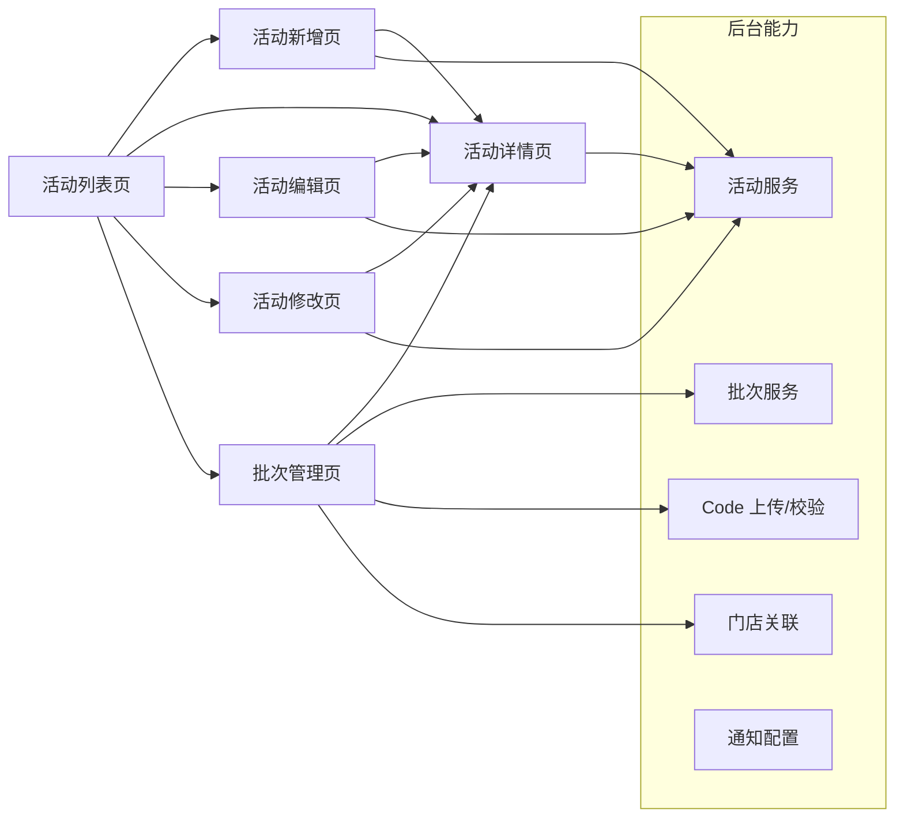
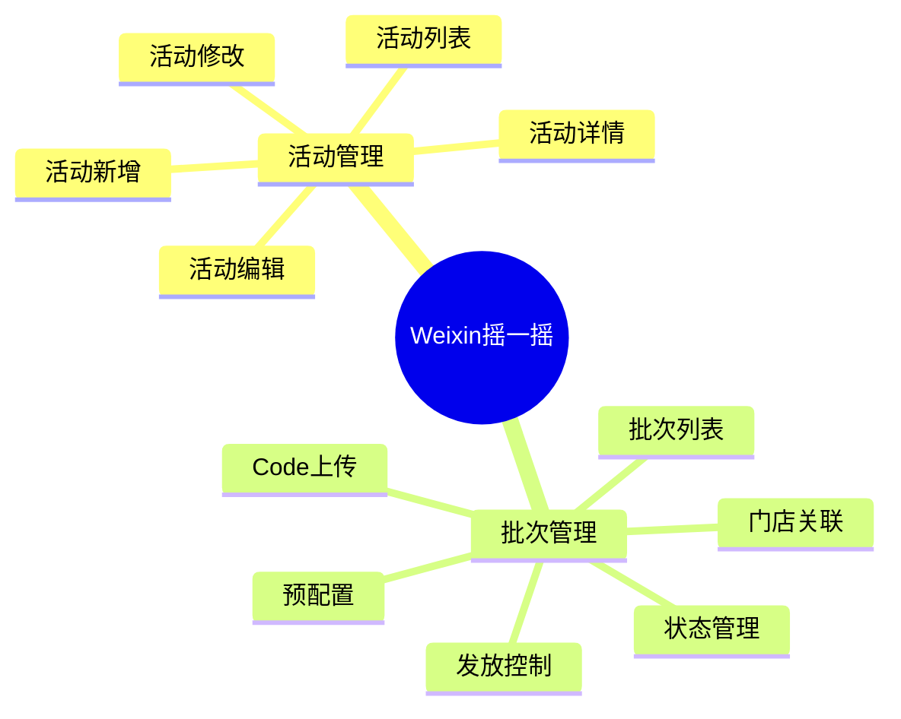
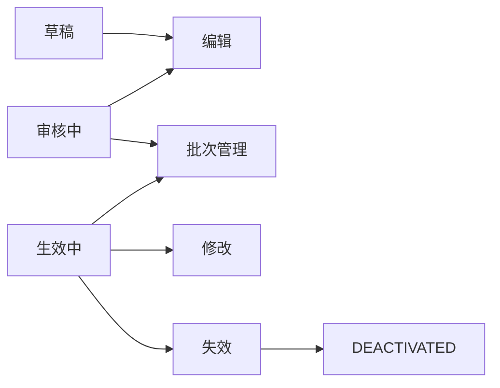
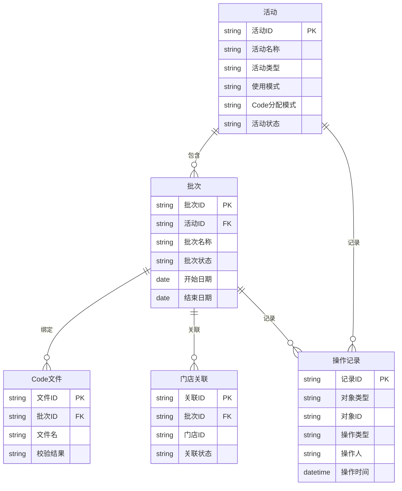

# Weixin摇一摇产品需求文档（PRD）

> 版本阶段：正式评审稿  
> 当前状态：评审中  
> 适用范围：Weixin摇一摇需求目录下的活动管理、批次管理与页面展示能力

## 1. 文档信息

| 项目 | 内容 |
|---|---|
| 项目名称 | Weixin摇一摇 |
| 产品名称 | Weixin摇一摇活动管理 |
| 模块/子系统 | 商品券活动管理 |
| 文档名称 | PRD |
| 文档版本 | V1.3 |
| 编写人 | Codex |
| 业务负责人 | 待评审签核 |
| 产品负责人 | 待评审签核 |
| 评审状态 | 评审中 |
| 编写日期 | 2026-05-10 |

## 2. 修订记录

| 文档版本号 | 提交时间 | 修订内容 | 修订人 | 审核人 |
|---|---|---|---|---|
| V1.0 | 2026-05-10 | 首版正式 PRD，汇总 6 个页面设计稿的已收口内容，并形成统一需求基线 | Codex | 待评审签核 |
| V1.1 | 2026-05-10 | 方案 A 冻结补强版：补充角色-权限-动作矩阵、活动层/批次层职责边界、状态迁移原则、接口契约要求、异常与验收基线；6 个已评审页面正文保持不变，仅补冻结外围约束 | Codex | 待评审签核 |
| V1.2 | 2026-05-10 | 术语统一与冻结闭环加强版：统一列表页时间窗口术语为“活动日期窗口（活动使用时间范围）”，细化列表页验收断言，并把原型绑定与归档口径切到正式回读源文件版本 | Codex | 待评审签核 |
| V1.3 | 2026-05-10 | 最终签核清单收敛版：将第 10 章待签项收束为唯一人工确认清单，仅保留业务、产品、技术、测试及原型/归档责任人的签核字段 | Codex | 待评审签核 |

## 3. 需求申请信息

| 业务需求 / Epic | 产品需求 / User Story | 需求描述 | 记录日期 | 计划版本 | 提出部门 |
|---|---|---|---|---|---|
| Weixin摇一摇活动管理 | 统一创建、维护、查看和执行商品券活动 | 覆盖活动列表、活动新增、活动编辑、活动修改、活动详情与批次管理，统一活动创建、草稿接续、生效前修订、只读详情与批次发放管理能力 | 2026-05-10 | V1.3 | 业务方待评审确认 |

## 4. 产品概述

### 4.1 业务背景

Weixin摇一摇用于承载商品券活动的创建、审阅、展示和批次执行管理。本 PRD 冻结范围内，目标是把活动层与批次层的职责边界固定下来，并把列表、详情、编辑、修改和批次管理的入口关系统一起来。当前需要解决的问题主要包括：

- 活动创建、草稿修订、生效前修订与生效后低风险修改的入口不统一
- 列表、详情、编辑、修改、批次管理之间的职责边界需要进一步收口
- `Code` 上传、门店关联、预预算、发放控制等批次层能力必须从活动层剥离
- 活动列表的检索口径、时间范围筛选口径和状态口径需要统一
- 正式冻结前需要形成可追踪的 PRD、原型绑定和交付留痕

本章冻结后，后续章节只允许围绕已确认范围补充规则、接口约束和验收标准，不再回改本章的业务边界定义。

### 4.9 方案 A 冻结补强原则

- 6 个已通过评审的页面正文不回改，只在主 PRD 中补充跨页治理、冻结门禁和验收约束。
- 如需引用已评审页面，仅调整矩阵、术语、路径和责任边界，不重写页面业务流程。
- 所有新增约束都应服务于冻结、研发拆解、测试验收和原型留痕，不新增页面职责。
- 若后续仍需修改页面正文，必须先说明修改理由，并评估是否会重新打开页面评审。

### 4.10 状态判定原则

- `审核中` 指提交后到审核结果产生前的期间，不额外拆分中间状态。
- `进入执行阶段` 的唯一判定依据为批次首次进入 `SENDING`。
- `PAUSED` 继续后若满足执行条件，应回到 `SENDING`；不允许定义模糊的中间恢复态。
- `STOPPED` 只表示自然终态，仅允许查看，不再回流到可编辑或可发放状态。

### 4.2 目标用户

| 目标用户 | 角色职责 | 主要诉求 | 权限范围 |
|---|---|---|---|
| 产品经理 | 管理需求范围、流程、评审与交付 | 快速定位活动、核对状态、确认范围 | 查看、编辑、修改、评审 |
| 运营人员 | 创建和维护活动配置 | 快速创建活动、补全信息、进行生效前调整 | 创建、编辑、提交 |
| 审核/管理角色 | 审核活动和批次配置 | 核对规则、确认是否可进入下一阶段 | 查看、预配置、审核 |
| 执行角色 | 进行批次发放和控制 | 管理批次、发放、暂停、失效 | 批次管理与发放控制 |
| 门店/区域协同角色 | 配合门店关联与执行 | 查看关联门店和配置结果 | 只读或受控操作 |

### 4.2.1 角色边界说明

- 产品经理负责需求范围、评审结论、冻结判断和交付确认，不承担日常配置执行
- 运营人员负责活动与批次的创建、补全、修改与提交，是主要业务操作者
- 审核/管理角色负责规则核对和是否进入下一阶段的判断，不直接改写业务规则
- 执行角色负责批次发放、暂停、失效等执行动作
- 门店/区域协同角色仅在门店关联范围内参与受控操作

### 4.3 产品目标

| 目标类型 | 目标说明 | 预期结果 | 成功指标 |
|---|---|---|---|
| 用户价值 | 降低活动创建、修订与批次管理的理解成本 | 用户能按状态快速找到正确入口 | 入口跳转正确率提升 |
| 业务价值 | 收口活动与批次职责边界，减少返工与误操作 | 活动层与批次层职责清晰 | 误入错误入口次数下降 |
| 产品价值 | 形成可复用的活动管理 PRD 与页面设计基线 | 六个页面设计稿可统一到正式 PRD | 需求评审一次通过率提升 |
| 交付价值 | 支持正式评审、冻结、交付与后续变更管理 | 可直接进入交付包输出阶段 | PRD/原型/交付包可追溯 |

### 4.3.1 冻结目标

本章冻结目标是确认以下内容：

- 需求对象为 Weixin摇一摇 活动管理与批次管理
- 页面职责划分固定为活动列表、活动新增、活动编辑、活动修改、活动详情、批次管理六类页面
- `Code` 上传、门店关联、预预算、发放控制属于批次层，不进入活动新增/编辑/修改页
- 活动列表支持按状态与时间窗口检索，并以部分重叠规则筛选活动日期窗口
- 活动详情页为只读快照，不承载编辑和发放动作

### 4.4 应用架构

### 4.5 功能架构

### 4.6 名词解释

| 名词 | 定义 |
|---|---|
| 活动 | 商品券活动的业务对象，是列表、详情和批次的上层承载对象 |
| 批次 | 活动下的发放执行单元，负责预配置、Code、门店、预算和发放控制 |
| 草稿 | 未提交审核的活动或批次编辑结果 |
| 预配置 | 审核中或发放前的准备性配置结果，不等同于最终发放态 |
| 活动日期窗口 | 列表页用于筛选的日期窗口，等同于活动使用时间范围 |
| `SINGLE` | 使用模式的固定值，表示单券模式 |
| `UPLOAD` | Code 分配模式的固定值，表示通过文件上传提供 Code |
| `AUDITING` | 活动审核中状态；在批次页中仅开放预配置类受控能力 |
| `EFFECTIVE` | 活动生效态；对应活动层可进入修改和批次管理入口 |
| `SENDING` | 批次发放中状态 |
| `PAUSED` | 批次已暂停状态 |
| `STOPPED` | 批次自然终态，仅允许查看 |
| `DEACTIVATED` | 活动或批次失效终态 |

### 4.7 业务场景

| 场景编号 | 场景名称 | 场景描述 | 目标角色 |
|---|---|---|---|
| S1 | 活动列表检索 | 按名称、ID、状态、时间范围和使用时间窗口查找活动 | 产品、运营 |
| S2 | 首次创建活动 | 从新增页完成首次活动创建并进入审核 | 运营、产品 |
| S3 | 草稿继续补全 | 系统识别已有草稿后跳转编辑页继续补全 | 运营 |
| S4 | 生效前修订 | 审核中且未进入执行阶段的活动进行修订 | 运营、产品 |
| S5 | 生效后低风险修改 | 对已生效活动的展示类字段进行低风险修改 | 运营、产品 |
| S6 | 批次执行与控制 | 管理批次预配置、门店关联、Code 上传与发放控制 | 执行角色 |

### 4.8 本章冻结结论

本章确认以下内容后可冻结：

- Weixin摇一摇 的正式需求对象和产品目标明确
- 角色、权限、场景、术语均已定义到可进入功能拆解的粒度
- 本 PRD 冻结范围内只讨论活动管理与批次管理，不扩展到其他营销能力
- 后续第5章开始按照页面级功能需求继续冻结

## 5. 功能需求

### 5.1 活动列表页

#### 5.1.1 功能描述

活动列表页是 Weixin摇一摇 的统一入口，用于承载活动检索、查看、跳转和状态分发。该页只管理活动级能力，不展开批次详情、Code 上传、门店关联和后端接口细节；批次相关能力统一进入批次管理页。

#### 5.1.2 用户故事

作为产品或运营人员，我希望在列表页快速查找目标活动，并根据活动状态跳转到正确入口，以便高效处理创建、修订、查看和批次管理操作。

#### 5.1.3 前置条件

- 用户已登录并具备相应权限
- 活动数据已存在
- 列表页能够访问当前需求目录下的活动数据快照
- 列表页展示的是活动层数据，不直接展开批次层明细

#### 5.1.4 目标用户

- 产品经理
- 运营人员
- 审核/管理角色
- 执行角色

#### 5.1.5 后置条件

- 用户可进入活动详情页、活动新增页、活动编辑页、活动修改页或批次管理页
- 用户可按状态识别可执行动作
- 用户完成查看或跳转后，不改变活动的业务状态

#### 5.1.6 页面/原型

- 原型/预览图：见第 10.5 章正式绑定记录
- 可编辑源文件：见第 10.5 章正式绑定记录
- 页面说明：活动总览、筛选、状态分发、入口跳转

#### 5.1.7 功能逻辑说明

1. 页面默认展示活动列表数据。
2. 用户可通过检索条件过滤活动。
3. 用户点击不同操作按钮后，系统按照活动状态跳转到对应页面。
4. `使用模式` 与 `Code 分配模式` 为系统固定值，不作为查询条件。
5. `活动日期窗口`（即 `活动使用时间范围`）仅用于查找与查询时间范围存在**部分重叠**的活动，不要求完全覆盖。
6. 列表页不允许直接编辑活动字段，只允许按状态跳转到对应页面。

#### 5.1.8 字段说明

| 字段 | 说明 | 是否展示 | 备注 |
|---|---|---:|---|
| 商品券名称 | 活动名称关键字 | 是 | 模糊搜索 |
| 商品券ID | 活动唯一标识 | 是 | 精确搜索 |
| 商品券类型 | 满减券 / 兑换券 | 是 | 固定枚举 |
| 优惠范围 | 活动适用范围摘要 | 是 | 展示摘要 |
| 状态 | 当前活动状态 | 是 | 状态标签展示 |
| 创建人 | 活动创建人 | 是 | 支持 hover 账号信息 |
| 最后修改人 | 最近一次修改活动的人 | 是 | 支持 hover 账号信息 |
| 创建时间 | 活动创建时间 | 是 | 显示到分钟 |
| 最后修改时间 | 活动最后修改时间 | 是 | 显示到分钟 |
| 活动日期窗口 | 当前活动下批次的日期窗口 | 是 | 仅展示汇总窗口；与“活动使用时间范围”同义 |

#### 5.1.9 业务规则

- 列表页是活动总入口
- 顶部仅保留 `新建活动`
- 行内按钮包括 `查看`、`编辑`、`修改`、`批次管理`、`失效`
- `活动日期窗口` 采用部分重叠规则进行筛选；同义术语为 `活动使用时间范围`
- 草稿不参与复杂批次语义展示
- `EFFECTIVE` 仅表示活动生效态，不是批次状态枚举
- `失效` 仅允许对 `生效中` 活动触发，并且必须经过二次确认
- 列表页中的所有跳转均属于状态驱动入口，不改变活动内容本身

#### 5.1.10 权限规则

| 动作 | 可见状态 | 说明 |
|---|---|---|
| 查看 | 全部状态 | 进入详情页 |
| 编辑 | `草稿`、`审核中` | 进入编辑页 |
| 修改 | `生效中` | 进入修改页 |
| 批次管理 | `审核中`、`生效中` | 进入批次管理页 |
| 失效 | `生效中` | 触发二次确认后失效，失效后转入 `DEACTIVATED` |

#### 5.1.11 状态流转

#### 5.1.12 异常情况

| 场景 | 提示 | 处理方式 |
|---|---|---|
| 无结果 | 未找到符合条件的数据 | 显示空态 |
| 无权限 | 当前角色无操作权限 | 按权限隐藏或置灰 |
| 状态加载失败 | 状态信息获取失败 | 提示重试 |
| 时间范围为空 | 当前无可查询批次日期窗口 | 展示 `--` |

#### 5.1.13 验收标准

- 列表页可完成检索、查看和入口跳转
- 不将 `使用模式`、`Code 分配模式` 作为查询条件
- `活动日期窗口` 的筛选结果与页面规则一致，且在相同条件下重复查询结果保持一致
- `批次管理`、`编辑`、`修改` 和 `失效` 按状态正确控制
- 列表页不出现批次层编辑、Code 上传或门店关联能力

#### 5.1.14 本页冻结结论

本页确认以下内容后可冻结：

- 活动列表页仅承担活动层总入口职责
- 状态驱动跳转、检索字段和权限规则已固定
- 批次能力不在列表页展开，统一进入批次管理页
- 页面验收标准已明确，可进入后续 5.2 新增页冻结

### 5.2 活动新增页

#### 5.2.1 功能描述

活动新增页负责“从无到有”的首次创建流程。系统识别到已有草稿时，新增页不继续承载草稿恢复，而是直接跳转到活动编辑页继续补全。

#### 5.2.2 用户故事

作为运营人员，我希望先选择券类型，再填写活动表单并提交审核，以便快速创建新活动。

#### 5.2.3 前置条件

- 仅支持 `满减券`、`兑换券`
- `使用模式` 固定为 `SINGLE`
- `Code 分配模式` 固定为 `UPLOAD`
- 当前活动在同一时间仅允许存在一个草稿

#### 5.2.4 页面结构

1. 券类型选择页
2. 创建表单页

#### 5.2.5 页面/原型

- 原型/预览图：见第 10.5 章正式绑定记录
- 可编辑源文件：见第 10.5 章正式绑定记录
- 页面说明：券类型选择、首次创建、草稿保存、提交审核

#### 5.2.6 功能逻辑说明

1. 先选择券类型，再进入对应表单。
2. 进入表单后不得中途切换券类型。
3. 若系统识别到同一活动存在草稿，则直接跳转到活动编辑页。
4. 保存草稿允许跨天恢复。
5. 提交审核成功后，活动状态进入 `审核中`。

#### 5.2.7 字段说明

**公共区**

| 字段 | 说明 | 是否必填 | 规则 |
|---|---|---:|---|
| 商品券名称 | 活动名称 | 是 | 3-15 字符，支持中英文、数字、空格和常用符号 |
| 商品券图片 | 活动展示图 | 是 | 仅支持图片上传，建议 1:1，大小不超过 2M |
| 商品券背景图 | 活动背景图 | 是 | 仅支持图片上传，建议 65:77，大小不超过 2M |
| 商品券详情图 | 活动详情图列表 | 否 | 最多 8 张 |
| 商品券标题文案 | 页面展示标题 | 是 | 3-20 字符 |
| 商品券副标题 | 辅助展示文案 | 否 | 0-30 字符 |
| 规则摘要 | 前台可读规则概述 | 是 | 0-200 字符 |
| 使用模式 | 系统固定值 | 是 | `SINGLE`，只读 |

**满减券差异区**

| 字段 | 说明 | 是否必填 | 规则 |
|---|---|---:|---|
| 门槛金额 | 触发门槛 | 是 | 大于 0 的金额 |
| 减免金额 | 减免金额 | 是 | 大于 0，且不大于门槛金额 |
| 满减说明 | 补充说明 | 否 | 0-100 字符 |

**兑换券差异区**

| 字段 | 说明 | 是否必填 | 规则 |
|---|---|---:|---|
| 商品原价 | 对应原价 | 是 | 大于 0 的金额 |
| 适用商品组合 | 可兑换商品组合配置 | 是 | 至少 1 组，最多 50 组 |
| 组合名称 | 商品组合名称 | 是 | 1-15 字符 |
| 可选单品数量 | 用户可选单品数量 | 是 | 正整数，且不大于当前组合单品总数 |
| 单品列表 | 组合内单品列表 | 是 | 至少 1 个单品，最多 99 个单品 |
| 单品名称 | 单品展示名称 | 是 | 1-15 字符 |
| 单品价格 | 单品价格 | 是 | 大于 0 的金额 |
| 单品数量 | 单品数量 | 是 | 正整数，至少 1 |
| 小程序 AppID | 单品跳转标识 | 否 | 与路径联动校验 |
| 小程序路径 | 单品跳转路径 | 否 | 与 AppID 联动校验 |

#### 5.2.8 业务规则

- 券类型仅支持 `满减券` 和 `兑换券`
- 券类型一旦进入创建表单，不允许中途切换
- 返回券类型选择页时不保留当前未保存内容
- 同一活动同一时间仅允许存在一个草稿
- 草稿允许保存，且以活动为单位保存
- `Code 文件上传` 不在新增页，统一归入批次管理页
- 新增页仅负责首次创建，不负责已有活动修订
- 点击 `提交审核` 成功后，返回活动详情页

#### 5.2.9 异常情况

| 场景 | 提示 | 处理方式 |
|---|---|---|
| 名称重复 | 名称已存在 | 提示修改名称 |
| 图片不合规 | 图片格式或尺寸不符合要求 | 阻止提交 |
| 必填项未填 | 存在未填写项 | 阻止提交并定位字段 |
| 单品列表为空 | 每个组合至少需要 1 个单品 | 阻止提交 |
| AppID/路径只填其一 | 两个字段需同时填写或同时不填 | 阻止提交 |

#### 5.2.10 验收标准

- 能够完成券类型选择、表单填写、草稿保存、提交审核
- 草稿存在时，新建入口可直接跳转到编辑页继续补全
- 校验规则与页面字段表一致
- 新增页不承载 `Code` 上传、门店关联或批次预配置能力

#### 5.2.11 本页冻结结论

本页确认以下内容后可冻结：

- 新增页仅负责首次创建，不负责草稿恢复和生效后修改
- 券类型选择与表单结构已固定
- 字段校验、异常提示和提交后状态流转已明确
- 页面验收标准已明确，可进入后续 5.3 编辑页冻结

### 5.3 活动编辑页

#### 5.3.1 功能描述

活动编辑页用于草稿补全和 `审核中` 且未进入执行阶段的修订。它是唯一的草稿继续入口，不承接生效后修改，也不承接 `Code` 配置。

#### 5.3.2 用户故事

作为运营人员，我希望继续编辑已有草稿或审核前活动，以便补全未完成字段并重新提交审核。

#### 5.3.3 前置条件

- 仅 `草稿`、`审核中` 且未进入执行阶段的活动可进入
- `EFFECTIVE`、`DEACTIVATED` 不使用本页
- `Code` 上传归入批次管理页

#### 5.3.4 页面结构

1. 基础信息
2. 公共字段区
3. 满减券差异区
4. 兑换券差异区
5. 编辑确认

#### 5.3.5 页面/原型

- 原型/预览图：见第 10.5 章正式绑定记录
- 可编辑源文件：见第 10.5 章正式绑定记录
- 页面说明：草稿补全、生效前修订、保存与重新提交

#### 5.3.6 字段说明

活动编辑页的字段集与新增页一致，字段规则、图片规格、长度限制与联动关系沿用新增页定义，不再通过“引用新建页”来描述。

#### 5.3.7 业务规则

- `EFFECTIVE` 和 `DEACTIVATED` 不使用本页
- `Code` 配置不放在编辑页
- 低风险字段可编辑，高风险字段仅只读展示
- 保存后仍处于生效前流程，不影响历史已发券
- 详情页不是编辑入口

#### 5.3.8 状态控制

| 状态 | 是否允许进入编辑页 | 是否允许保存修改 | 说明 |
|---|---:|---:|---|
| 草稿 | 是 | 是 | 可继续补全 |
| 审核中且未执行 | 是 | 是 | 可生效前修订 |
| 生效中 | 否 | 否 | 走修改页 |
| 已失效 | 否 | 否 | 不使用本页 |

#### 5.3.9 验收标准

- 草稿可从列表/详情进入编辑页继续补全
- 审核中且未进入执行阶段的活动可通过本页修订
- `EFFECTIVE` 与 `DEACTIVATED` 不出现编辑动作
- 编辑页不承载 `Code` 配置、门店关联或批次预配置能力

#### 5.3.10 本页冻结结论

本页确认以下内容后可冻结：

- 编辑页仅承接草稿补全与审核前修订
- 进入条件、字段集、状态控制和验收标准已明确
- 页面不承接 `EFFECTIVE` 后修改，也不承接批次能力
- 页面验收标准已明确，可进入后续 5.4 修改页冻结

### 5.4 活动修改页

#### 5.4.1 功能描述

活动修改页用于对已 `EFFECTIVE` 的活动进行低风险修订。页面仅允许修改展示类、文案类和图片类等不影响券规则与批次执行结果的字段。

#### 5.4.2 用户故事

作为运营人员，我希望在活动生效后修订低风险展示配置，以便修正展示内容并仅影响后续新发券。

#### 5.4.3 前置条件

- 仅 `EFFECTIVE` 可进入
- `AUDITING`、`DEACTIVATED` 不使用本页
- 仅允许修改低风险字段

#### 5.4.4 页面/原型

- 原型/预览图：见第 10.5 章正式绑定记录
- 可编辑源文件：见第 10.5 章正式绑定记录
- 页面说明：生效后低风险修订、保存与回流详情页

#### 5.4.5 字段范围

| 字段类别 | 是否可编辑 | 说明 |
|---|---:|---|
| 商品券图片 | 是 | 低风险展示类 |
| 商品券背景图 | 是 | 低风险展示类 |
| 商品券标题文案 | 是 | 低风险展示类 |
| 商品券副标题 | 是 | 低风险展示类 |
| 规则摘要 | 是 | 低风险展示类 |
| 门槛金额 | 否 | 高风险字段，只读 |
| 减免金额 | 否 | 高风险字段，只读 |
| 商品原价 | 否 | 高风险字段，只读 |
| 适用商品组合 | 否 | 高风险字段，只读 |
| `Code` 配置 | 否 | 不在本页 |

#### 5.4.6 业务规则

- 修改结果仅影响后续新发券，不影响历史已发券
- 高风险字段只读，不进入本页编辑动作
- `Code` 配置在批次管理页处理
- 保存前必须完成必填项校验
- 保存成功后返回详情页并刷新本地快照

#### 5.4.7 验收标准

- 只有 `EFFECTIVE` 可进入并保存
- 高风险字段不能编辑
- 保存后仅影响后续新发券
- 修改页不承载批次发放、门店关联或 Code 上传能力

#### 5.4.8 本页冻结结论

本页确认以下内容后可冻结：

- 修改页仅承接生效后的低风险修订
- 可编辑字段与只读字段已固定
- 保存后对历史已发券的影响边界已明确
- 页面验收标准已明确，可进入后续 5.5 详情页冻结

### 5.5 活动详情页

#### 5.5.1 功能描述

活动详情页是活动的只读快照页，用于展示活动核心身份信息、展示信息和批次入口。它不承接活动编辑、不承接批次编辑，也不承接 `Code` 配置。

#### 5.5.2 用户故事

作为产品或运营人员，我希望查看活动完整快照并进入正确的后续入口，以便核对活动状态和执行信息。

#### 5.5.3 页面结构

1. 顶部摘要区
2. 基础信息区
3. 展示信息区
4. 批次概览区
5. 操作记录区

#### 5.5.4 页面/原型

- 原型/预览图：见第 10.5 章正式绑定记录
- 可编辑源文件：见第 10.5 章正式绑定记录
- 页面说明：活动只读快照、状态核对、批次入口跳转

#### 5.5.5 业务规则

- 详情页只读
- 只展示活动层信息，不展示批次编辑语义
- 批次概览仅做汇总与跳转
- 批次关键动作记录统一进入批次管理页
- 从编辑页、修改页或批次管理页返回时，需重新拉取本地最新快照并刷新

#### 5.5.6 详情展示字段

| 区域 | 字段 |
|---|---|
| 顶部摘要 | 商品券名称、商品券ID、商品券类型、状态、规则摘要、创建人、最后修改人、创建时间、最后修改时间 |
| 基础信息 | 商品券名称、商品券ID、商品券类型、使用模式、Code 分配模式、状态 |
| 展示信息 | 商品券主图、商品券标题文案、副标题、原价、适用商品组合、背景图、详情图 |
| 批次概览 | 批次数量、批次状态统计、最近创建批次、最近更新时间、批次管理入口 |
| 操作记录 | 活动级创建记录、编辑记录、修改记录、失效记录 |

#### 5.5.7 验收标准

- 页面只读，不出现编辑态
- `AUDITING` 和 `EFFECTIVE` 的入口状态与列表页一致
- 批次概览仅用于汇总与跳转
- 详情页不出现 `Code` 上传、门店关联或批次编辑动作

#### 5.5.8 本页冻结结论

本页确认以下内容后可冻结：

- 详情页仅作为只读快照页
- 展示字段、批次概览和操作记录区已固定
- 页面不承接编辑、修改或批次管理能力
- 页面验收标准已明确，可进入后续 5.6 批次管理页冻结

### 5.6 批次管理页

#### 5.6.1 功能描述

批次管理页用于管理单个活动下的批次集合，承载批次创建、预配置、预预算、门店关联、Code 管理、发放控制和状态管理。后端接口流转与生命周期控制不在本页展开。

#### 5.6.2 用户故事

作为执行或管理角色，我希望在批次页完成批次创建、预配置、Code 上传和发放控制，以便让活动按可控节奏执行。

#### 5.6.3 前置条件

- 批次必须归属到某一个活动
- `AUDITING` 状态允许进入，但仅支持查看和预配置
- `SENDING` 是批次发放中状态
- `PAUSED`、`STOPPED`、`DEACTIVATED` 均为受限状态

#### 5.6.4 页面结构

1. 活动摘要区
2. 批次列表区
3. 批次详情区
4. 预预算配置区
5. 门店关联区
6. Code 管理区
7. 通知配置区
8. 操作记录区

#### 5.6.5 页面/原型

- 原型/预览图：见第 10.5 章正式绑定记录
- 可编辑源文件：见第 10.5 章正式绑定记录
- 页面说明：批次创建、预配置、Code 上传、门店关联与发放控制

#### 5.6.6 核心规则

- 批次不脱离活动独立存在
- `AUDITING` 仅允许查看和预配置
- `EFFECTIVE` 仅表示活动生效态，不是新的批次状态值
- `pre-config` 仅是页面概念，不应作为接口状态
- `STOPPED` 为自然终态，仅允许查看
- `DEACTIVATED` 不允许继续编辑、发放或上传 Code
- `Code` 文件上传与校验归入本页

#### 5.6.7 批次状态

| 状态 | 说明 | 可执行操作 |
|---|---|---|
| `AUDITING` | 审批中 | 查看、预配置 |
| `SENDING` | 发放中 | 完整管理、发放、暂停 |
| `PAUSED` | 已暂停 | 继续、预配置、查看 |
| `STOPPED` | 已停止 | 仅查看 |
| `DEACTIVATED` | 已失效 | 仅查看 |

#### 5.6.8 关键字段

| 字段 | 说明 | 规则 |
|---|---|---|
| 批次编号 | 批次唯一标识 | 系统生成 |
| 批次名称 | 批次展示名称 | 可编辑字段 |
| 批次状态 | 当前批次状态 | 采用接口状态 |
| 可用开始日期 | 开始日期窗口 | 保存时归一化为 `00:00:00` |
| 可用结束日期 | 结束日期窗口 | 保存时归一化为 `23:59:59` |
| 总 Code 数量 | 已上传 Code 总数 | 只读 |
| 可用 Code 数量 | 当前可用 Code | 只读 |
| 已发放量 | 批次生命周期内已发放次数 | 只读 |
| 门店关联状态 | 门店关联结果 | `store_scope = SPECIFIC` 时开放 |
| 关联门店列表 | 已关联门店明细 | 仅在门店范围指定时开放 |
| 通知配置 | 通知配置对象 | 页面级配置 |

#### 5.6.9 业务规则

- 批次时间仅保留日期级语义
- 周期、离散时间段、秒级规则不再展示
- `available_begin_time` / `available_end_time` 仅保留日期选择，保存时统一归一化
- `available_days`、`wait_days_after_receive` 受日期窗口约束
- `store_scope = ALL` 时不展示门店关联操作
- `store_scope = SPECIFIC` 时支持批量关联与取消关联
- `Code` 上传前必须先通过校验
- 预预算与基础信息分离
- 通知配置作为独立配置对象

#### 5.6.10 验收标准

- `AUDITING` 仅允许查看和预配置
- `SENDING` 支持完整管理动作
- `DEACTIVATED` 不允许编辑、发放、预算或上传
- `Code` 上传必须先校验再进入下一步
- 批次页不承载活动新增、活动修改或活动详情编辑能力

#### 5.6.11 本页冻结结论

本页确认以下内容后可冻结：

- 批次管理页仅承接活动下的批次集合管理
- 批次状态、字段、业务规则和验收标准已明确
- `Code` 上传、门店关联、预预算和发放控制归入本页
- 页面验收标准已明确，可进入后续 5.7 一致性矩阵冻结

### 5.7 PRD-原型一致性矩阵

> 本矩阵仅用于冻结映射，不回改已通过评审的 6 个页面正文；页面内容以各自独立设计稿和评审结论为准。

| 功能点 / 场景 | 对应原型页面 / 路径 | 关键状态 | 关键交互 | 关联规则 / 异常 | 是否已覆盖 |
|---|---|---|---|---|---|
| 活动列表检索 | [Weixin摇一摇_活动列表页_v1.6_20260510.md](E:/Codex/New_rules/docs/versions/Weixin摇一摇/Weixin摇一摇_活动列表页_v1.6_20260510.md) | 列表态 | 搜索、筛选、跳转 | 时间范围部分重叠 | 是 |
| 活动新增 | [Weixin摇一摇_活动新增页_v1.8_20260510.md](E:/Codex/New_rules/docs/versions/Weixin摇一摇/Weixin摇一摇_活动新增页_v1.8_20260510.md) | 草稿/审核中 | 选券类型、填写、提交 | 草稿存在直接跳转编辑页 | 是 |
| 活动编辑 | [Weixin摇一摇_活动编辑页_v1.8_20260510.md](E:/Codex/New_rules/docs/versions/Weixin摇一摇/Weixin摇一摇_活动编辑页_v1.8_20260510.md) | 草稿/审核中 | 继续补全、保存、提交 | 生效后不可编辑 | 是 |
| 活动修改 | [Weixin摇一摇_活动修改页_v1.3_20260510.md](E:/Codex/New_rules/docs/versions/Weixin摇一摇/Weixin摇一摇_活动修改页_v1.3_20260510.md) | 生效中 | 低风险字段修订 | 高风险字段只读 | 是 |
| 活动详情 | [Weixin摇一摇_活动详情页_v1.5_20260510.md](E:/Codex/New_rules/docs/versions/Weixin摇一摇/Weixin摇一摇_活动详情页_v1.5_20260510.md) | 全部只读 | 查看、跳转 | 批次动作不在本页展开 | 是 |
| 批次管理 | [Weixin摇一摇_批次管理页_v1.7_20260510.md](E:/Codex/New_rules/docs/versions/Weixin摇一摇/Weixin摇一摇_批次管理页_v1.7_20260510.md) | 审核中/发放中/暂停/失效 | 预配置、上传、发放、暂停 | Code 校验、门店关联、预预算分离 | 是 |

### 5.8 本章冻结结论

本章确认以下内容后可冻结：

- 六个功能页面的职责边界已经固定
- 活动层与批次层的拆分关系已经固定
- 页面级字段、状态、权限、异常和验收标准已经明确
- 原型路径将在第 10.5 章正式绑定记录中补齐，需求侧不再调整页面职责

## 6. 集成需求

### 6.1 集成范围

本 PRD 涉及的集成能力主要包括，且仅包括：

- 活动服务：活动创建、编辑、修改、详情读取
- 批次服务：批次创建、状态切换、发放控制
- Code 上传与校验：批次待用 Code 的文件上传、合法性校验和状态回写
- 门店关联：`store_scope = SPECIFIC` 时的门店绑定与解绑
- 通知配置：批次执行相关通知能力的配置和保存

### 6.2 集成规则

- `Code` 上传归入批次管理页，不归入活动新增/编辑/修改页
- `EFFECTIVE` 在活动层表示生效态，在批次页只作为入口能力，不作为批次状态值
- 批次预配置不等同于发放态的完整编辑能力
- 后端接口失败时应保留当前草稿或配置结果，并提示用户重试
- 活动层接口与批次层接口应分别设计，不通过单一接口承担双层职责
- 接口设计必须同时满足：对象归属清晰、输入输出稳定、错误码可判定、失败可重试、重复提交可幂等

### 6.3 依赖与待决项

> 以下依赖项在当前版本仅要求“责任边界明确、接口能力可评审”，正式字段与错误码仍由接口评审补齐，不在本次回改 6 个页面正文的范围内。

| 依赖项 | 说明 | 当前状态 |
|---|---|---|
| 活动服务接口 | 支持列表、详情、创建、编辑、修改、失效 | 待接口评审确认 |
| 批次服务接口 | 支持列表、预配置、发放、暂停、失效 | 待接口评审确认 |
| Code 文件处理 | 支持上传、校验、回写 | 待接口评审确认 |
| 门店服务 | 支持关联与取消关联 | 待接口评审确认 |
| 通知服务 | 支持配置与触发 | 待接口评审确认 |

#### 6.3.1 接口契约要求

| 项目 | 要求 |
|---|---|
| 责任归属 | 每个接口必须明确归属服务，不允许活动层和批次层共用一个“万能接口” |
| 输入输出 | 必须定义请求对象、返回对象、分页口径和状态口径 |
| 幂等性 | 创建、提交、上传、失效、暂停、继续等可重复操作必须定义幂等策略 |
| 错误处理 | 必须定义可读错误码、提示文案和重试方式 |
| 回退策略 | 失败后必须保留草稿或当前配置结果，不得静默丢失用户输入 |

### 6.4 本章冻结结论

本章确认以下内容后可冻结：

- 集成范围已经限定在活动服务、批次服务、Code 文件处理、门店服务和通知服务
- 活动层与批次层的集成边界已经固定，不允许交叉承担职责
- 当前待决项仅作为外部依赖留存，不影响本 PRD 的评审进入
- 后续如果接口字段、状态或错误码变化，应通过变更流程单独管理

## 7. 非功能性需求

### 7.1 性能需求

| 项目 | 要求 |
|---|---|
| 列表查询 | 待性能基线评审 |
| 详情加载 | 待性能基线评审 |
| 批次列表与配置保存 | 待性能基线评审 |
| Code 上传与校验 | 待性能基线评审 |

### 7.2 安全需求

- 需要登录认证
- 按角色控制可见按钮与可编辑字段
- 敏感字段按权限隐藏或只读
- 所有关键操作应留痕
- `Code` 上传需要防重和防越权校验

### 7.3 监控需求

- 活动创建、提交审核、失效需要留痕
- 批次创建、预配置保存、Code 上传、发放、暂停、失效需要留痕
- 关键失败场景需要记录失败原因

### 7.4 运行环境

| 类型 | 要求 |
|---|---|
| 前端形态 | Web 页面 |
| 时间口径 | 本地时区，默认 `Asia/Shanghai` |
| 浏览器 | 主流 Chromium 浏览器（Chrome / Edge） |
| 终端 | PC 为主；移动端仅做兼容评估，不作为本次冻结交付的强制范围 |

### 7.5 埋点需求

| 事件类型 | 事件说明 | 触发时机 | 记录字段 | 备注 |
|---|---|---|---|---|
| 页面曝光 | 活动列表/新增/编辑/修改/详情/批次页曝光 | 页面打开时 | 页面名、用户、时间 | 基础埋点 |
| 点击 | 新建、查看、编辑、修改、批次管理、失效 | 按钮点击时 | 按钮名、状态、用户 | 关键转化 |
| 保存 | 保存草稿、保存修改、保存预配置 | 保存成功时 | 页面、状态、结果 | 追踪成功率 |
| 提交 | 提交审核、发起批次发放 | 提交成功时 | 业务对象、状态、结果 | 追踪交付 |

### 7.6 本章冻结结论

本章确认以下内容后可冻结：

- 安全、监控、埋点和运行环境的约束方向已经明确
- 性能指标中的待决项已识别为后续实施量化内容，不再影响功能范围
- 非功能需求不扩展新的页面职责，只约束现有页面的质量边界
- 后续若补充具体性能数值，应作为实施或测试基线补录，不回改功能定义

## 8. 数据治理-逻辑模型

### 8.1 逻辑模型视图

### 8.2 业务对象及属性

| 业务对象 | 属性 | 类型 | 是否必填 | 说明 |
|---|---|---|---:|---|
| 活动 | 活动ID、名称、类型、状态、使用模式、Code 分配模式 | 对象 | 是 | 活动层主对象 |
| 批次 | 批次ID、名称、状态、开始日期、结束日期 | 对象 | 是 | 活动下执行单元 |
| Code文件 | 文件名、文件状态、校验结果 | 对象 | 否 | 批次待用资源 |
| 门店关联 | 门店ID、关联状态、关联结果 | 对象 | 否 | 仅指定门店范围时启用 |
| 操作记录 | 操作类型、操作人、操作时间、结果 | 对象 | 是 | 全链路留痕 |

### 8.3 本章冻结结论

本章确认以下内容后可冻结：

- 活动、批次、Code 文件、门店关联和操作记录的逻辑关系已经固定
- 逻辑模型仅作为需求层对象定义，不直接限定物理库表实现
- 后续如需补充字段，只能在既有对象下扩展，不再新增跨层概念
- 该逻辑模型与第 5 章的页面职责划分保持一致

## 9. 用户测试用例

| 测试用例ID | 关联编码 | 测试类型 | 测试场景 | 前置条件 | 测试步骤 | 测试数据 | 预期结果 |
|---|---|---|---|---|---|---|---|
| TC-001 | LIST-01 | 正常流程 | 列表页检索活动 | 存在活动数据 | 输入名称/ID/状态/时间条件并查询 | 关键活动字段 | 返回符合条件的活动列表 |
| TC-002 | LIST-02 | 状态分发 | 列表页按状态进入正确入口 | 存在不同状态活动 | 点击查看/编辑/修改/批次管理/失效 | 不同状态活动 | 跳转到正确页面 |
| TC-003 | ADD-01 | 正常流程 | 新增活动并提交审核 | 无草稿活动 | 选券类型、填写字段、提交 | 满减券 / 兑换券 | 创建成功并进入审核中 |
| TC-004 | ADD-02 | 异常流程 | 存在草稿时从新增入口跳转编辑页 | 同一活动存在草稿 | 点击新增活动 | 有草稿活动 | 直接进入编辑页继续补全 |
| TC-005 | EDIT-01 | 正常流程 | 草稿继续补全并保存 | 存在草稿活动 | 修改可编辑字段并保存 | 草稿活动 | 保存成功且仍处于生效前流程 |
| TC-006 | MODIFY-01 | 规则流程 | 生效中活动进行低风险修改 | 活动状态为 `EFFECTIVE` | 修改展示类字段并保存 | 生效中活动 | 保存成功，仅影响后续新发券 |
| TC-007 | DETAIL-01 | 只读流程 | 详情页查看快照 | 存在活动 | 打开详情页 | 目标活动 | 仅展示，不出现编辑动作 |
| TC-008 | BATCH-01 | 正常流程 | 批次页预配置 | 活动为审核中/生效中 | 新建批次、配置日期窗、门店、预算 | 批次配置数据 | 配置成功并保存 |
| TC-009 | BATCH-02 | 校验流程 | Code 文件上传校验 | 批次为可上传状态 | 上传 Code 文件并校验 | 非法/合法文件 | 合法可通过，非法阻止保存 |
| TC-010 | BATCH-03 | 状态控制 | 失效/暂停/停止状态动作控制 | 批次处于受限状态 | 尝试执行受限动作 | 受限状态批次 | 按状态限制操作 |

### 9.1 本章冻结结论

本章确认以下内容后可冻结：

- 10 条测试用例已经覆盖列表、新增、编辑、修改、详情和批次管理主流程
- 异常、状态和权限场景已经进入测试视角
- 后续如补充测试用例，应保持与第 5 章功能边界一致，不新增页面职责
- 测试用例可作为研发联调与验收检查的最小基线

## 10. 评审与确认

### 10.1 评审结论

| 结论 | 说明 | 评审人 | 日期 |
|---|---|---|---|
| 可冻结（待人工签核） | 当前文档在保留 6 个已评审页面正文不变的前提下，补齐了冻结外围治理、原型映射和交付留痕要求；第 10 章继续用于正式签核与归档记录 | 评审会确认 | 2026-05-10 |

### 10.2 最终签核清单

> 以下为唯一需要人工确认的签核项，其余页面、绑定和归档证据均视为已固定材料，不再作为待签项重复列出。

| 签核项 | 确认人 | 签字 | 日期 |
|---|---|---|---|
| 业务确认 |  |  |  |
| 产品确认 |  |  |  |
| 技术确认 |  |  |  |
| 测试确认 |  |  |  |
| 原型绑定确认 |  |  |  |
| 归档确认 |  |  |  |

### 10.3 原型交互验收

> 原型交互证据已固化在 `binding.md` 与 6 个页面设计稿中，不再单列为待签项；如后续补入独立 Figma / HTML 原型链接，再回填至绑定记录即可。

### 10.4 需求交付包输出

> 交付包清单、原型绑定记录与归档清单已分别固化到第 5.7 章、第 10.5 章、第 10.6 章以及对应外部文件，不再在此重复作为待签项。

### 10.5 原型绑定记录

> 原型绑定记录已形成正式载体 `docs/prototype/Weixin摇一摇/binding.md`，其中真正需要人工确认的仅为“确认人 / 确认时间”；其余字段均为固定信息，不再作为签核待办拆列。

### 10.6 原型归档记录

> 原型归档记录已形成正式载体 `docs/prototype/Weixin摇一摇/archive/Weixin摇一摇_v1.3_20260510/archive-manifest.md`，其中需要人工确认的仅为“归档确认人 / 时间”；其余均为留档证据，不再拆分成待签项。

### 10.7 本章冻结结论

本章确认以下内容后可冻结：

- 评审、签核、原型绑定和原型归档的责任链路已经定义
- `binding.md` 和归档目录属于正式留痕位置，已按正式路径落地
- 当前文档已具备冻结材料框架，剩余内容属于外部记录填充，不再改变 PRD 主体
- 第 10 章内容完成后，即可进入正式冻结与交付包输出

### 10.8 人工签核项

以下事项已收敛到第 10.2 章的人工签核清单，不再单独列为待决项：

- 业务、产品、技术、测试的人工签核
- 原型绑定确认
- 归档确认

## 11. 填写建议

- 每个功能页都应独立说明，不要把多个页面混写到同一段
- `Code` 上传、门店关联、预预算和发放控制必须与活动层拆开
- `AUDITING`、`EFFECTIVE` 和 `DEACTIVATED` 的页面权限必须明确
- 若字段暂未最终确认，优先写明确的人工签核项，不要留成散装空白
- 正式评审前必须补齐原型绑定和交互验收记录
