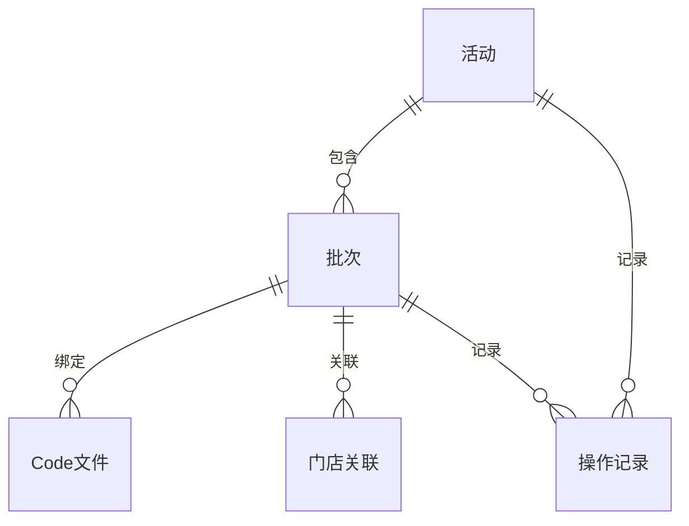

# Weixin摇一摇产品需求文档（PRD）

> 版本阶段：正式交付稿  
> 当前状态：已冻结待归档  
> 适用范围：Weixin摇一摇需求目录下的活动管理、批次管理与页面展示能力

## 封面信息

- 项目名称：Weixin摇一摇
- 文档名称：Weixin摇一摇产品需求文档 PRD / 需求规格说明
- 产品名称：Weixin摇一摇活动管理
- 文档版本：V1.5
- 编写人：Codex
- 编写日期：2026-05-11
- 所属部门：产品/业务协同

## 修订记录

| 文档版本号 | 提交时间 | 修订内容 | 修订人 | 审核人 |
|---|---|---|---|---|
| V1.0 | 2026-05-10 | 首版正式 PRD，汇总 6 个页面设计稿的已收口内容，并形成统一需求基线 | Codex | 待评审签核 |
| V1.1 | 2026-05-10 | 方案 A 冻结补强版：补充角色-权限-动作矩阵、活动层/批次层职责边界、状态迁移原则、接口契约要求、异常与验收基线 | Codex | 待评审签核 |
| V1.2 | 2026-05-10 | 术语统一与冻结闭环加强版：统一列表页时间窗口术语为“活动日期窗口（活动使用时间范围）” | Codex | 待评审签核 |
| V1.3 | 2026-05-10 | 最终签核清单收敛版：将第 10 章待签项收束为唯一人工确认清单 | Codex | 待评审签核 |
| V1.4 | 2026-05-10 | 最终签核模板版：保留冻结内容不变，仅将签核位显式收敛为可人工填写模板 | Codex | 待评审签核 |
| V1.5 | 2026-05-11 | 按正式交付模板重排结构，补齐标准章节、正式图引用与模板化交付格式 | Codex | 待评审签核 |

## 需求列表

| 业务需求 / Epic | 产品需求 / User Story | 产品需求描述 | 记录日期 | 产品发布版本 | 提出部门 |
|---|---|---|---|---|---|
| Weixin摇一摇活动管理 | 统一创建、维护、查看和执行商品券活动 | 覆盖活动列表、活动新增、活动编辑、活动修改、活动详情与批次管理，统一活动创建、草稿接续、生效前修订、只读详情与批次发放管理能力 | 2026-05-11 | V1.5 | 业务方待确认 |

## 目录

1. 产品概述
2. 功能需求
3. 集成需求
4. 非功能性需求
5. 数据治理-逻辑模型
6. 用户测试用例
7. 附件一 产品需求文档（PRD）确认书

## 1. 产品概述

### 1.1 业务背景

Weixin摇一摇用于承载商品券活动的创建、审阅、展示和批次执行管理。本 PRD 冻结范围内，目标是把活动层与批次层的职责边界固定下来，并把列表、详情、编辑、修改和批次管理的入口关系统一起来。

当前需要解决的问题主要包括：

- 活动创建、草稿修订、生效前修订与生效后低风险修改的入口不统一
- 列表、详情、编辑、修改、批次管理之间的职责边界需要进一步收口
- `Code` 上传、门店关联、预预算、发放控制等批次层能力必须从活动层剥离
- 活动列表的检索口径、时间范围筛选口径和状态口径需要统一
- 正式冻结前需要形成可追踪的 PRD、原型绑定和交付留痕

### 1.2 目标用户

| 目标用户 | 目标用户分析 |
|---|---|
| PM / 产品经理 | 负责需求范围、评审结论、冻结判断与交付确认，关注入口分发、状态边界和验收标准 |
| OPS / 运营人员 | 负责活动创建、补全、修订和提交，关注表单效率、草稿恢复与批次入口 |
| REVIEW / 审核管理角色 | 负责审核活动和批次配置，关注规则、状态与是否进入下一阶段 |
| EXEC / 执行角色 | 负责批次发放、暂停、失效，关注批次状态、Code、门店与发放控制 |
| STORE / 区域协同角色 | 负责门店关联与协同确认，关注门店范围和受控操作 |

### 1.3 产品目标

- 用户价值：降低活动创建、修订与批次管理的理解成本
- 业务价值：收口活动与批次职责边界，减少返工与误操作
- 产品价值：形成可复用的活动管理 PRD 与页面设计基线
- 可量化目标：入口跳转正确率提升、误入错误入口次数下降、评审一次通过率提升

### 1.4 应用架构

| 图文件 | 可编辑源文件 | 图示说明 |
|---|---|---|
| [Weixin摇一摇_应用架构图_v1.4_20260510.png](E:/Codex/New_rules/docs/versions/Weixin摇一摇/Weixin摇一摇_应用架构图_v1.4_20260510.png) | [Weixin摇一摇_应用架构图.drawio](E:/Codex/New_rules/docs/versions/Weixin摇一摇/Weixin摇一摇_应用架构图.drawio) | 前台页面层、业务能力层、数据与留痕层；明确活动状态主源、批次状态主源、页面路由、业务调用、数据流向和留痕归档 |

### 1.5 功能架构

### 1.5.1 功能清单（思维导图的形式）

| 图文件 | 可编辑源文件 | 图示说明 |
|---|---|---|
| [Weixin摇一摇_功能架构图_v1.4_20260510.png](E:/Codex/New_rules/docs/versions/Weixin摇一摇/Weixin摇一摇_功能架构图_v1.4_20260510.png) | [Weixin摇一摇_功能架构图.drawio](E:/Codex/New_rules/docs/versions/Weixin摇一摇/Weixin摇一摇_功能架构图.drawio) | 根节点为 Weixin摇一摇；一级分支为活动管理与批次管理；活动管理覆盖活动列表/新增/编辑/修改/详情，批次管理覆盖批次列表/预配置/Code 上传校验/门店关联/发放控制/批次状态管理 / 发放状态管理 |

### 1.5.2 角色清单

| 角色名称 / 编码 | 功能 |
|---|---|
| 产品经理 / PM | 查看、编辑、修改、评审、冻结与交付确认 |
| 运营人员 / OPS | 创建、编辑、保存草稿、提交审核、查看详情 |
| 审核/管理角色 / REVIEW | 审核活动与批次，判断是否进入下一阶段 |
| 执行角色 / EXEC | 批次预配置、Code 上传、发放、暂停、失效 |
| 门店/区域协同角色 / STORE | 门店关联确认、范围校验与受控查看 |

### 1.5.3 整体流程图

| 图文件 | 可编辑源文件 | 图示说明 |
|---|---|---|
| [Weixin摇一摇_整体流程图_v1.5_20260511.png](E:/Codex/New_rules/docs/versions/Weixin摇一摇/Weixin摇一摇_整体流程图_v1.5_20260511.png) | [Weixin摇一摇_整体流程图.drawio](E:/Codex/New_rules/docs/versions/Weixin摇一摇/Weixin摇一摇_整体流程图.drawio) | 活动列表页、活动新增/编辑/修改/详情、批次管理页、批次预配置/Code 校验/门店关联/发放控制与状态结果的主流程，含草稿恢复、校验失败和失效处理 |

### 1.6 名词解释

| 名词名称 | 名词描述 |
|---|---|
| 活动 | 商品券活动的业务对象，是列表、详情和批次的上层承载对象 |
| 批次 | 活动下的发放执行单元，负责预配置、Code、门店、预算和发放控制 |
| 草稿 | 未提交审核的活动或批次编辑结果 |
| 预配置 | 审核中或发放前的准备性配置结果，不等同于最终发放态 |
| 活动日期窗口 | 列表页用于筛选的日期窗口，等同于活动使用时间范围 |
| `SINGLE` | 使用模式的固定值，表示单券模式 |
| `UPLOAD` | Code 分配模式的固定值，表示通过文件上传提供 Code |
| `AUDITING` | 活动审核中状态；在批次页中仅开放预配置类受控能力 |
| `EFFECTIVE` | 活动生效态；对应活动层可进入修改和批次管理入口 |
| `SENDING` | 批次发放中状态 |
| `PAUSED` | 批次已暂停状态 |
| `STOPPED` | 批次自然终态，仅允许查看 |
| `DEACTIVATED` | 活动或批次失效终态 |

### 1.7 业务场景

| 分类 | 功能模块 | 业务场景 | 描述 |
|---|---|---|---|
| 活动管理 | 活动列表 | 活动列表检索 | 按名称、ID、状态、时间范围和使用时间窗口查找活动 |
| 活动管理 | 活动新增 | 首次创建活动 | 从新增页完成首次活动创建并进入审核 |
| 活动管理 | 活动编辑 | 草稿继续补全 | 系统识别已有草稿后跳转编辑页继续补全 |
| 活动管理 | 活动修改 | 生效前修订 | 审核中且未进入执行阶段的活动进行修订 |
| 活动管理 | 活动详情 | 生效后低风险修改 | 对已生效活动的展示类字段进行低风险修改 |
| 批次管理 | 批次执行 | 批次执行与控制 | 管理批次预配置、门店关联、Code 上传与发放控制 |

## 2. 功能需求

> 说明：详细页面级字段、规则和表单内容以对应页面设计稿为准，本 PRD 保留正式交付所需的结构、边界与验收口径。

### 2.1 <Weixin摇一摇活动管理>

#### 2.1.1 活动列表页

##### 2.1.1.1 功能描述

活动列表页是 Weixin摇一摇 的统一入口，用于承载活动检索、查看、跳转和状态分发。该页只管理活动级能力，不展开批次详情、Code 上传、门店关联和后端接口细节；批次相关能力统一进入批次管理页。

##### 2.1.1.2 产品流程

###### 2.1.1.2.1 角色用例图

| 图文件 | 可编辑源文件 | 图示说明 |
|---|---|---|
| [Weixin摇一摇_角色用例图_v1.5_20260511.png](E:/Codex/New_rules/docs/versions/Weixin摇一摇/Weixin摇一摇_角色用例图_v1.5_20260511.png) | [Weixin摇一摇_角色用例图.drawio](E:/Codex/New_rules/docs/versions/Weixin摇一摇/Weixin摇一摇_角色用例图.drawio) | 产品经理、运营人员、审核/管理角色、执行角色、门店/区域协同角色与活动/批次能力的角色边界 |

###### 2.1.1.2.2 产品流程图

| 图文件 | 可编辑源文件 | 图示说明 |
|---|---|---|
| [Weixin摇一摇_整体流程图_v1.5_20260511.png](E:/Codex/New_rules/docs/versions/Weixin摇一摇/Weixin摇一摇_整体流程图_v1.5_20260511.png) | [Weixin摇一摇_整体流程图.drawio](E:/Codex/New_rules/docs/versions/Weixin摇一摇/Weixin摇一摇_整体流程图.drawio) | 列表页到新增/编辑/修改/详情/批次管理的主流程与状态判断 |

##### 2.1.1.3 前置条件

- 用户已登录并具备相应权限
- 活动数据已存在
- 列表页能够访问当前需求目录下的活动数据快照
- 列表页展示的是活动层数据，不直接展开批次层明细

##### 2.1.1.4 目标用户

产品经理、运营人员、审核/管理角色、执行角色。

##### 2.1.1.5 后置条件

- 用户可进入活动详情页、活动新增页、活动编辑页、活动修改页或批次管理页
- 用户可按状态识别可执行动作
- 用户完成查看或跳转后，不改变活动的业务状态

##### 2.1.1.6 原型图 / UI 界面

| 页面名称 | 图文件 | 可编辑源文件 | 图示说明 |
|---|---|---|---|
| 活动列表页 | 见 [Weixin摇一摇_活动列表页_v1.6_20260510.md](E:/Codex/New_rules/docs/versions/Weixin摇一摇/Weixin摇一摇_活动列表页_v1.6_20260510.md) 所述页面原型 | [Weixin摇一摇_活动列表页_v1.6_20260510.md](E:/Codex/New_rules/docs/versions/Weixin摇一摇/Weixin摇一摇_活动列表页_v1.6_20260510.md) | 活动总入口、筛选、状态分发、入口跳转 |

##### 2.1.1.6.1 功能逻辑说明

1. 页面默认展示活动列表数据。
2. 用户可通过检索条件过滤活动。
3. 用户点击不同操作按钮后，系统按照活动状态跳转到对应页面。
4. `使用模式` 与 `Code 分配模式` 为系统固定值，不作为查询条件。
5. `活动日期窗口` 仅用于查找与查询时间范围存在部分重叠的活动。

##### 2.1.1.6.2 交互说明

| 序号 | 元件名称 | 交互方式 | 交互结果 |
|---:|---|---|---|
| 1 | 查询条件 | 输入 / 选择 | 过滤活动列表 |
| 2 | 新建活动 | 点击 | 进入新增页 |
| 3 | 查看 / 编辑 / 修改 / 批次管理 / 失效 | 点击 | 跳转到对应页面或触发二次确认 |

##### 2.1.1.6.3 字段说明

| 序号 | 字段 | 数据类型 | 数据限制 | 是否必填 | 描述 | 默认值 | 数据来源 | 数据是否可编辑 | 数据字典 | 数据字典说明 |
|---:|---|---|---|---|---|---|---|---|---|---|
| 1 | 商品券名称 | 文本 | 模糊查询 | 否 | 活动名称关键字 | 无 | 用户输入 | 可编辑 | 无 | 无 |
| 2 | 商品券ID | 文本 | 精确查询 | 否 | 活动唯一标识 | 无 | 用户输入 | 可编辑 | 无 | 无 |
| 3 | 状态 | 枚举 | 固定枚举 | 否 | 活动当前状态 | 无 | 系统生成 | 不可编辑 | 状态字典 | 草稿/审核中/生效中/已失效 |

##### 2.1.1.6.4 业务规则

- 列表页是活动总入口
- 顶部仅保留 `新建活动`
- 行内按钮包括 `查看`、`编辑`、`修改`、`批次管理`、`失效`
- `活动日期窗口` 采用部分重叠规则进行筛选
- `EFFECTIVE` 仅表示活动生效态，不是批次状态枚举

##### 2.1.1.7 异常情况

| 异常场景 | 触发条件 | 系统处理 | 用户提示 |
|---|---|---|---|
| 无结果 | 未找到符合条件的数据 | 显示空态 | 未找到符合条件的数据 |
| 无权限 | 当前角色无操作权限 | 按权限隐藏或置灰 | 当前角色无操作权限 |
| 状态加载失败 | 状态信息获取失败 | 提示重试 | 状态信息获取失败 |
| 时间范围为空 | 当前无可查询批次日期窗口 | 展示 `--` | 当前无可查询批次日期窗口 |

#### 2.1.2 活动新增页

##### 2.1.2.1 功能描述

活动新增页负责“从无到有”的首次创建流程。系统识别到已有草稿时，新增页不继续承载草稿恢复，而是直接跳转到活动编辑页继续补全。

##### 2.1.2.2 产品流程

- 先选择券类型，再进入对应表单
- 进入表单后不得中途切换券类型
- 保存草稿允许跨天恢复
- 提交审核成功后，活动状态进入 `审核中`

##### 2.1.2.3 前置条件

- 仅支持 `满减券`、`兑换券`
- `使用模式` 固定为 `SINGLE`
- `Code 分配模式` 固定为 `UPLOAD`
- 当前活动在同一时间仅允许存在一个草稿

##### 2.1.2.4 目标用户

运营人员。

##### 2.1.2.5 后置条件

- 创建成功后返回活动详情页
- 活动状态进入审核中

##### 2.1.2.6 原型图 / UI 界面

| 页面名称 | 图文件 | 可编辑源文件 | 图示说明 |
|---|---|---|---|
| 活动新增页 | 见 [Weixin摇一摇_活动新增页_v1.8_20260510.md](E:/Codex/New_rules/docs/versions/Weixin摇一摇/Weixin摇一摇_活动新增页_v1.8_20260510.md) | [Weixin摇一摇_活动新增页_v1.8_20260510.md](E:/Codex/New_rules/docs/versions/Weixin摇一摇/Weixin摇一摇_活动新增页_v1.8_20260510.md) | 券类型选择、首次创建、草稿保存、提交审核 |

##### 2.1.2.7 业务规则与异常

- 券类型仅支持 `满减券` 和 `兑换券`
- 券类型一旦进入创建表单，不允许中途切换
- `Code 文件上传` 不在新增页
- 名称重复、图片不合规、必填项未填、组合为空、AppID/路径只填其一时均阻止提交

#### 2.1.3 活动编辑页

##### 2.1.3.1 功能描述

活动编辑页用于草稿补全和 `审核中` 且未进入执行阶段的修订。它是唯一的草稿继续入口，不承接生效后修改，也不承接 `Code` 配置。

##### 2.1.3.2 目标与规则

- 仅 `草稿`、`审核中` 且未进入执行阶段的活动可进入
- `EFFECTIVE`、`DEACTIVATED` 不使用本页
- `Code` 上传归入批次管理页

##### 2.1.3.3 页面引用

| 页面名称 | 图文件 | 可编辑源文件 | 图示说明 |
|---|---|---|---|
| 活动编辑页 | 见 [Weixin摇一摇_活动编辑页_v1.8_20260510.md](E:/Codex/New_rules/docs/versions/Weixin摇一摇/Weixin摇一摇_活动编辑页_v1.8_20260510.md) | [Weixin摇一摇_活动编辑页_v1.8_20260510.md](E:/Codex/New_rules/docs/versions/Weixin摇一摇/Weixin摇一摇_活动编辑页_v1.8_20260510.md) | 草稿补全、生效前修订、保存与重新提交 |

#### 2.1.4 活动修改页

##### 2.1.4.1 功能描述

活动修改页用于对已经 `EFFECTIVE` 的活动进行低风险修订。页面支持展示当前活动的完整配置快照，并仅允许修改不影响券规则和批次执行结果的展示类字段。

##### 2.1.4.2 页面引用

| 页面名称 | 图文件 | 可编辑源文件 | 图示说明 |
|---|---|---|---|
| 活动修改页 | 见 [Weixin摇一摇_活动修改页_v1.3_20260510.md](E:/Codex/New_rules/docs/versions/Weixin摇一摇/Weixin摇一摇_活动修改页_v1.3_20260510.md) | [Weixin摇一摇_活动修改页_v1.3_20260510.md](E:/Codex/New_rules/docs/versions/Weixin摇一摇/Weixin摇一摇_活动修改页_v1.3_20260510.md) | 生效后低风险展示修订，保存后回流详情页 |

#### 2.1.5 活动详情页

##### 2.1.5.1 功能描述

活动详情页用于查看单个商品券活动的核心身份信息、展示信息和批次入口，是活动从列表页进入后的只读总览页。

##### 2.1.5.2 页面引用

| 页面名称 | 图文件 | 可编辑源文件 | 图示说明 |
|---|---|---|---|
| 活动详情页 | 见 [Weixin摇一摇_活动详情页_v1.5_20260510.md](E:/Codex/New_rules/docs/versions/Weixin摇一摇/Weixin摇一摇_活动详情页_v1.5_20260510.md) | [Weixin摇一摇_活动详情页_v1.5_20260510.md](E:/Codex/New_rules/docs/versions/Weixin摇一摇/Weixin摇一摇_活动详情页_v1.5_20260510.md) | 活动只读快照、状态核对、批次入口跳转 |

#### 2.1.6 批次管理页

##### 2.1.6.1 功能描述

批次管理页用于管理单个活动下的批次集合，承载批次创建、预配置、预算配置、门店关联、Code 管理、发放控制和状态管理。

##### 2.1.6.2 页面引用

| 页面名称 | 图文件 | 可编辑源文件 | 图示说明 |
|---|---|---|---|
| 批次管理页 | 见 [Weixin摇一摇_批次管理页_v1.7_20260510.md](E:/Codex/New_rules/docs/versions/Weixin摇一摇/Weixin摇一摇_批次管理页_v1.7_20260510.md) | [Weixin摇一摇_批次管理页_v1.7_20260510.md](E:/Codex/New_rules/docs/versions/Weixin摇一摇/Weixin摇一摇_批次管理页_v1.7_20260510.md) | 批次创建、预配置、Code 上传、门店关联与发放控制 |

##### 2.1.6.3 核心规则

- 批次不脱离活动独立存在
- `AUDITING` 仅允许查看和预配置
- `EFFECTIVE` 仅表示活动生效态，不是新的批次状态值
- `STOPPED` 为自然终态，仅允许查看
- `DEACTIVATED` 不允许继续编辑、发放或上传 Code

## 3. 集成需求

### 3.1 集成范围

本 PRD 涉及的集成能力主要包括，且仅包括：

- 活动服务：活动创建、编辑、修改、详情读取
- 批次服务：批次创建、状态切换、发放控制
- Code 上传与校验：批次待用 Code 的文件上传、合法性校验和状态回写
- 门店关联：`store_scope = SPECIFIC` 时的门店绑定与解绑
- 通知配置：批次执行相关通知能力的配置和保存

### 3.2 集成规则

- `Code` 上传归入批次管理页，不归入活动新增/编辑/修改页
- `EFFECTIVE` 在活动层表示生效态，在批次页只作为入口能力，不作为批次状态值
- 后端接口失败时应保留当前草稿或配置结果，并提示用户重试
- 活动层接口与批次层接口应分别设计，不通过单一接口承担双层职责

## 4. 非功能性需求

### 4.1 性能需求

| 项目 | 要求 |
|---|---|
| 列表查询 | 待性能基线评审 |
| 详情加载 | 待性能基线评审 |
| 批次列表与配置保存 | 待性能基线评审 |
| Code 上传与校验 | 待性能基线评审 |

### 4.2 安全需求

- 需要登录认证
- 按角色控制可见按钮与可编辑字段
- 敏感字段按权限隐藏或只读
- 所有关键操作应留痕
- `Code` 上传需要防重和防越权校验

### 4.3 监控需求

- 活动创建、提交审核、失效需要留痕
- 批次创建、预配置保存、Code 上传、发放、暂停、失效需要留痕
- 关键失败场景需要记录失败原因

### 4.4 运行环境

| 类型 | 要求 |
|---|---|
| 前端形态 | Web 页面 |
| 时间口径 | 本地时区，默认 `Asia/Shanghai` |
| 浏览器 | 主流 Chromium 浏览器（Chrome / Edge） |
| 终端 | PC 为主；移动端仅做兼容评估，不作为本次冻结交付的强制范围 |

### 4.5 埋点需求（非必填）

| 事件类型 | 事件说明 | 记录规则 | 相关指标 |
|---|---|---|---|
| 页面曝光 | 活动列表/新增/编辑/修改/详情/批次页曝光 | 页面打开时记录页面名、用户、时间 | 基础埋点 |
| 点击 | 新建、查看、编辑、修改、批次管理、失效 | 记录按钮名、状态、用户 | 关键转化 |
| 保存 | 保存草稿、保存修改、保存预配置 | 记录页面、状态、结果 | 追踪成功率 |
| 提交 | 提交审核、发起批次发放 | 记录业务对象、状态、结果 | 追踪交付 |

### 4.6 其他需求

补充兼容性、可用性、可维护性、国际化、无障碍、数据迁移、灰度发布等其他要求。

## 5. 数据治理-逻辑模型

### 5.1 编制逻辑模型视图

### 5.2 填写业务对象及相关属性

| 业务对象 | 逻辑实体 | 属性名称 | 属性说明 | 数据类型 | 是否必填 | 数据来源 | 备注 |
|---|---|---|---|---|---|---|---|
| 活动 | 活动 | 活动ID、名称、类型、状态、使用模式、Code 分配模式 | 活动层主对象 | 对象 | 是 | 系统/用户输入 | 活动层状态主源 |
| 批次 | 批次 | 批次ID、名称、状态、开始日期、结束日期 | 活动下执行单元 | 对象 | 是 | 系统/用户输入 | 批次状态主源 |
| Code 文件 | Code文件 | 文件名、文件状态、校验结果 | 批次待用资源 | 对象 | 否 | 用户上传 | 批次管理页 |
| 门店关联 | 门店关联 | 门店ID、关联状态、关联结果 | 仅指定门店范围时启用 | 对象 | 否 | 门店系统 | 受控操作 |
| 操作记录 | 操作记录 | 操作类型、操作人、操作时间、结果 | 全链路留痕 | 对象 | 是 | 系统 | 审计留痕 |

## 6. 用户测试用例

| 测试用例ID | 关联编号 | 测试类型 | 测试场景 | 前置条件 | 测试步骤 | 测试数据 | 预期结果 |
|---|---|---|---|---|---|---|---|
| TC-001 | LIST-01 | 正常流程 | 列表页检索活动 | 存在活动数据 | 输入名称/ID/状态/时间条件并查询 | 关键活动字段 | 返回符合条件的活动列表 |
| TC-002 | LIST-02 | 状态分发 | 列表页按状态进入正确入口 | 存在不同状态活动 | 点击查看/编辑/修改/批次管理/失效 | 不同状态活动 | 跳转到正确页面 |
| TC-003 | ADD-01 | 正常流程 | 新增活动并提交审核 | 无草稿活动 | 选券类型、填写字段、提交 | 满减券 / 兑换券 | 创建成功并进入审核中 |
| TC-004 | ADD-02 | 异常流程 | 存在草稿时从新增入口跳转编辑页 | 同一活动存在草稿 | 点击新增活动 | 有草稿活动 | 直接进入编辑页继续补全 |
| TC-005 | EDIT-01 | 正常流程 | 草稿继续补全并保存 | 存在草稿活动 | 修改可编辑字段并保存 | 草稿活动 | 保存成功且仍处于生效前流程 |
| TC-006 | MODIFY-01 | 规则流程 | 生效中活动进行低风险修改 | 活动状态为 `EFFECTIVE` | 修改展示类字段并保存 | 生效中活动 | 保存成功，仅影响后续新发券 |
| TC-007 | DETAIL-01 | 只读流程 | 详情页查看快照 | 存在活动 | 打开详情页 | 目标活动 | 仅展示，不出现编辑动作 |
| TC-008 | BATCH-01 | 正常流程 | 批次页预配置 | 活动为审核中/生效中 | 新建批次、配置日期窗、门店、预算 | 批次配置数据 | 配置成功并保存 |
| TC-009 | BATCH-02 | 校验流程 | Code 文件上传校验 | 批次为可上传状态 | 上传 Code 文件并校验 | 非法/合法文件 | 合法可通过，非法阻止保存 |
| TC-10 | BATCH-03 | 状态控制 | 失效/暂停/停止状态动作控制 | 批次处于受限状态 | 尝试执行受限动作 | 受限状态批次 | 按状态限制操作 |

## 7. 附件一 产品需求文档（PRD）确认书

| 项目名称 | Weixin摇一摇 |
|---|---|
| 文档名称 | Weixin摇一摇产品需求文档 PRD / 需求规格说明 |
| 版本号 | V1.5 |
| IT 项目总监 | 待签核 |
| IT 项目经理 | 待签核 |
| 业务需求确认意见 | 待签核 |

| 结论 | （ ）通过  （ ）不通过 |
|---|---|
| 业务需求确认部门 | 待签核 |
| 业务需求确认人姓名 | LEO |
| 业务需求确认人签字 | LEO |
| 业务需求确认部门负责人签字 | LEO |

### 7.1 原型绑定记录

| 绑定项 | 要求 | 说明 | 记录位置 |
|---|---|---|---|
| 原型活链接 | 是 | 可打开、可点击、可预览的正式原型链接 | [docs/prototype/Weixin摇一摇/binding.md](E:/Codex/New_rules/docs/prototype/Weixin摇一摇/binding.md) |
| 对应 PRD 版本 | 是 | 记录关联的 PRD 冻结版本号 | [docs/prototype/Weixin摇一摇/binding.md](E:/Codex/New_rules/docs/prototype/Weixin摇一摇/binding.md) |
| 原型版本 / 页面范围 | 是 | 记录原型名称、页面范围、版本号或设计稿标识 | [docs/prototype/Weixin摇一摇/binding.md](E:/Codex/New_rules/docs/prototype/Weixin摇一摇/binding.md) |
| 源文件路径 | 是 | 记录 Figma / HTML / 其他可编辑源文件链接或路径 | [docs/prototype/Weixin摇一摇/binding.md](E:/Codex/New_rules/docs/prototype/Weixin摇一摇/binding.md) |
| 确认人 / 确认时间 | 是 | 记录冻结时的确认责任人和时间 | [docs/prototype/Weixin摇一摇/binding.md](E:/Codex/New_rules/docs/prototype/Weixin摇一摇/binding.md) |
| 留档结果 | 是 | 记录是否已归档到正式留档路径 | [docs/prototype/Weixin摇一摇/binding.md](E:/Codex/New_rules/docs/prototype/Weixin摇一摇/binding.md) |

### 7.2 PRD-原型一致性矩阵

| 功能点 / 场景 | 原型页面 / 路径 | 关键状态 | 关键交互 | 关联规则 / 异常 | 是否已覆盖 |
|---|---|---|---|---|---|
| 活动列表检索 | [Weixin摇一摇_活动列表页_v1.6_20260510.md](E:/Codex/New_rules/docs/versions/Weixin摇一摇/Weixin摇一摇_活动列表页_v1.6_20260510.md) | 列表态 | 搜索、筛选、跳转 | 时间范围部分重叠 | 是 |
| 活动新增 | [Weixin摇一摇_活动新增页_v1.8_20260510.md](E:/Codex/New_rules/docs/versions/Weixin摇一摇/Weixin摇一摇_活动新增页_v1.8_20260510.md) | 草稿/审核中 | 选券类型、填写、提交 | 草稿存在直接跳转编辑页 | 是 |
| 活动编辑 | [Weixin摇一摇_活动编辑页_v1.8_20260510.md](E:/Codex/New_rules/docs/versions/Weixin摇一摇/Weixin摇一摇_活动编辑页_v1.8_20260510.md) | 草稿/审核中 | 继续补全、保存、提交 | 生效后不可编辑 | 是 |
| 活动修改 | [Weixin摇一摇_活动修改页_v1.3_20260510.md](E:/Codex/New_rules/docs/versions/Weixin摇一摇/Weixin摇一摇_活动修改页_v1.3_20260510.md) | 生效中 | 低风险字段修订 | 高风险字段只读 | 是 |
| 活动详情 | [Weixin摇一摇_活动详情页_v1.5_20260510.md](E:/Codex/New_rules/docs/versions/Weixin摇一摇/Weixin摇一摇_活动详情页_v1.5_20260510.md) | 全部只读 | 查看、跳转 | 批次动作不在本页展开 | 是 |
| 批次管理 | [Weixin摇一摇_批次管理页_v1.7_20260510.md](E:/Codex/New_rules/docs/versions/Weixin摇一摇/Weixin摇一摇_批次管理页_v1.7_20260510.md) | 审核中/发放中/暂停/失效 | 预配置、上传、发放、暂停 | Code 校验、门店关联、预预算分离 | 是 |

### 7.3 原型归档记录

| 归档项 | 要求 | 说明 | 记录位置 |
|---|---|---|---|
| 归档清单 | 是 | 记录本次冻结归档的内容清单 | [archive-manifest.md](E:/Codex/New_rules/docs/prototype/Weixin摇一摇/archive/Weixin摇一摇_v1.5_20260511/archive-manifest.md) |
| 原型活链接 | 是 | 记录冻结时可回读的正式原型链接 | [archive-manifest.md](E:/Codex/New_rules/docs/prototype/Weixin摇一摇/archive/Weixin摇一摇_v1.5_20260511/archive-manifest.md) |
| 对应 PRD 版本 | 是 | 记录关联的 PRD 冻结版本号 | [archive-manifest.md](E:/Codex/New_rules/docs/prototype/Weixin摇一摇/archive/Weixin摇一摇_v1.5_20260511/archive-manifest.md) |
| 源文件 / 导出文件 | 是 | 记录 Figma / HTML / 导出包等位置 | [archive-manifest.md](E:/Codex/New_rules/docs/prototype/Weixin摇一摇/archive/Weixin摇一摇_v1.5_20260511/archive-manifest.md) |
| 关键页面预览图 | 是 | 记录冻结时的页面预览或导出证据 | [archive-manifest.md](E:/Codex/New_rules/docs/prototype/Weixin摇一摇/archive/Weixin摇一摇_v1.5_20260511/archive-manifest.md) |
| 归档确认人 / 时间 | 是 | 记录归档责任人和归档时间 | [archive-manifest.md](E:/Codex/New_rules/docs/prototype/Weixin摇一摇/archive/Weixin摇一摇_v1.5_20260511/archive-manifest.md) |
