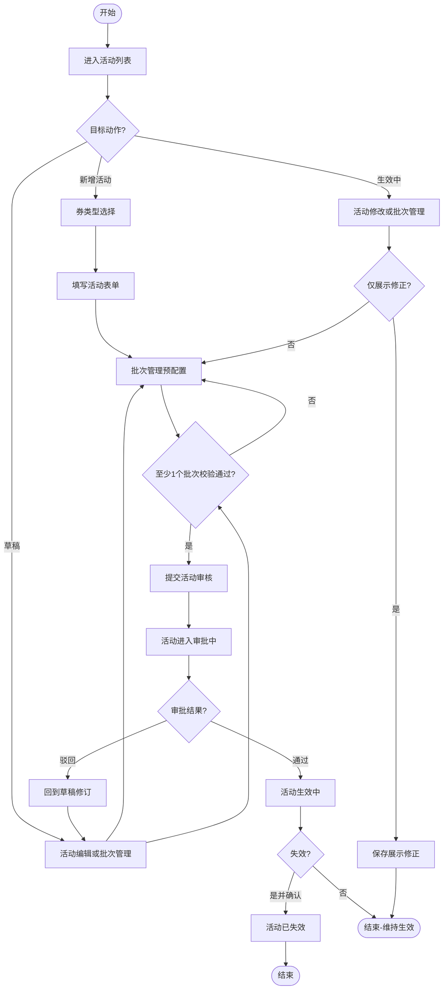
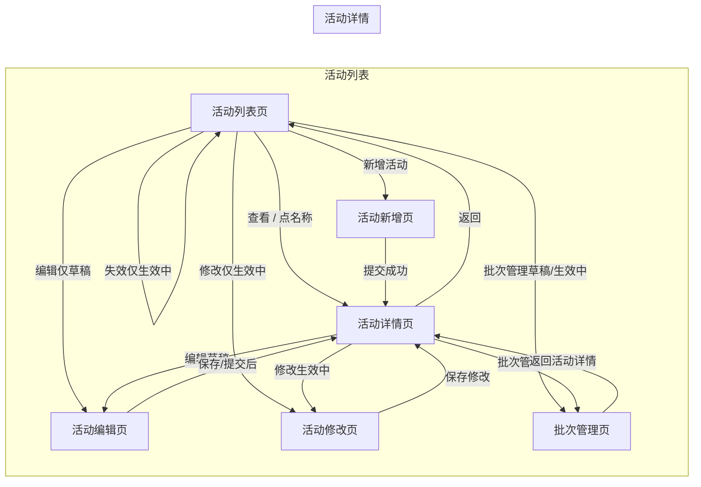
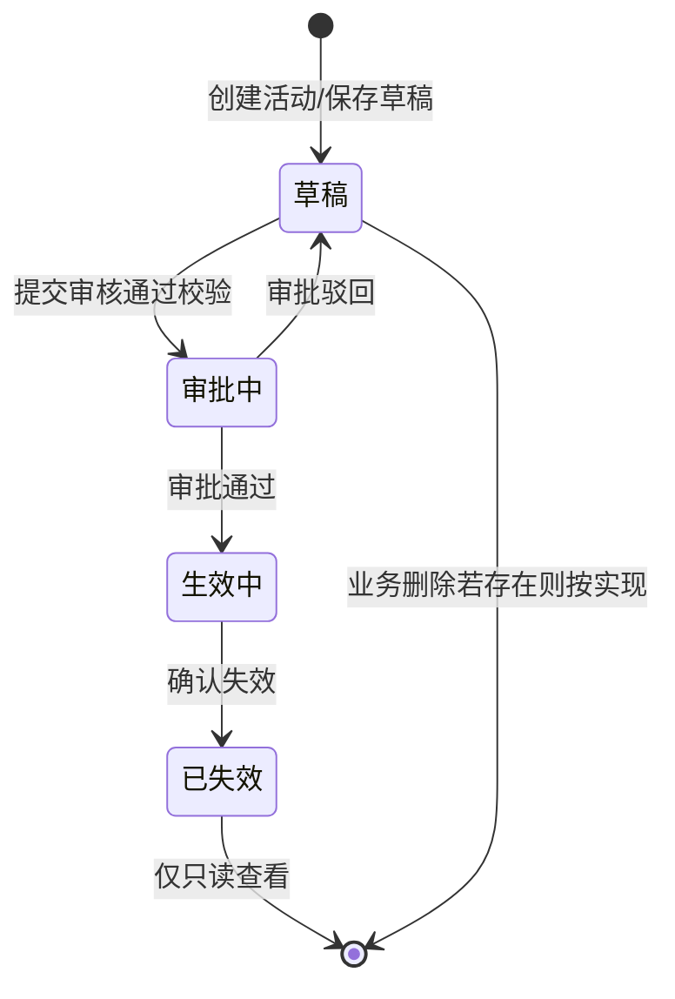
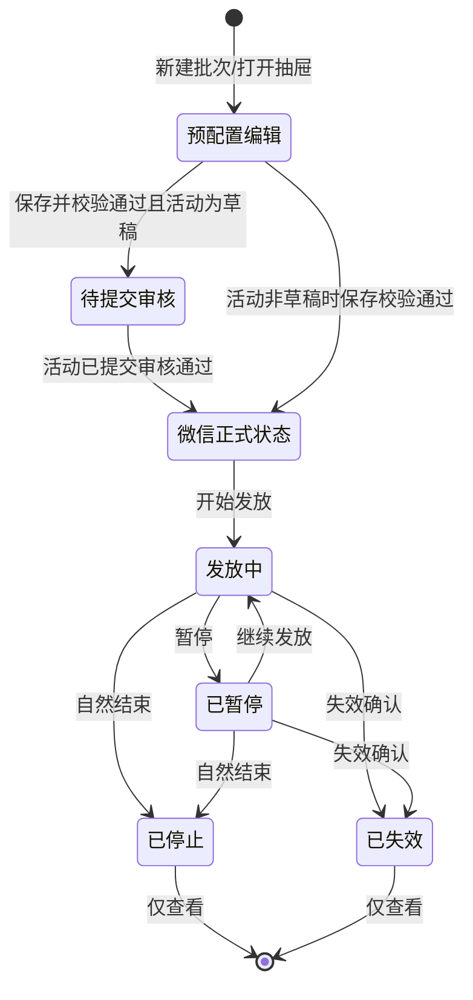
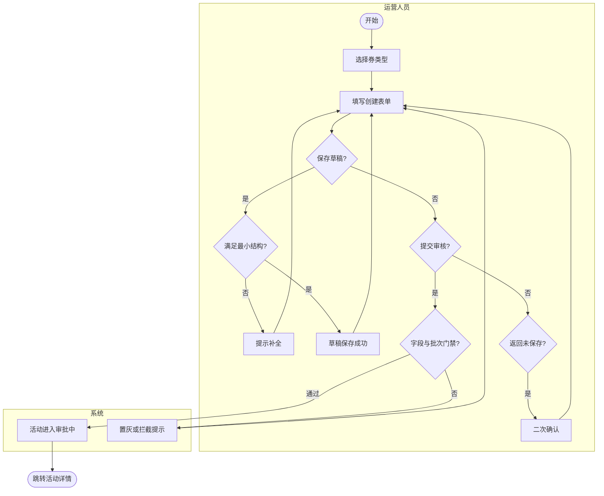
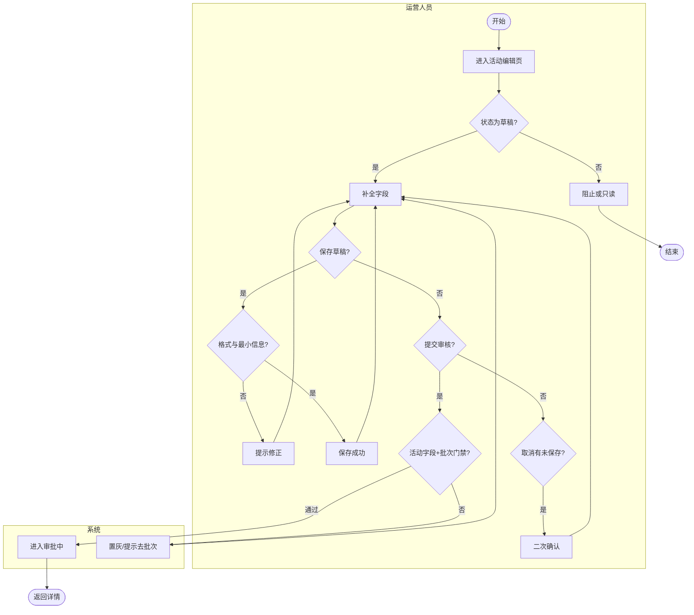
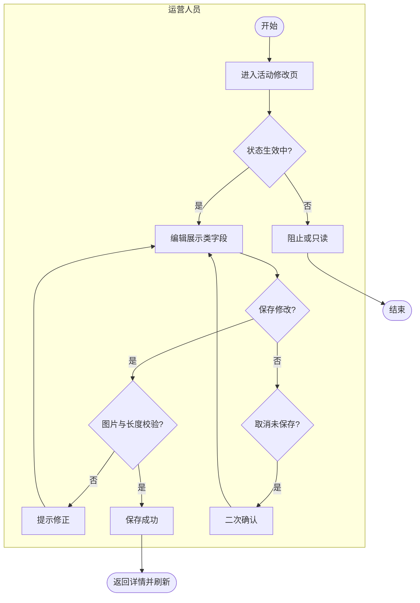
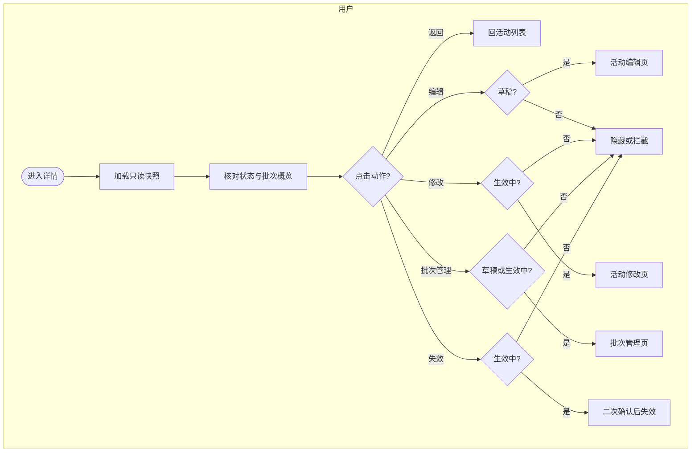
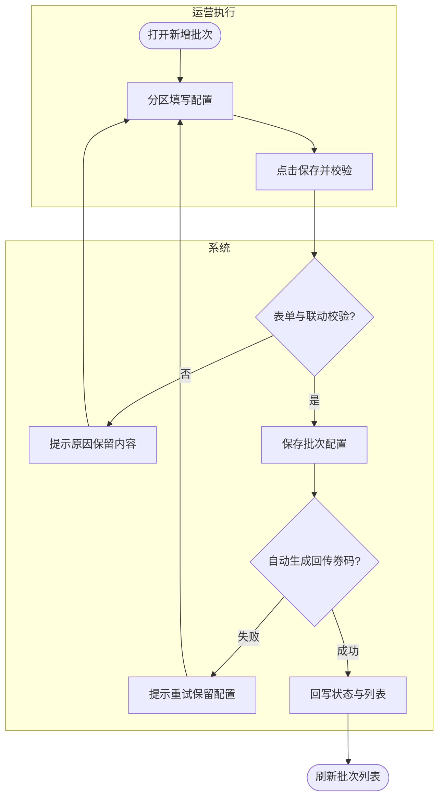
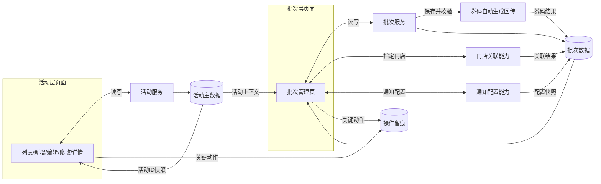

# Weixin摇一摇 PRD 业务流程图（Mermaid）

> 依据：`Weixin摇一摇_PRD_v2.20_20260513.md`  
> 生成说明：按《PRD 生成流程图 — 提示词模板》提炼流程并输出 Mermaid，便于渲染与评审。  
> 生成日期：2026-05-13

---

## 第一步：流程清单

| 序号 | 流程名称 | 流程类型 | 复杂度 | 涉及角色 |
|------|---------|---------|--------|---------|
| 1 | 活动与批次端到端主链路 | 业务主流程 | 高 | 运营人员、审核管理角色、执行角色、系统 |
| 2 | 活动层页面入口流转 | 页面流转图 | 中 | 运营人员、审核管理角色、执行角色 |
| 3 | 活动层状态机 | 状态流转图 | 中 | 系统、审核管理角色 |
| 4 | 批次层状态与过程态 | 状态流转图 | 高 | 系统、微信侧、执行角色 |
| 5 | 活动新增（两段式）与提交审核 | 操作子流程 | 中 | 运营人员、系统 |
| 6 | 活动编辑（草稿续填）与提交审核 | 操作子流程 | 中 | 运营人员、系统 |
| 7 | 活动修改（生效中展示修正） | 操作子流程 | 低 | 运营人员、系统 |
| 8 | 活动详情只读与入口分发 | 操作子流程 | 中 | 运营人员、审核管理角色、执行角色 |
| 9 | 批次管理保存校验与券码回传 | 操作子流程 | 高 | 运营人员、执行角色、系统 |
| 10 | 活动层与集成侧数据关系 | 数据流向图 | 中 | 活动服务、批次服务、券码能力、门店、通知、留痕 |

---

## 第二步：逐流程输出

### 流程1：活动与批次端到端主链路

**流程类型**：业务主流程  
**涉及角色**：运营人员、审核管理角色、执行角色、系统（活动服务、批次服务、券码生成）  
**前置条件**：用户已登录；具备对应页面与操作权限。  
**结束条件**：活动到达终态（如已失效）或用户停留在列表/详情只读查看；批次到达已停止/已失效等终态。

#### 流程说明

从活动列表进入「新增」或「编辑/详情」链路：活动草稿阶段必须先通过批次管理完成至少 1 个「保存并校验」通过的批次，才能提交活动审核；活动进入审批中后列表与详情收紧入口；生效后可进入修改与批次执行；生效中活动可失效（二次确认）。批次侧在活动仍为草稿时展示过程态「待提交审核」，活动提交审核后批次正式状态以微信返回为准。

#### 流程图代码

#### 关键决策点说明

| 决策点 | 判断条件 | 条件为真 | 条件为假 |
|--------|----------|----------|----------|
| 批次门禁 | 是否存在至少 1 个已完成预配置且校验通过的批次 | 允许提交活动审核 | 阻止提交，引导去批次管理 |
| 活动入口（列表/详情） | 活动状态是否为审批中 | 仅可查看详情 | 草稿可编辑与批次管理；生效中可修改与批次管理 |
| 审批结果 | 审核是否通过 | 进入生效中 | 回到草稿继续修订 |

---

### 流程2：活动层页面入口流转

**流程类型**：页面流转图  
**涉及角色**：运营人员、审核管理角色、执行角色  
**前置条件**：已登录且有活动列表访问权限。  
**结束条件**：用户停留在某一活动页面或返回列表。

#### 流程说明

活动列表为总路由：新增进入活动新增页；名称/查看进入详情；编辑/修改/批次管理受状态门禁。详情页在从编辑、修改、批次返回时应刷新快照。审批中活动不展示编辑、修改、批次管理入口（与列表规则一致）。

#### 流程图代码

#### 关键决策点说明

| 决策点 | 判断条件 | 条件为真 | 条件为假 |
|--------|----------|----------|----------|
| 列表行「编辑」 | 活动状态为草稿 | 进入活动编辑页 | 按钮隐藏，不可进入 |
| 列表行「批次管理」 | 草稿或生效中（且非审批中入口） | 进入批次管理页 | 审批中、已失效等不展示 |
| 详情「审批中」 | 状态为审批中 | 仅保留返回与只读查看 | 不展示编辑、修改、批次管理 |

---

### 流程3：活动层状态机

**流程类型**：状态流转图  
**涉及角色**：系统、审核管理角色、运营人员（触发提交/失效）  
**前置条件**：活动记录已创建或可被读取。  
**结束条件**：活动处于已失效终态，或仍在草稿/审批中/生效中流转中。

#### 流程说明

活动状态枚举：草稿、审批中、生效中、已失效。提交审核由活动层发起；审批通过进入生效中，驳回回草稿；生效中可执行失效（二次确认）进入已失效。列表与详情以活动服务返回为状态主源。

#### 流程图代码

#### 关键决策点说明

| 决策点 | 判断条件 | 条件为真 | 条件为假 |
|--------|----------|----------|----------|
| 能否提交审核 | 字段与联动校验通过且批次门禁满足 | 进入审批中 | 保持草稿，拦截或置灰 |
| 失效入口 | 状态为生效中且用户确认 | 进入已失效 | 保持生效中 |

---

### 流程4：批次层状态与过程态

**流程类型**：状态流转图  
**涉及角色**：系统、微信侧、执行角色  
**前置条件**：用户已进入批次管理且活动允许进入该页。  
**结束条件**：批次为已停止或已失效等终态；或持续在发放中/已暂停受控运行。

#### 流程说明

页面「预配置」仅为编辑过程，不作为正式状态。活动仍为草稿时：校验通过的批次在列表可展示过程态「待提交审核」。活动提交审核后，批次正式状态以微信返回为准（如发放中、已暂停、已停止、已失效等）。发放中与已暂停等状态下的失效需二次确认。具体微信返回子状态以接口为准，本图概括 PRD 描述的主干。

#### 流程图代码

#### 关键决策点说明

| 决策点 | 判断条件 | 条件为真 | 条件为假 |
|--------|----------|----------|----------|
| 列表展示过程态 | 活动为草稿且批次保存校验通过 | 展示待提交审核 | 展示微信正式状态 |
| 失效动作 | 状态允许且用户二次确认 | 进入已失效 | 保持原状态 |

---

### 流程5：活动新增（两段式）与提交审核

**流程类型**：操作子流程  
**涉及角色**：运营人员、系统  
**前置条件**：具备活动创建权限；券类型仅满减/兑换。  
**结束条件**：保存草稿留在表单；或提交成功进入审批中并返回详情页；或用户确认放弃返回。

#### 流程说明

先券类型选择再表单；券类型锁定。更多配置默认收起。保存草稿允许主字段不完整但需满足最小结构约束。提交前需完整校验 + 至少 1 个校验通过批次。返回列表或类型选择时若有未保存更改需二次确认。外部商品 ID 在活动未产生批次前可编辑（产生后全链路只读，批次在后续产生）。

#### 流程图代码

#### 关键决策点说明

| 决策点 | 判断条件 | 条件为真 | 条件为假 |
|--------|----------|----------|----------|
| 保存草稿 | 最小识别信息是否满足 | 保存成功 | 阻止并提示 |
| 提交审核 | 必填与联动及批次门禁 | 创建/更新并置审批中 | 置灰或拦截 |

---

### 流程6：活动编辑（草稿续填）与提交审核

**流程类型**：操作子流程  
**涉及角色**：运营人员、系统  
**前置条件**：活动状态为草稿；从列表或详情「编辑」进入。  
**结束条件**：保存草稿成功；或提交审核进入审批中；或取消返回。

#### 流程说明

编辑页不承接券码上传、门店与发放控制。提交审核同样受批次门禁约束；提示区可引导跳转批次管理。外部商品 ID 在已产生批次后只读。非草稿状态应阻止进入或只读。

#### 流程图代码

#### 关键决策点说明

| 决策点 | 判断条件 | 条件为真 | 条件为假 |
|--------|----------|----------|----------|
| 进入编辑 | 状态为草稿 | 可编辑 | 阻止或只读 |
| 提交审核 | 活动校验通过且批次门禁满足 | 提交成功 | 拦截并提示 |

---

### 流程7：活动修改（生效中展示修正）

**流程类型**：操作子流程  
**涉及角色**：运营人员、系统  
**前置条件**：活动状态为生效中；具备修改权限。  
**结束条件**：保存后返回详情并刷新快照；或取消放弃。

#### 流程说明

基础信息与高风险规则区只读；仅「主展示修正」「补充展示修正」可编辑。保存不影响已发/在途券与批次执行链路。非生效中不得继续编辑。

#### 流程图代码

#### 关键决策点说明

| 决策点 | 判断条件 | 条件为真 | 条件为假 |
|--------|----------|----------|----------|
| 可编辑范围 | 字段属于展示修正区 | 允许保存 | 高风险区不可编辑 |
| 保存后导航 | 保存成功 | 返回详情刷新快照 | 提示重试 |

---

### 流程8：活动详情只读与入口分发

**流程类型**：操作子流程  
**涉及角色**：运营人员、审核管理角色、执行角色  
**前置条件**：具备查看权限；活动数据可读。  
**结束条件**：用户返回列表或跳转至受控页面；查看本身不改变活动状态。

#### 流程说明

详情为只读总览与状态分发：展示基础信息、展示信息、批次概览；按钮随状态变化。审批中仅查看。从其他页返回须刷新快照。

#### 流程图代码

#### 关键决策点说明

| 决策点 | 判断条件 | 条件为真 | 条件为假 |
|--------|----------|----------|----------|
| 编辑入口 | 草稿 | 跳转编辑 | 不展示或不可点 |
| 批次管理入口 | 草稿或生效中 | 可进入批次页 | 审批中等不展示 |

---

### 流程9：批次管理保存校验与券码回传

**流程类型**：操作子流程  
**涉及角色**：运营人员、执行角色、系统（批次服务、券码生成）  
**前置条件**：从列表或详情进入；活动未失效且非审批中入口限制场景。  
**结束条件**：保存校验成功并回写列表；或失败保留表单并提示。

#### 流程说明

新增批次抽屉分区填写；「保存并校验」先保存再由系统自动生成/回传商品券 ID、批次 ID 与券码结果并校验一致性。失败不清空已填。券码不提供人工上传。门店、通知等按联动规则校验。

#### 流程图代码

#### 关键决策点说明

| 决策点 | 判断条件 | 条件为真 | 条件为假 |
|--------|----------|----------|----------|
| 保存并校验 | 配置与联动规则满足 | 触发券码生成 | 阻止保存 |
| 券码生成结果 | 回传成功且校验一致 | 更新批次状态与展示 | 失败可重试，不清空表单 |

---

### 流程10：活动层与集成侧数据关系

**流程类型**：数据流向图  
**涉及角色**：前端、活动服务、批次服务、券码能力、门店能力、通知能力、留痕  
**前置条件**：各集成能力可用。  
**结束条件**：数据回写页面展示层。

#### 流程说明

活动层读写集中在活动服务；批次层由批次服务维护；保存并校验触发券码自动生成/回传；指定门店范围走门店关联；通知配置独立绑定批次；关键动作写入留痕。批次页不反向改写活动主数据。

#### 流程图代码

> 注：留痕箭头已拆为 `P1`、`P2` 各一条，便于在更多 Mermaid 渲染器中兼容（等价于多源指向同一节点）。

#### 关键决策点说明

| 决策点 | 判断条件 | 条件为真 | 条件为假 |
|--------|----------|----------|----------|
| 数据主源 | 活动状态展示 | 以活动服务返回为准 | 页面不自行推导终态 |
| 批次正式状态 | 活动是否已脱离草稿提审 | 以微信/批次服务返回为准 | 草稿阶段可展示待提交审核过程态 |

---

## 附注

1. **PRD 与界面文案**：修改页/详情中「券码分配模式」展示文案与 V2.20「系统自动生成/回传」在名词上若并存，以实现与最新 PRD 批次章节为准；流程结构不受影响。  
2. **节点规模**：单图节点控制在模板建议范围内；更细字段级异常已归入 PRD 原文与各页异常表。  
3. **渲染**：可将本文档整体导入支持 Mermaid 的 Markdown 预览器或文档平台直接渲染。
