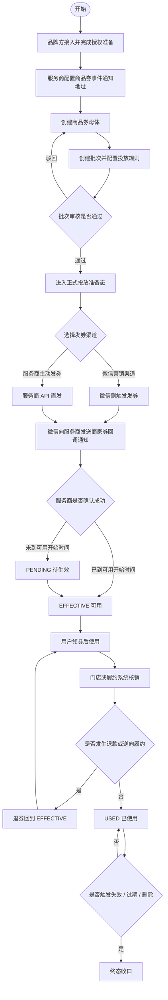
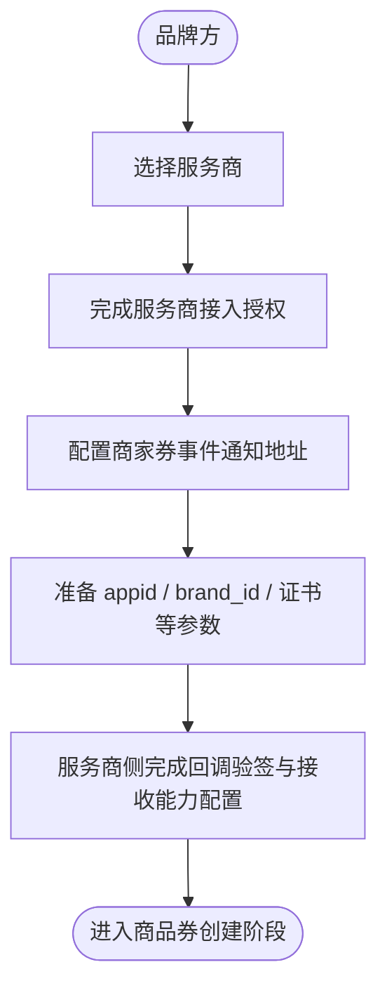
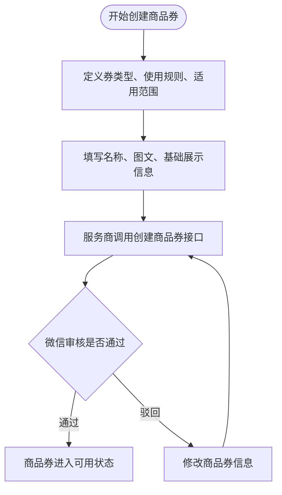
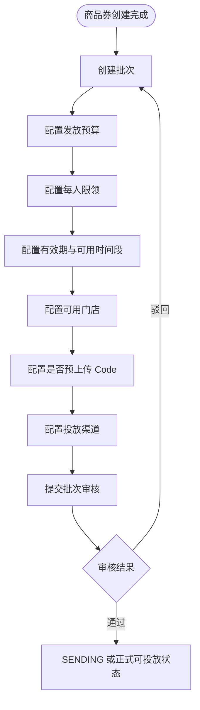
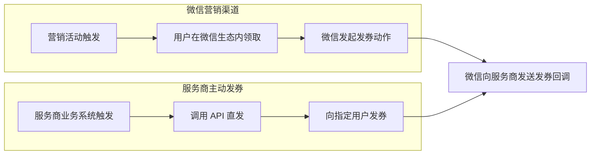
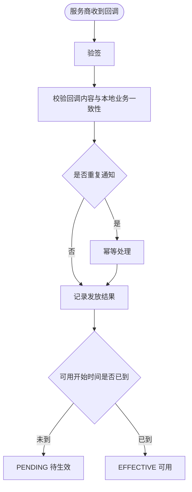
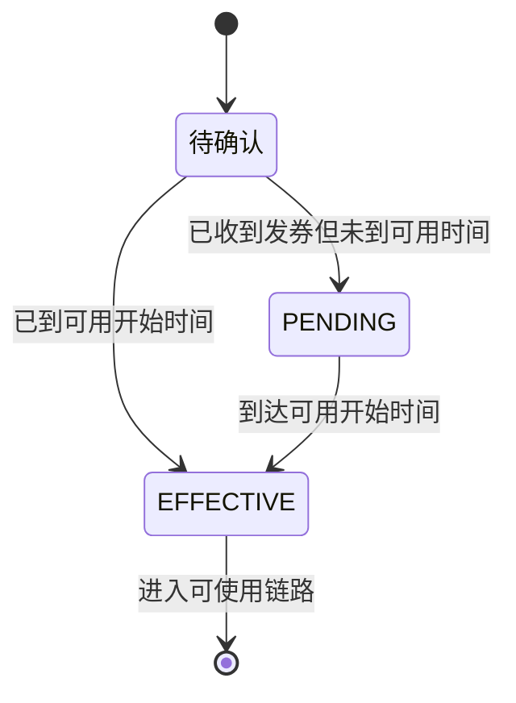
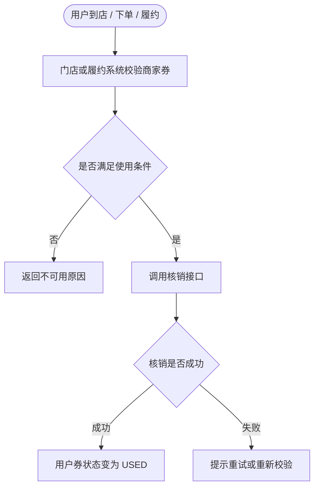
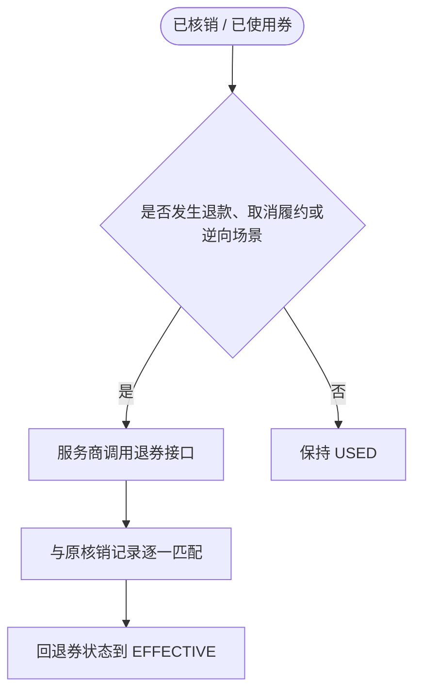
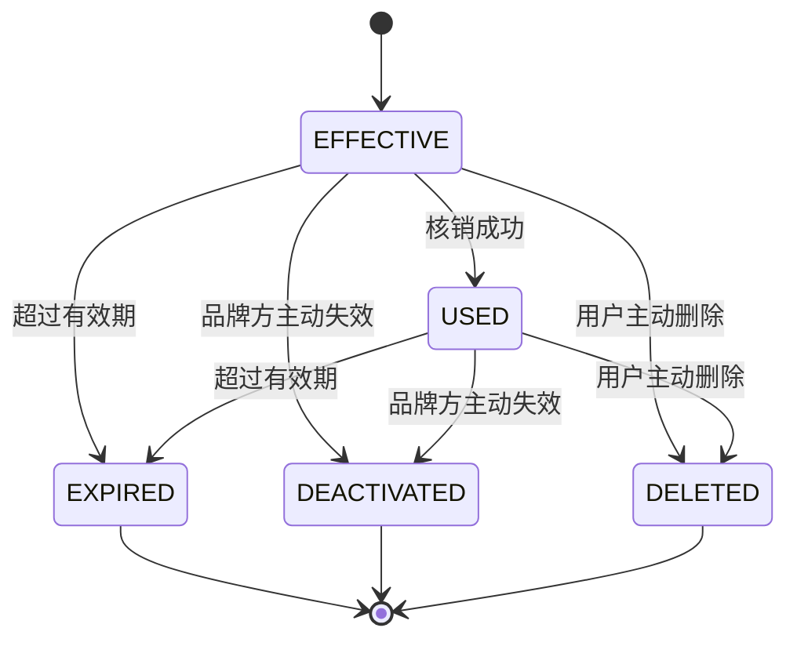

# 商品券业务 PRD 业务流程图

> 来源：`E:\下载\PRD生成流程图-提示词模板_测试.md`
> 说明：仅依据附件正文中的业务描述提炼流程，不引用其他历史记录。
> 输出格式：Mermaid 流程图，可直接渲染。

## 流程清单

| 序号 | 流程名称 | 类型 | 说明 |
|---:|---|---|---|
| 1 | 商品券业务总生命周期 | 业务主流程 | 从接入授权到终态管理 |
| 2 | 品牌接入与授权准备 | 操作子流程 | 服务商完成基础接入与回调配置 |
| 3 | 商品券创建流程 | 操作子流程 | 定义券规则并创建券主对象 |
| 4 | 批次创建与投放规则配置 | 操作子流程 | 建立可投放、可审核的批次 |
| 5 | 发券渠道派发流程 | 业务主流程 | 微信营销渠道 / 服务商主动发券两条路径 |
| 6 | 回调接收与发放确认 | 状态流转图 | 服务商接收微信回调并确认发放结果 |
| 7 | 领券后进入可用状态 | 状态流转图 | 从待确认 / 待生效到可用 |
| 8 | 用券与核销流程 | 操作子流程 | 门店或履约系统完成真实核销 |
| 9 | 退券与逆向履约流程 | 操作子流程 | 退款、取消履约等场景下的退券 |
| 10 | 失效、过期、删除终态 | 状态流转图 | 各类终态收口 |

## 1. 商品券业务总生命周期

## 2. 品牌接入与授权准备

## 3. 商品券创建流程

## 4. 批次创建与投放规则配置

## 5. 发券渠道派发流程

## 6. 回调接收与发放确认

## 7. 领券后进入可用状态

## 8. 用券与核销流程

## 9. 退券与逆向履约流程

## 10. 失效、过期、删除终态

## 关键决策点

| 决策点 | 判断条件 | 条件为真 | 条件为假 |
|---|---|---|---|
| 是否需要审核 | 商品券或批次是否进入正式发布链路 | 进入审核流程 | 直接保存或继续配置 |
| 是否进入可用 | 发放确认成功且可用时间已到 | 进入 EFFECTIVE | 进入 PENDING |
| 是否已核销 | 门店 / 履约系统完成真实核销 | 进入 USED | 保持原状态 |
| 是否允许退券 | 发生退款、取消履约或逆向处理 | 回退到 EFFECTIVE | 保持 USED |
| 是否终态 | 失效、过期或删除 | 进入终态 | 继续业务流转 |

